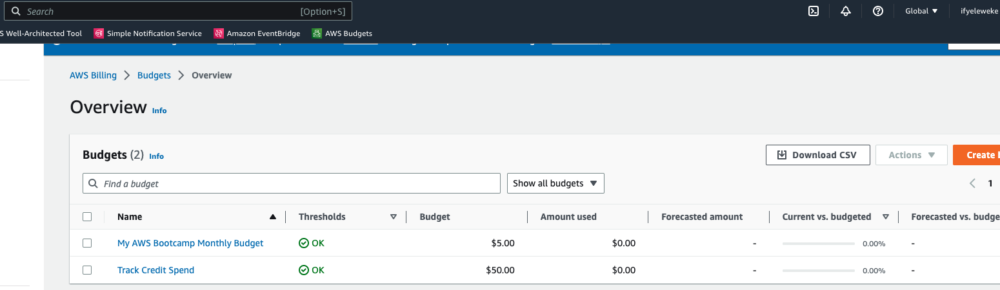
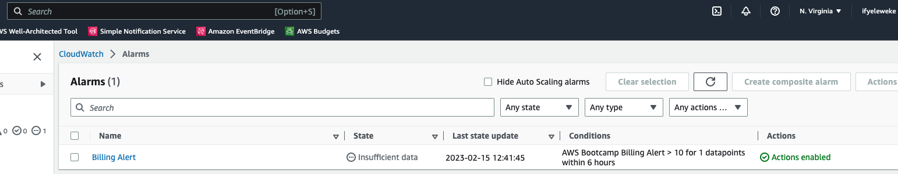
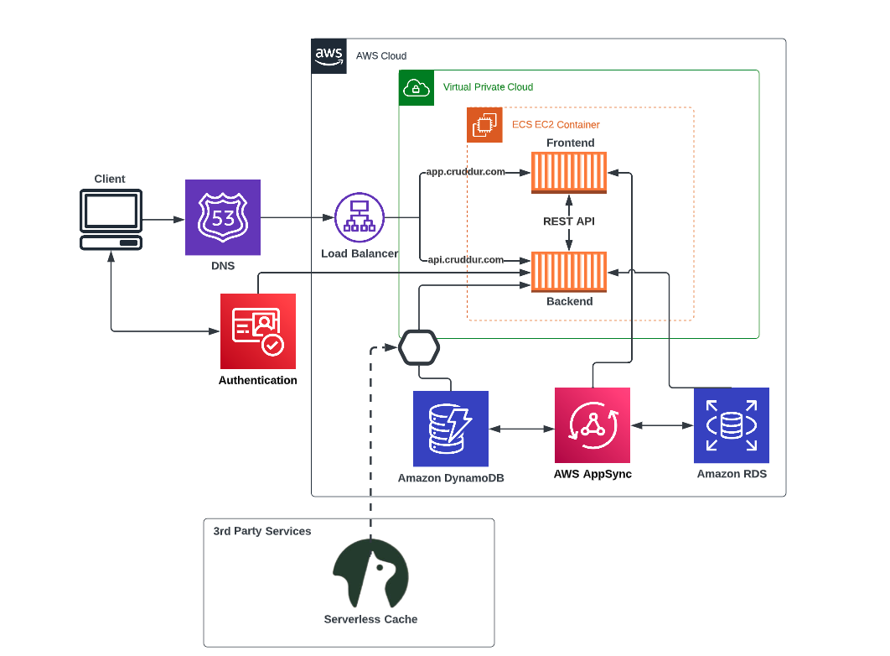
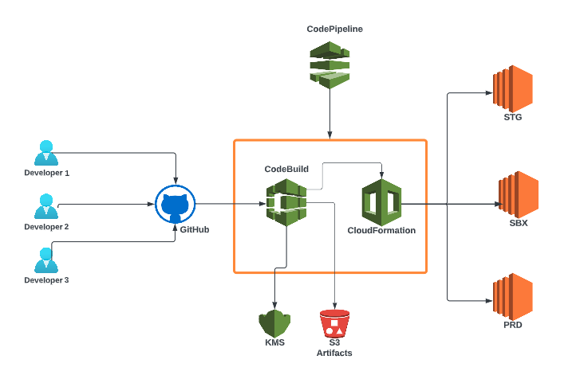
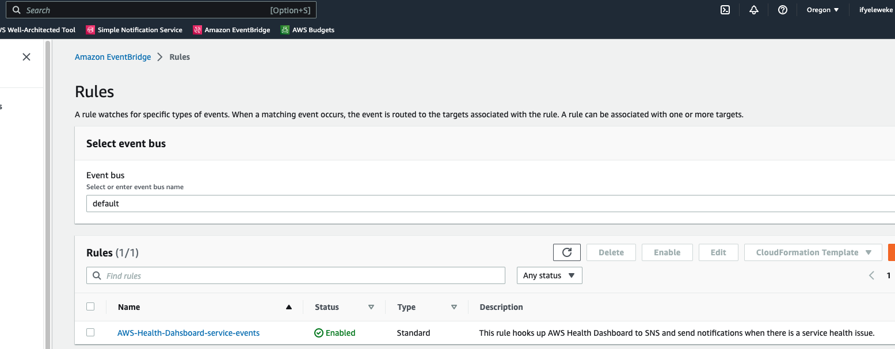
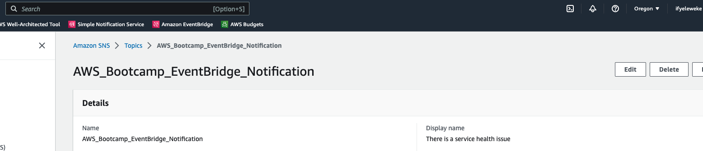

# Week 0 — Billing and Architecture

## Required Homework/Tasks

### Install and Verify AWS CLI 

Using `Gitpod` workspace, I was able to install the AWS CLI for Linux in the **Terminal** following the instructions in this documentation:

I followed the instructions on the [AWS CLI Install Documentation Page](https://docs.aws.amazon.com/cli/latest/userguide/getting-started-install.html)

```
curl "https://awscli.amazonaws.com/awscli-exe-linux-x86_64.zip" -o "awscliv2.zip"
unzip awscliv2.zip
sudo ./aws/install

# confirm installation using this command
aws --version
```

### Create an IAM Admin User

Following the steps provided by Amazon, I successfully created an IAM user with `admin` privileges

[Creating an Administrator User](https://docs.aws.amazon.com/streams/latest/dev/setting-up.html#setting-up-iam)

### Create a Budget

Watching this video, [Creating Budget via CLI](https://www.youtube.com/watch?v=OdUnNuKylHg&list=PLBfufR7vyJJ7k25byhRXJldB5AiwgNnWv&index=14) provided by the instructor, I created my own Budget to track my monthly spend as well as my AWS credits. I cannot afford to spend more than I have. 

I created just 2 budgets not to go over the free-tier limit. 

 


### Create a Billing alarm

I created an alarm to notify me when my daily estimated charges are going over $1. I can't afford any kind of spend. 




### Recreate Logical Architectural Deisgn

Here is my recreation of the logical diagram



[Lucid Charts Share Link](https://lucid.app/lucidchart/d666d7ec-62f8-4674-87bf-5b73b2cbb2ca/edit?viewport_loc=-373%2C83%2C2219%2C1107%2CtDPx9NrE1ha4&invitationId=inv_f2376395-0591-4336-bc43-db1ebf838aa4)


### Recreate Conceptual Architectural Deisgn on a Napkin

Here is my recreation of the conceptual diagram on a napkin


## Homework Challenges 

Below are some of the challenges I was able to work on:

1. Created the architectural diagram of a CI/CD pipeline



[Lucid Charts Share Link](https://lucid.app/lucidchart/d666d7ec-62f8-4674-87bf-5b73b2cbb2ca/edit?viewport_loc=-890%2C-420%2C3328%2C1660%2CfPhxy5N10Ybw&invitationId=inv_f2376395-0591-4336-bc43-db1ebf838aa4)

2. Reviewed part of the questions of each pillar in the well-architected tool

3. Created an EventBridge event for our health dashboards 

This event is created alongside an SNS topic with a subscription for our health dashboards to send notifications when there is a service health issue.




4. Enabled MFA for both the root account and the user account created as well as an IAM role


