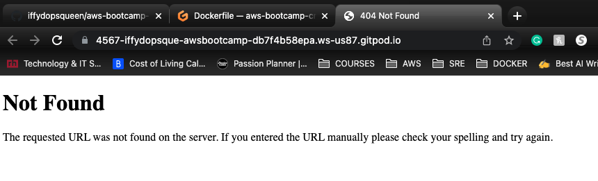
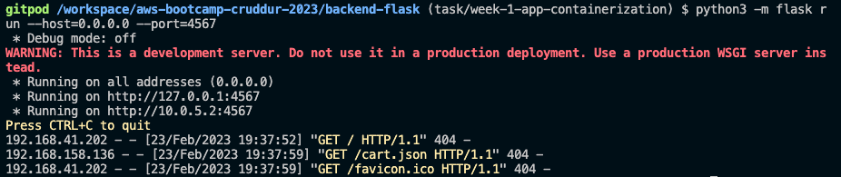
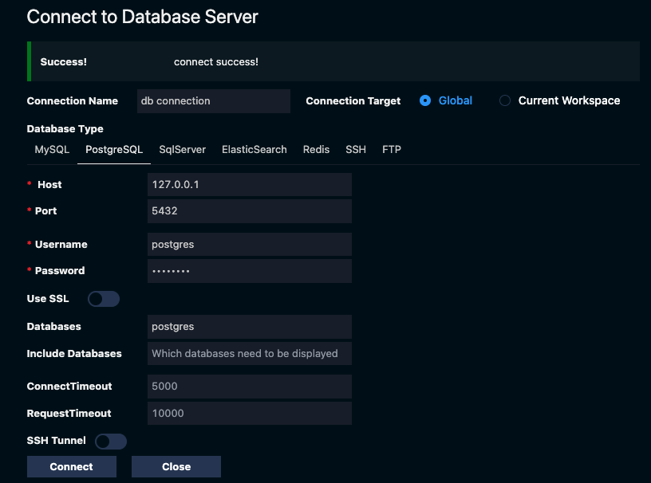

# Week 1 — App Containerization

## Required Homework/Tasks

All the tasks under this section is done using `Gitpod` workspace.

### 1. Containerizing the Backend

To containerize your applications, you have to start off by creating `Dockerfile`s for each of your services. In this [link](https://docs.docker.com/develop/develop-images/dockerfile_best-practices/), you will find a detailed explanation and best practices on how to create one. 

For the backend, create a `Dockerfile` in the `backend-flask` directory. Either do this by using the CLI or in the UI. 

```bash
touch backend-flask/Dockerfile
```

Go ahead and paste this content into your `Dockerfile` 
```docker
# This image is fetched from Docker Hub
FROM python:3.10-slim-buster

# Create this directory within the container 
WORKDIR /backend-flask

# Copy this file from your computer to the container: source -> destination 
# This file contains the libraries needed to run the app
COPY requirements.txt requirements.txt

# Run this cmd in the container 
# This is to install the python libraries needed for the app
RUN pip3 install -r requirements.txt

# Copy everything in the current directory to the container 
COPY . .

# Set env variables in the container 
# This is a way to configure our environment
ENV FLASK_ENV=development

# This will expose our app port 4567 
EXPOSE ${PORT}

# -m means to use the flask module
# --host=0.0.0.0 is for setting the port in the container 
# --port=4567 is for setting the app port
CMD [ "python3", "-m" , "flask", "run", "--host=0.0.0.0", "--port=4567"]
```

*To make sure your file works when you build it, try running the individual commands just to be extra sure.*

Build the `Dockerfile` you created into an image 
```bash
# This is to build our image while in the backend-flask/ directory
# -t is for naming the image 
docker build -t backend-flask .

# to tag the image use the ":"
docker build -t backend-flask:v1.0 .
```

Start up the container using the image built 
```bash
docker run --rm -p 4567:4567 -it backend-flask:v1.0
```

Initially there will be a `404` error. 



That is because we don't have any `env` variables set in the container for our application. Let's investigate to be sure that is the reason.

To enter into a running container, use this command:
```bash
docker exec -it <CONTAINER_NAME> /bin/bash

# to investigate the ENV variables - FRONTEND & BACKEND URLs
env 

# OR
env | grep FRONTEND 
env | grep BACKEND
```

If those variables aren't set, let's go ahead and set it using this command:
```bash
docker run --rm -p 4567:4567 -it -e FRONTEND_URL='*' -e BACKEND_URL='*' backend-flask:v1.0
```

### 2. Containerizing the Frontend

For the frontend, create a `Dockerfile` in the `frontend-react-js` directory. Either do this by using the CLI or in the UI. 

```bash
touch frontend-react-js/Dockerfile
```

Go ahead and paste this content into your `Dockerfile` 
```docker
# This image is fetched from Docker Hub
FROM node:16.18

# set the port for the app
ENV PORT=3000

# copy everything in my computer to the /frontend-react-js directory in the container
COPY . /frontend-react-js

# set the working directory to /frontend-react-js
WORKDIR /frontend-react-js

# install npm 
RUN npm install

# expose the app port 3000
EXPOSE ${PORT}

# start the frontend 
CMD ["npm", "start"]
```

*To make sure your file works when you build it, try running the individual commands just to be extra sure.*

Build the `Dockerfile` you created into an image 
```bash
# This is to build our image while in the frontend-react-js/ directory
# -t is for naming the image 
docker build -t frontend-react-js .

# to tag the image use the ":"
docker build -t frontend-react-js:v1.0 .
```

Start up the container using the image built 
```bash
docker run --rm -p 3000:3000 -it frontend-react-js:v1.0
```

### 3. Using `docker compose` to handle both services 

The use of `docker compose` helps us deal with multiple containers. In this [link](https://docs.docker.com/compose/gettingstarted/), you will find a detailed explanation and best practices on how to create one.

Let's create a `docker compose` file at the root of our project `/workspace/aws-bootcamp-cruddur-2023`, assuming you are using `gitpod`. Either do this by using the CLI or in the UI.

```bash
# to make sure you are in the root of your project 
pwd 

# now create the docker-compose file
touch docker-compose.yml
```

Go ahead and paste this content into your file 
```yaml
version: "3.8"

# here is where you declare your services -> frontend & backend 
services:

  # BACKEND
  backend-flask:

    # passing our env variables
    environment:
      FRONTEND_URL: "https://3000-${GITPOD_WORKSPACE_ID}.${GITPOD_WORKSPACE_CLUSTER_HOST}"
      BACKEND_URL: "https://4567-${GITPOD_WORKSPACE_ID}.${GITPOD_WORKSPACE_CLUSTER_HOST}"
    
    # building our image
    build: ./backend-flask

    # mapping our ports -> local:container
    ports:
      - "4567:4567"
    
    # mapping our volumes -> local:container
    volumes:
      - ./backend-flask:/backend-flask
  
  # FRONTEND
  frontend-react-js:
    
    # passing our env variables
    environment:
      REACT_APP_BACKEND_URL: "https://4567-${GITPOD_WORKSPACE_ID}.${GITPOD_WORKSPACE_CLUSTER_HOST}"
    
    # building our image
    build: ./frontend-react-js
    
    # mapping our ports -> local:container
    ports:
      - "3000:3000"
    
    # mapping our volumes -> local:container
    volumes:
      - ./frontend-react-js:/frontend-react-js

# the name flag is a hack to change the default prepend folder
# name when outputting the image names
networks: 
  internal-network:
    driver: bridge
    name: cruddur
```

Start up our containers using this command:
```bash
docker compose up
```
*Now you should see both services up and running*

**Because our volumes are mapped, if we make changes to our frontend, we would immediately see those changes**

### 4. Adding Endpoint for Notifications - Using Flask for Backend 

Add the notifications endpoint to the `openapi.yml` file using these contents:
```yaml
#create a path using the OpenAPI extension
/api/activities/notifications:
    get:
      description: 'Return a feed of activity for all those I follow'
      tags: 
        - activities
      parameters: []
      responses:
        '200':
          description: Return an array of activities 
          content:
            application/json:
              schema:
                type: array
                items: 
                  $ref: '#/components/schemas/Activity'
```

Now we need to add a route for the endpoint we created. Add these contents to the `backend-flask/app.py` file 
```python
# add this in the beginning of the file.
# It adds the notifications module
from services.notifications_activities import *

# add notifications route 
@app.route("/api/activities/notifications", methods=['GET'])
def data_notifications():
  data = NotificationsActivities.run()
  return data, 200
```

Go ahead and add a `notification` file in the `backend-flask/services/` directory
```bash
touch backend-flask/services/notifications_activities.py
```

Add the following content to the created file 
```python
from datetime import datetime, timedelta, timezone
class NotificationsActivities:
  def run():
    now = datetime.now(timezone.utc).astimezone()
    results = [{
      'uuid': '68f126b0-1ceb-4a33-88be-d90fa7109eee',
      'handle':  'Dev Queen',
      'message': 'Yah, I got this!',
      'created_at': (now - timedelta(days=2)).isoformat(),
      'expires_at': (now + timedelta(days=5)).isoformat(),
      'likes_count': 5,
      'replies_count': 1,
      'reposts_count': 0,
      'replies': [{
        'uuid': '26e12864-1c26-5c3a-9658-97a10f8fea67',
        'reply_to_activity_uuid': '68f126b0-1ceb-4a33-88be-d90fa7109eee',
        'handle':  'Worf',
        'message': 'This post has no honor!',
        'likes_count': 0,
        'replies_count': 0,
        'reposts_count': 0,
        'created_at': (now - timedelta(days=2)).isoformat()
      }],
    }
    ]
    return results
```

### 5. Adding a React Page for Notifications

We need to add a notification feed to the `app.js` file in the `frontend-react-js/src/app.js` directory. Go ahead and add the following contents:

```js
//to import the module
import NotificationsFeedPage from './pages/NotificationsFeedPage';

//delete this line from the code
import process from 'process';

//under the const router ... add a router for notifications
{
    path: "/notifications",
    element: <NotificationsFeedPage />
  },
```

Now let's create a page for the feed we just created:
```bash
# in frontend-react-js/src/pages/
touch frontend-react-js/src/pages/NotificationsFeedPage.js
touch frontend-react-js/src/pages/NotificationsFeedPage.css
```

Add the following content to the `NotificationsFeedPage.js` file:
```js
import './NotificationsFeedPage.css';
import React from "react";

import DesktopNavigation  from '../components/DesktopNavigation';
import DesktopSidebar     from '../components/DesktopSidebar';
import ActivityFeed from '../components/ActivityFeed';
import ActivityForm from '../components/ActivityForm';
import ReplyForm from '../components/ReplyForm';

// [TODO] Authenication
import Cookies from 'js-cookie'

export default function NotificationsFeedPage() {
  const [activities, setActivities] = React.useState([]);
  const [popped, setPopped] = React.useState(false);
  const [poppedReply, setPoppedReply] = React.useState(false);
  const [replyActivity, setReplyActivity] = React.useState({});
  const [user, setUser] = React.useState(null);
  const dataFetchedRef = React.useRef(false);

  const loadData = async () => {
    try {
      const backend_url = `${process.env.REACT_APP_BACKEND_URL}/api/activities/notifications`
      const res = await fetch(backend_url, {
        method: "GET"
      });
      let resJson = await res.json();
      if (res.status === 200) {
        setActivities(resJson)
      } else {
        console.log(res)
      }
    } catch (err) {
      console.log(err);
    }
  };

  const checkAuth = async () => {
    console.log('checkAuth')
    // [TODO] Authenication
    if (Cookies.get('user.logged_in')) {
      setUser({
        display_name: Cookies.get('user.name'),
        handle: Cookies.get('user.username')
      })
    }
  };

  React.useEffect(()=>{
    //prevents double call
    if (dataFetchedRef.current) return;
    dataFetchedRef.current = true;

    loadData();
    checkAuth();
  }, [])

  return (
    <article>
      <DesktopNavigation user={user} active={'notifications'} setPopped={setPopped} />
      <div className='content'>
        <ActivityForm  
          popped={popped}
          setPopped={setPopped} 
          setActivities={setActivities} 
        />
        <ReplyForm 
          activity={replyActivity} 
          popped={poppedReply} 
          setPopped={setPoppedReply} 
          setActivities={setActivities} 
          activities={activities} 
        />
        <ActivityFeed 
          title="Notifications" 
          setReplyActivity={setReplyActivity} 
          setPopped={setPoppedReply} 
          activities={activities} 
        />
      </div>
      <DesktopSidebar user={user} />
    </article>
  );
}
```

### 6. Creating and Running DynamoDB Local 

DynamoDB local is a downloadable version of DynamoDB that enables developers to develop and test applications using a version of DynamoDB running in your own development environment. Read [more](https://hub.docker.com/r/amazon/dynamodb-local)

To create our `dynamodb` service, add this content to the `docker compose` file
```yaml
  dynamodb-local:
    # https://stackoverflow.com/questions/67533058/persist-local-dynamodb-data-in-volumes-lack-permission-unable-to-open-databa
    # We needed to add user:root to get this working.
    user: root
    command: "-jar DynamoDBLocal.jar -sharedDb -dbPath ./data"
    image: "amazon/dynamodb-local:latest"
    container_name: dynamodb-local
    ports:
      - "8000:8000"
    volumes:
      - "./docker/dynamodb:/home/dynamodblocal/data"
    working_dir: /home/dynamodblocal
```

**Test that the DynamoDB is working** 

Create a dynamodb table using this command: 
```bash
aws dynamodb create-table \
    --endpoint-url http://localhost:8000 \
    --table-name Music \
    --attribute-definitions \
        AttributeName=Artist,AttributeType=S \
        AttributeName=SongTitle,AttributeType=S \
    --key-schema AttributeName=Artist,KeyType=HASH AttributeName=SongTitle,KeyType=RANGE \
    --provisioned-throughput ReadCapacityUnits=1,WriteCapacityUnits=1 \
    --table-class STANDARD
```

Add an item to the table created using this command:
```bash
aws dynamodb put-item \
    --endpoint-url http://localhost:8000 \
    --table-name Music \
    --item \
        '{"Artist": {"S": "No One You Know"}, "SongTitle": {"S": "Call Me Today"}, "AlbumTitle": {"S": "Somewhat Famous"}}' \
    --return-consumed-capacity TOTAL
```

List all the tables created using this command:
```bash
aws dynamodb list-tables --endpoint-url http://localhost:8000
```

Get the `Item(s)` record from the table `Music` using this command:
```bash
aws dynamodb scan --table-name Music --query "Items" --endpoint-url http://localhost:8000
```

### 7. Creating and Running Postgres DB

To create our `postgres` service, add this content to the `docker compose` file 
```yaml
  db:
    image: postgres:13-alpine
    restart: always
    environment:
      - POSTGRES_USER=postgres
      - POSTGRES_PASSWORD=password
    ports:
      - '5432:5432'
    volumes: 
      - db:/var/lib/postgresql/data

volumes:
  db:
    driver: local
```

To be able to intercat with the `postgres client`, we need to install the driver. And to do that, we need to add these following lines to our `gitpod.yml` file:
```yaml
- name: postgres
    init: |
      curl -fsSL https://www.postgresql.org/media/keys/ACCC4CF8.asc|sudo gpg --dearmor -o /etc/apt/trusted.gpg.d/postgresql.gpg
      echo "deb http://apt.postgresql.org/pub/repos/apt/ `lsb_release -cs`-pgdg main" |sudo tee  /etc/apt/sources.list.d/pgdg.list
      sudo apt update
      sudo apt install -y postgresql-client-13 libpq-dev
```

Now to get the `postgres` installed, you could either manually run the commands above individually. Or stop `gitpod` and restart it. Either way works. 

After installation, create a database with any password of your choice using the postgres extension in `gitpod`.


Connect to the `postgres client` using these commands:
```bash
# to connect to the postgres client
psql --host localhost

# to access the postgres DB
psql -h localhost -U postgres

# play around with the postgres commands 
\l # lists the tables you have 
\dl
\q # quits the DB
```


## Homework Challenges

## Misc Notes

To run your container in the background without seeing all those logs, use this command:
```bash
# -d simply means detached
docker run --rm -p 4567:4567 -d backend-flask:v1.0
docker run --rm -p 3000:3000 -d frontend-react-js:v1.0
```