# Week 3 — Decentralized Authentication

## Required Homework/Tasks

All the tasks under this section is done using `Gitpod` workspace.

### 1. Setup AWS Cognito User Pool

Amazon Cognito provides authentication, authorization, and user management for your web and mobile apps. Your users can sign in directly with a username and password or through a third party such as Facebook, Amazon, Google, or Apple. We will be working with one of its components known as **user pool**. 

**User pools** are simply user directories that provide sign-up and sign-in options for your app users. Check out this [link](https://docs.aws.amazon.com/cognito/latest/developerguide/cognito-user-identity-pools.html) for better explanation of the service.

We will be using the AWS console to set up our Cognito User Pool. First things first, login to your AWS account and search for **Cognito**. Go ahead and select the first option, **Amazon Cognito**.


**Step 1:**
- In the `Provider types` section, select `Cognito user pool` as shown below:

- Now to the `Cognito user pool sign-in options`, make sure to select only the `User name` and `Email` attributes. **DON'T** check any box for the `User name requirements`. Click **Next**

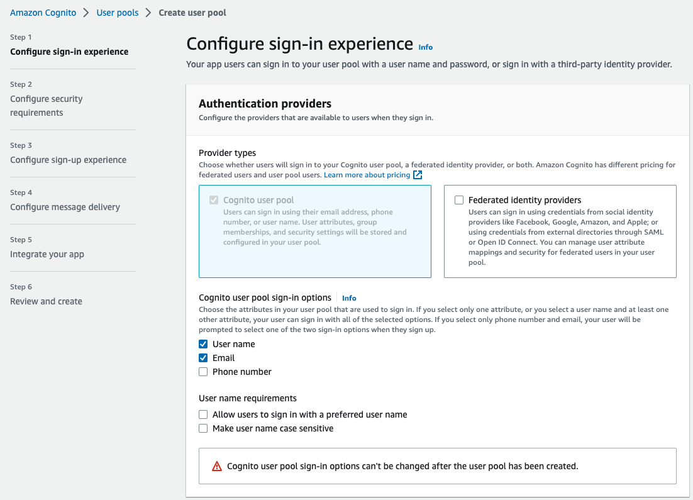


**Step 2:**
- In the `Password policy` section, we will be using the `Cognito defaults` for our project, but you can set a custom one if you want. 

- Next to the `Multi-factor authentication` section. We won't be using any MFA because this service is not included in the free tier. But, if you want to add an MFA, go over the [pricing](https://aws.amazon.com/cognito/pricing/) before implementation. 

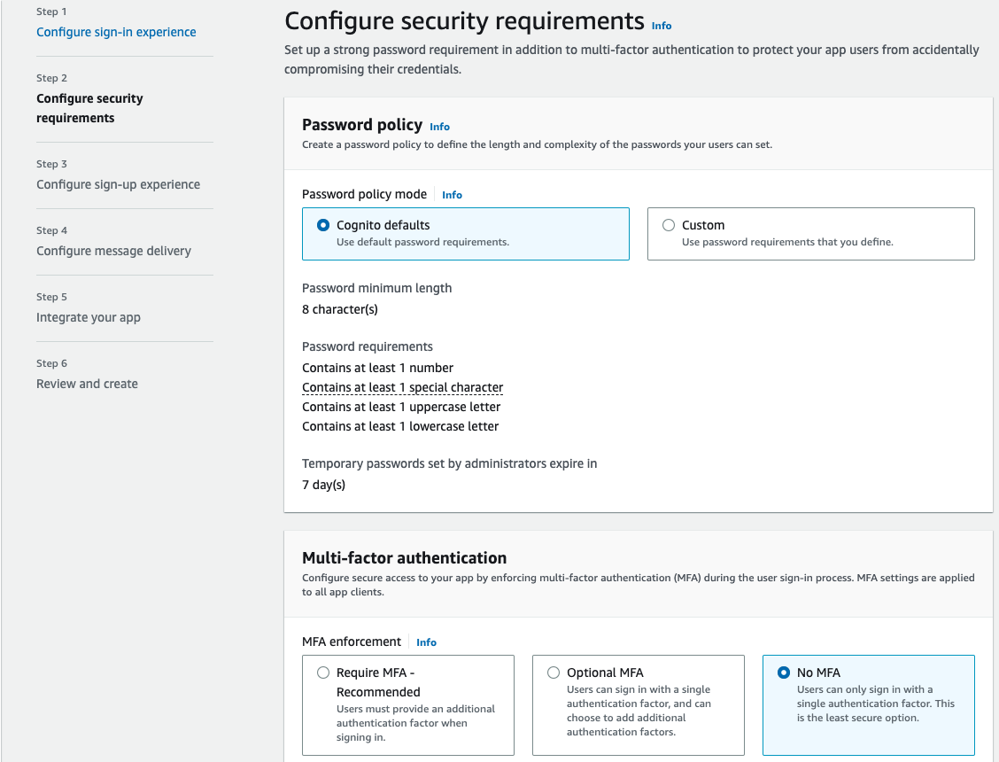

- In the `User account recovery` section, check the box that says `Enable self-service account recovery`. This feature enables users to be able to reset their password whenever they want.

- Now select the `Email only` option. We are using this feature because it is free. If you want to use the SMS option, check out the [pricing](https://aws.amazon.com/sns/sms-pricing/). Click **Next**

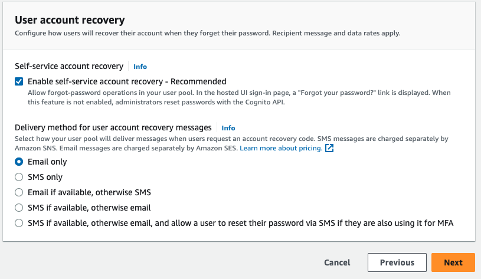


**Step 3:**
- In the `Self-service sign-up` section, make sure you check the box that says ` Enable self-registration`.

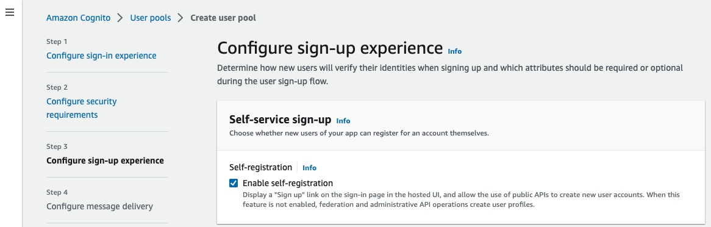

- Next to the `Attribute verification and user account confirmation` section. Make sure to leave the default selections. See the image below:

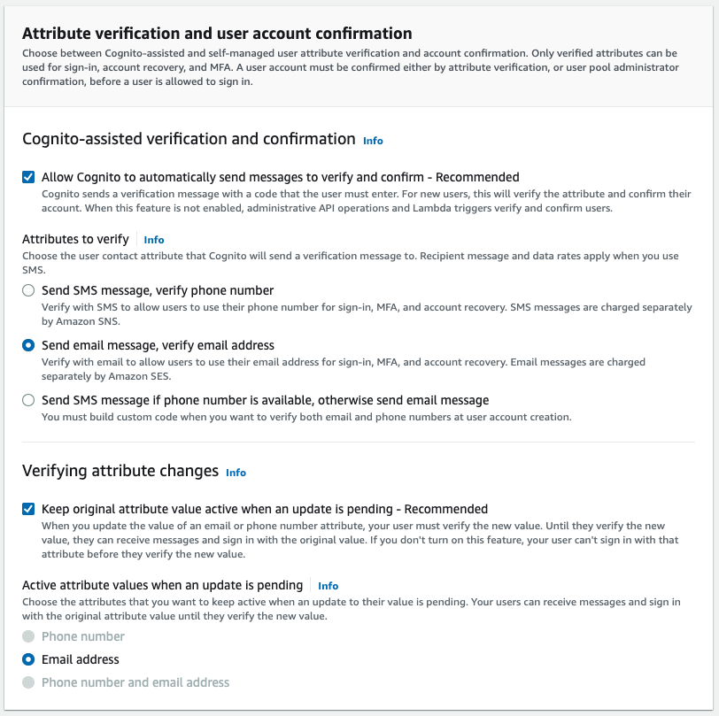

- In the `Required attributes` section, add some additional required attributes - `name` and `preferred_username`. 

**Note:Required attributes can't be changed once this user pool has been created.**

The `custom attributes` are optional to set since we will be using a database to store our data. Click **Next**

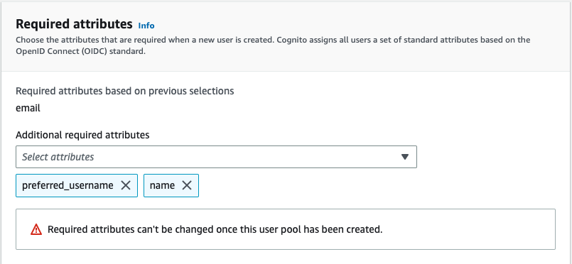


**Step 4:**
- In the `Email provider` section, change the selection to `Send email with Cognito`. After that, leave the default selection that comes with the option. Click **Next**

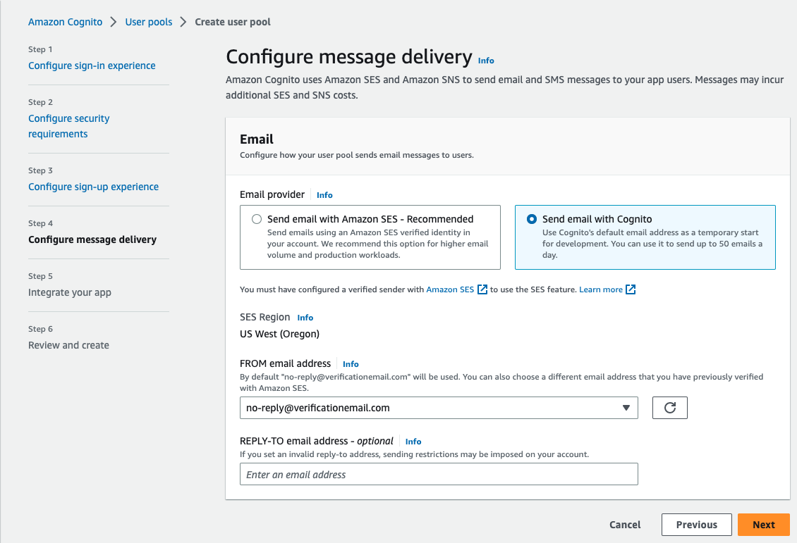


**Step 5:**
- In the `User pool name` section, add a name of your choice; mine was `cruddur-suer-pool`.

**Note: Your user pool name can't be changed once this user pool is created.**

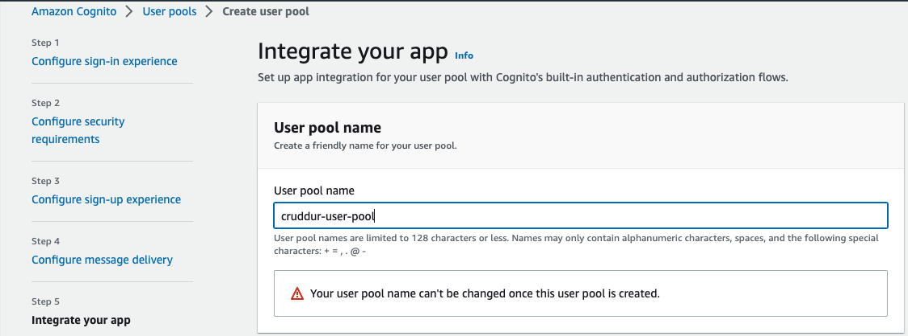

- Next to the `Hosted authentication pages` section, **DON'T** check the box that says `Use the Cognito Hosted UI`. We won't be using that feature for our project. 

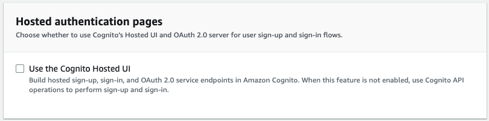

- In the `Initial app client` section, select `Public client` as our `App type`.

- Add a name for the `App client name`; mine was `cruddur`. After that, leave the rest of the default selections and click **Next**

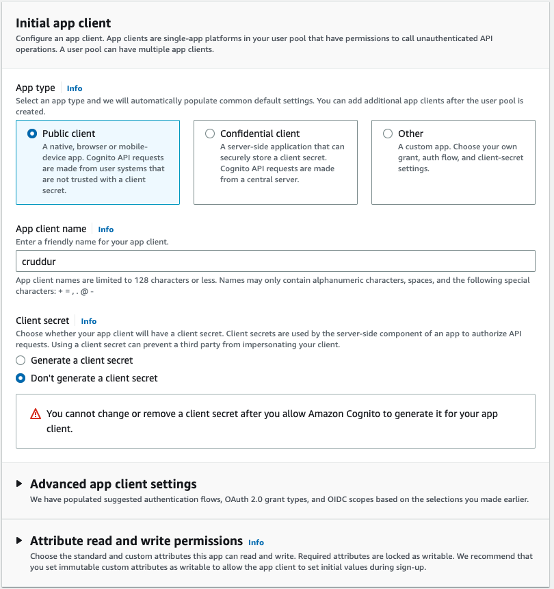


**Step 6:**
- In this section, we will review all our configurations and then go ahead to `Create user pool`. After creation, you should get this success message.


### 2. Configure Amazon Amplify

Amazon Amplify is a complete solution that lets frontend web and mobile developers easily build, ship, and host full-stack applications on AWS, with the flexibility to leverage the breadth of AWS services as use cases evolve. Check out this [link](https://aws.amazon.com/amplify/#:~:text=AWS%20Amplify%20is%20a%20complete,Build%20a%20frontend%20UI) for better explanation of the service.

Let's go ahead and configure our Amazon Amplify. 

- In your **Terminal**, navigate to the `frontend-react-js` directory, and run this command:
```bash
# navigate to frontend-react-js
cd frontend-react-js

# add aws-amplify library
npm i aws-amplify --save
# the --save flag saves the library to your package.json file 
```

- Go into your `frontend-react-js/src/App.js` and add the following contents. Make sure to add it before the `router` configuration. 

```js
// AWS Amplify
import { Amplify } from 'aws-amplify';

Amplify.configure({
  "AWS_PROJECT_REGION": process.env.REACT_APP_AWS_PROJECT_REGION,
  "aws_cognito_region": process.env.REACT_APP_AWS_COGNITO_REGION,
  "aws_user_pools_id": process.env.REACT_APP_AWS_USER_POOLS_ID,
  "aws_user_pools_web_client_id": process.env.REACT_APP_CLIENT_ID,
  "oauth": {},
  Auth: {
    // We are not using an Identity Pool
    // identityPoolId: process.env.REACT_APP_IDENTITY_POOL_ID, // REQUIRED - Amazon Cognito Identity Pool ID
    region: process.env.REACT_APP_AWS_PROJECT_REGION,           // REQUIRED - Amazon Cognito Region
    userPoolId: process.env.REACT_APP_AWS_USER_POOLS_ID,         // OPTIONAL - Amazon Cognito User Pool ID
    userPoolWebClientId: process.env.REACT_APP_AWS_USER_POOLS_WEB_CLIENT_ID,   // OPTIONAL - Amazon Cognito Web Client ID (26-char alphanumeric string)
  }
});
```

- Now let's set our environment variables from the code mentioned above. Go into your `docker-compose.yml` file, and under the `frontend-react-js` service, add the following lines:

```yaml
# AWS Amplify
REACT_APP_AWS_PROJECT_REGION: "${AWS_DEFAULT_REGION}"
REACT_APP_AWS_COGNITO_REGION: "${AWS_DEFAULT_REGION}"
REACT_APP_AWS_USER_POOLS_ID: "${REACT_APP_AWS_USER_POOLS_ID}"
REACT_APP_CLIENT_ID: "${REACT_APP_CLIENT_ID}"
```

**Important - To view your `user pool ID`, select the user pool name from the AWS console. For the `client ID`, click into the pool you created and look for the `App integration` tab as shown in the image below. Then scroll all the way down to view your `client ID`**

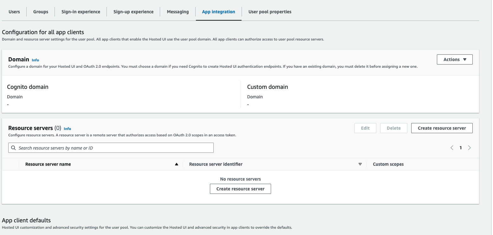

- In the `frontend-react-js/src/pages/HomeFeedPage.js` file, add the follwoing lines of code:

```js
// AWS Amplify
import { Auth } from 'aws-amplify';

// DELETE THESE LINES
const checkAuth = async () => {
    console.log('checkAuth')
    // [TODO] Authenication
    if (Cookies.get('user.logged_in')) {
      setUser({
        display_name: Cookies.get('user.name'),
        handle: Cookies.get('user.username')
      })
    }
  };


// ADD THESE LINES 
// check if we are authenicated
const checkAuth = async () => {
  Auth.currentAuthenticatedUser({
    // Optional, By default is false. 
    // If set to true, this call will send a 
    // request to Cognito to get the latest user data
    bypassCache: false 
  })
  .then((user) => {
    console.log('user',user);
    return Auth.currentAuthenticatedUser()
  }).then((cognito_user) => {
      setUser({
        display_name: cognito_user.attributes.name,
        handle: cognito_user.attributes.preferred_username
      })
  })
  .catch((err) => console.log(err));
};
```

- Now let's update our `frontend-react-js/src/components/ProfileInfo.js` file with the following contents:

```js
// DELETE THIS LINE 
import Cookies from 'js-cookie'

//ADD THIS LINE
// AWS Amplify
import { Auth } from 'aws-amplify';

// DELETE THESE LINES 
const signOut = async () => {
    console.log('signOut')
    // [TODO] Authenication
    Cookies.remove('user.logged_in')
    //Cookies.remove('user.name')
    //Cookies.remove('user.username')
    //Cookies.remove('user.email')
    //Cookies.remove('user.password')
    //Cookies.remove('user.confirmation_code')
    window.location.href = "/"
  }

// ADD THESE LINES 
const signOut = async () => {
  try {
      await Auth.signOut({ global: true });
      window.location.href = "/"
  } catch (error) {
      console.log('error signing out: ', error);
  }
}
```

After the above configurations, let's go ahead and spin up our application to be sure everything still works. 

```bash
# start up app
docker compose up
```

If you are encountering some error, follow the instructions below to resolve them.

**Troubleshooting**

If on initial start-up of your frontend application, you got a blank page and an error in your console like the image below. 

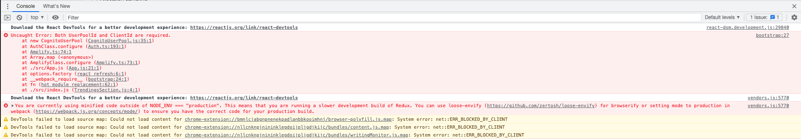

**Error message:** `Uncaught Error: Both UserPoolId and ClientId are required.`

Follow my steps below to resolve them. 
- First, let's view our environment variables in our `frontend-react-js` container. Do that by manually attaching a shell to the container, and type `env` to verify the variables are actually set in the container. OR use the following command to attach a shell to your container 

```bash
# to get the name of running containers 
docker ps 
OR 
docker container ls

# to get a bash shell in the running container
docker exec -it <container name> /bin/bash

# verify your env variables are set
env
```

- Second, navigate to your `App.js` and `docker-compose.yml` files to double-check if the env variables are rightly spelled out or configured. In the `App.js` file make these changes:

```js
// Replace the Auth{} section with this revised code 
Auth: {
    // We are not using an Identity Pool
    // identityPoolId: process.env.REACT_APP_IDENTITY_POOL_ID, // REQUIRED - Amazon Cognito Identity Pool ID
    region: process.env.REACT_APP_AWS_PROJECT_REGION,           // REQUIRED - Amazon Cognito Region
    userPoolId: process.env.REACT_APP_AWS_USER_POOLS_ID,         // OPTIONAL - Amazon Cognito User Pool ID
    userPoolWebClientId: process.env.REACT_APP_CLIENT_ID,   // OPTIONAL - Amazon Cognito Web Client ID (26-char alphanumeric string)
  }
```

Both steps should resolve the error. Now you should see your `frontend` again. 

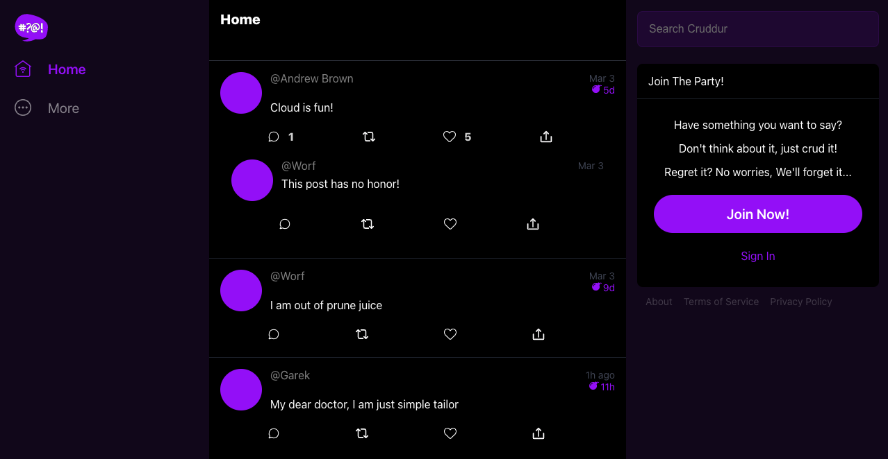


### 3. Implement Custom SignIn Page 

Let's configure our SignIn page. Go to your `frontend-react-js/src/pages/SigninPage.js` file and add the following lines of code:

```js
// AWS Amplify
// DELETE this line 
import Cookies from 'js-cookie'

// ADD this line instead
import { Auth } from 'aws-amplify';

// DELETE these line 
const onsubmit = async (event) => {
    event.preventDefault();
    setErrors('')
    console.log('onsubmit')
    if (Cookies.get('user.email') === email && Cookies.get('user.password') === password){
      Cookies.set('user.logged_in', true)
      window.location.href = "/"
    } else {
      setErrors("Email and password is incorrect or account doesn't exist")
    }
    return false
  }

// ADD these lines instead
const onsubmit = async (event) => {
  setErrors('')
  event.preventDefault();
  try {
    Auth.signIn(email, password)
      .then(user => {
        localStorage.setItem("access_token", user.signInUserSession.accessToken.jwtToken)
        window.location.href = "/"
      })
      .catch(err => { console.log('Error!', err) });
  } catch (error) {
    if (error.code == 'UserNotConfirmedException') {
      window.location.href = "/confirm"
    }
    setCognitoErrors(error.message)
  }
  return false
}
```

After the above configurations, let's go ahead and spin up our application to be sure everything still works. 

```bash
# start up app
docker compose up
```

Try signing in to your frontend and see if you get any errors. If you do, you are on the right track. Follow the steps below to resolve them.

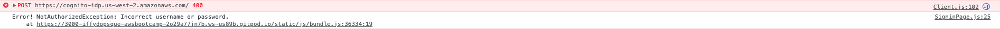


**Troubleshooting**
If you got the error message `Incorrect username or password` in your debug page instead of the UI, go ahead into your `frontend-react-js/src/pages/SignInPage.js` file and make these adjustments to correct the error display. 

```js
// Replace your previous "onsubmit" constant with the following
const onsubmit = async (event) => {
    setErrors('')
    event.preventDefault();
    Auth.signIn(email, password)
      .then(user => {
        localStorage.setItem("access_token", user.signInUserSession.accessToken.jwtToken)
        window.location.href = "/"
      })
      .catch(error => {
        if (error.code == 'UserNotConfirmedException') {
          window.location.href = "/confirm"
        }
        setErrors(error.message)
      }); 
      return false
  }
```

After the code adjustments, refresh your frontend and try logging in with fake credentials. Now you should get an error message displayed on the page like so:

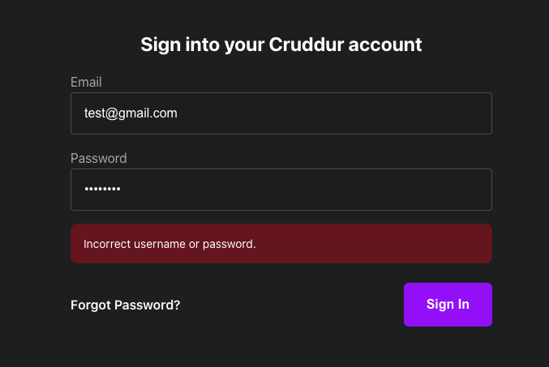


**Testing**
Now let's test our application with a real user. We will be creating our first user through the AWS console. 

- In the AWS console, navigate to **Cognito** where we created the user pool. Under the `User` tab, click the `Create user` button to create a user. 

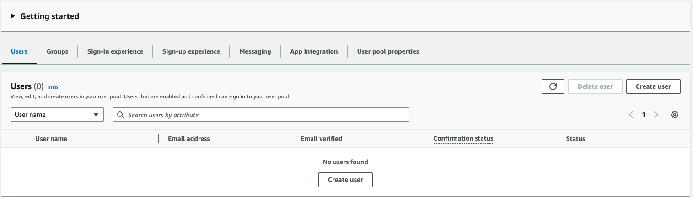

- In the `User name` section, enter any username of your choice. Do the same for your `Email address`. Make sure your email is real this time around.

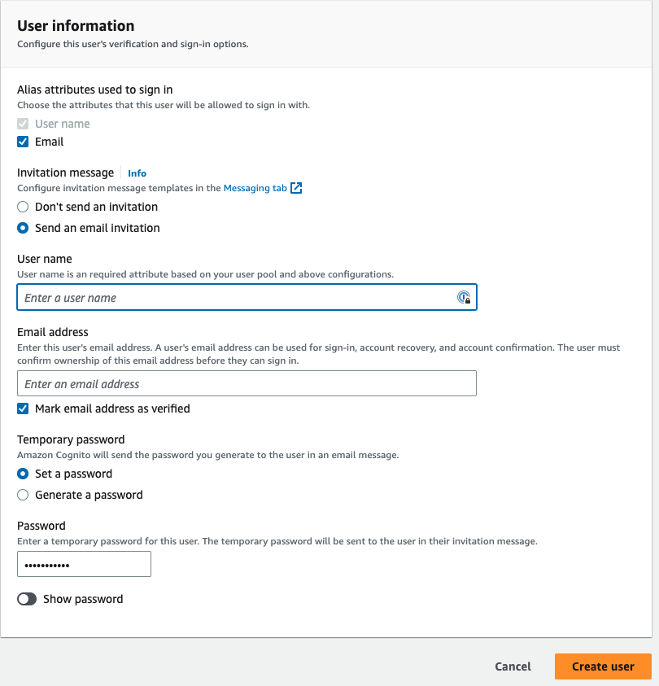

- After creation, you should get an email with your **username** and **temporary password**.

If while trying to log in with the newly created credentials and you get an error, follow the steps below to resolve them. 

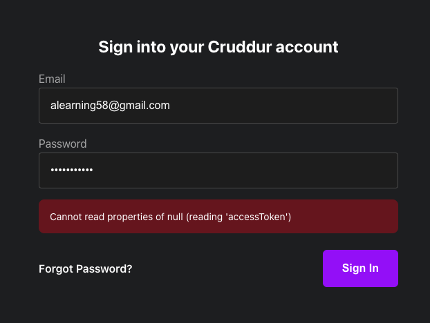

*Troubleshooting*
Let's fix that `accessToken` error. In your **Terminal** run the following command:

```bash
# to make sure your AWS credentials are properly set
aws sts get-caller-identity

# change user's password and update status
aws cognito-idp admin-set-user-password --user-pool-id <your-user-pool-id> --username <your-username> --password <your-password> --permanent
```

After the configuration, you should now be able to log into the application. 


### 4. Change Display Name and Handle

To change the display name `My Name` and `@handle` to a name of your choice, do the following:

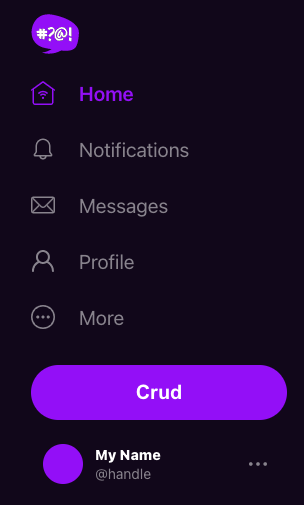

- In your AWS console, navigate to **Cognito** and select the created **user** you just created. 

- Under `User attributes`, select `Edit`

- Now give `preferred_name` and `username` of your choice. Click `Save changes`. Now log back in and you should see the **name** and **handle** you configured. 

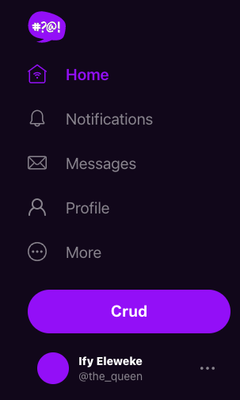


### 5. Implement Custom SignUp Page

Let's configure our SignUp page. Before that, let’s go ahead to disable and delete the created user from the AWS UI. 

Select the user; then you should see this screen. Go ahead and `Disable user access` and then `Delete`.

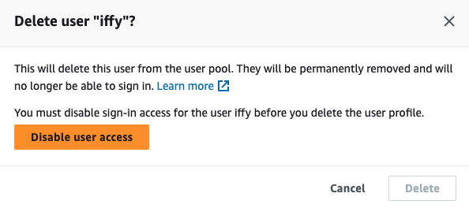

Now to configuration:
- In your `frontend-react-js/src/pages/SignUpPage.js` file, add the following contents:

```js
// AWS Amplify
// DELETE this line 
import Cookies from 'js-cookie'

// ADD this line instead
import { Auth } from 'aws-amplify';

// DELETE these lines
const onsubmit = async (event) => {
    event.preventDefault();
    console.log('SignupPage.onsubmit')
    // [TODO] Authenication
    Cookies.set('user.name', name)
    Cookies.set('user.username', username)
    Cookies.set('user.email', email)
    Cookies.set('user.password', password)
    Cookies.set('user.confirmation_code',1234)
    window.location.href = `/confirm?email=${email}`
    return false
  }

// ADD these lines
const onsubmit = async (event) => {
    event.preventDefault();
    setErrors('')
    try {
      const { user } = await Auth.signUp({
        username: email,
        password: password,
        attributes: {
            name: name,
            email: email,
            preferred_username: username,
        },
        autoSignIn: { // optional - enables auto sign in after user is confirmed
          enabled: true,
        }
      });
      console.log(user);
      window.location.href = `/confirm?email=${email}`
    } catch (error) {
        console.log(error);
        setCognitoErrors(error.message)
    }
    return false
  }
```


### 6. Implement Custom Confirmation Page

Let's configure our SignUp page. In your `frontend-react-js/src/pages/ConfirmationPage.js` file, add the following contents:

```js
// AWS Amplify
// DELETE this line 
import Cookies from 'js-cookie'

// ADD this line instead
import { Auth } from 'aws-amplify';

// Remember to replace the previous codes with these ones 
const resend_code = async (event) => {
    setErrors('')
    try {
      await Auth.resendSignUp(email);
      console.log('code resent successfully');
      setCodeSent(true)
    } catch (err) {
      // does not return a code
      // does cognito always return english
      // for this to be an okay match?
      console.log(err)
      if (err.message == 'Username cannot be empty'){
        setCognitoErrors("You need to provide an email in order to send Resend Activiation Code")   
      } else if (err.message == "Username/client id combination not found."){
        setCognitoErrors("Email is invalid or cannot be found.")   
      }
    }
  }

  const onsubmit = async (event) => {
    event.preventDefault();
    setErrors('')
    try {
      await Auth.confirmSignUp(email, code);
      window.location.href = "/"
    } catch (error) {
      setErrors(error.message)
    }
    return false
  }
```

After your configurations, let's go ahead and test them out. 

```bash
# start up app
docker compose up
```

After spin up, try signing up. There should be an error message in your debig page. Follow the steps below to resolve them.

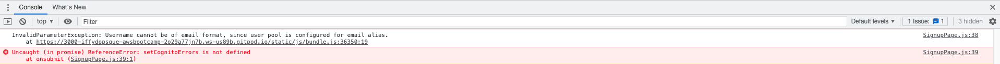

**Troubleshooting**
If you are getting the above error, it is because we checked the wrong box while creating our user pool in Cognito. Go ahead and recreate the user pool, this time, ensure not BOTH boxes are checked. 

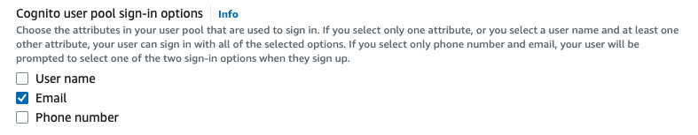

After creating the new **user pool**, copy the `user pool ID ` and `client ID` to your `docker-compose.yml` file. 

```yaml
REACT_APP_AWS_USER_POOLS_ID: ""
REACT_APP_CLIENT_ID: ""
```

After the changes, start up your application again. 

```bash
# start up app
docker compose up
```

You should now get this page after clicking the `Sign Up` button. 

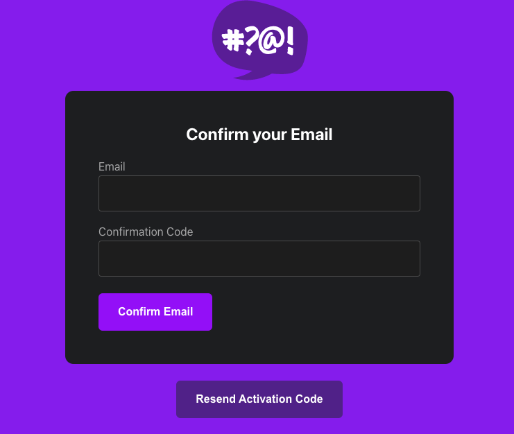

Before you verify your email, go over to your AWS console; under the `Users` tab, you should see that the created user has an `Unconfirmed` status. 

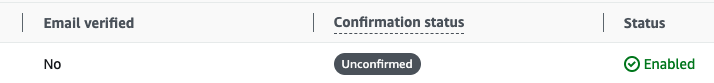

After confirmation, check back your AWS console, and you should see that the `Confirmation` status now says `confirmed`. 

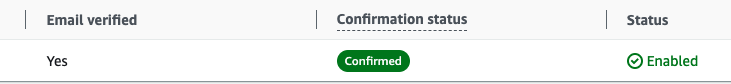

Now try logging into the application using the newly confirmed credential. Yay!!!

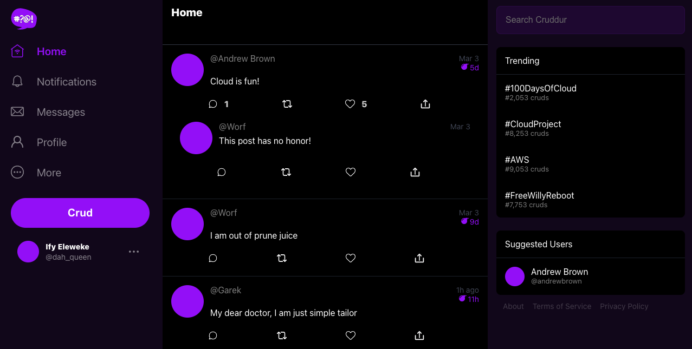


### 7. Implement Custom Recovery Page

Let's configure our Recovery Page. This page allows users to reset their password anytime they want. 

- In your `frontend-react-js/src/pages/RecoveryPage.js` file, add the following contents:

```js
// AWS Amplify
// DELETE this line 
import Cookies from 'js-cookie'

// ADD this line instead
import { Auth } from 'aws-amplify';

// DELETE these lines
const onsubmit_send_code = async (event) => {
    event.preventDefault();
    console.log('onsubmit_send_code')
    return false
  }

// ADD these lines
const onsubmit_send_code = async (event) => {
    event.preventDefault();
    setErrors('')
    Auth.forgotPassword(username)
    .then((data) => setFormState('confirm_code') )
    .catch((err) => setErrors(err.message) );
    return false
  }

// DELETE these lines
const onsubmit_confirm_code = async (event) => {
    event.preventDefault();
    console.log('onsubmit_confirm_code')
    return false
  }

// ADD these lines
const onsubmit_confirm_code = async (event) => {
    event.preventDefault();
    setErrors('')
    if (password == passwordAgain){
      Auth.forgotPasswordSubmit(username, code, password)
      .then((data) => setFormState('success'))
      .catch((err) => setErrors(err.message) );
    } else {
      setCognitoErrors('Passwords do not match')
    }
    return false
  }
```

After configuration, start up the application again. 

```bash
# start up app
docker compose up
```

**Testing**
- Click `Forgot Password` to test out your configuration. The page should look like this:

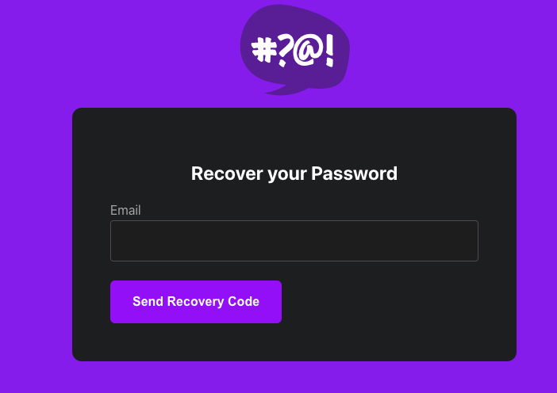

- Now go to your email to grab the recovery code sent to your email. Continue resetting your password. 

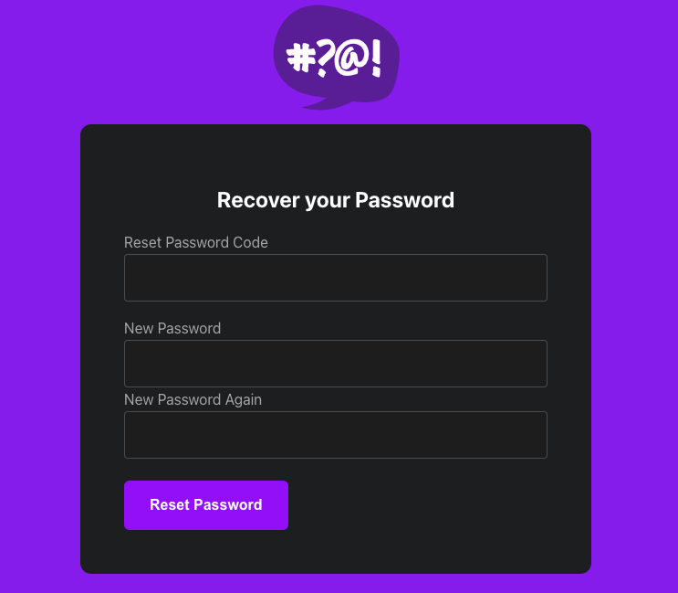


### 8. Cognito JWT server-side Verify

We need to pass our `accessToken` that is stored in `localStorage`.

- In the `frontend-react-js/src/pages/HomeFeedPage.js` file, add the following contents:

```js
// add in the const loadData = async ... section

// Authenticating Server Side
// Add in the `HomeFeedPage.js` a header to pass along the access token

  headers: {
    Authorization: `Bearer ${localStorage.getItem("access_token")}`
  }
```

**Fix CORS**
Replace our previous `cors` configuration with the following lines of code:

```py
# DELETE these lines 
cors = CORS(
  app, 
  resources={r"/api/*": {"origins": origins}},
  expose_headers="location,link",
  allow_headers="content-type,if-modified-since",
  methods="OPTIONS,GET,HEAD,POST"
)

# ADD these lines 
# cors = CORS(
  app, 
  resources={r"/api/*": {"origins": origins}},
  headers=['Content-Type', 'Authorization'], 
  expose_headers='Authorization',
  methods="OPTIONS,GET,HEAD,POST"
)
```

**Validating Our Token**

*Configuration*
- Add the library below to your `requirements.txt` file

```bash
# Library
Flask-AWSCognito

# install the library and its dependencies 
pip install -r backend-flask/requirements.txt
```

- Now let’s add some env variables in our `docker-compose.yml` file

```yaml
# under the backend-flask service
AWS_COGNITO_USER_POOL_ID: ""
AWS_COGNITO_USER_POOL_CLIENT_ID: ""
```

*Verification*
- In the `backend-flask` directory, create a new folder and file

```bash
# create folder 
mkdir backend-flask/lib/

# create the file 
touch backend-flask/lib/cognito_jwt_token.py
```

- In the new file, add the following content:

```py 
import time
import requests
from jose import jwk, jwt
from jose.exceptions import JOSEError
from jose.utils import base64url_decode

class FlaskAWSCognitoError(Exception):
  pass

class TokenVerifyError(Exception):
  pass

def extract_access_token(request_headers):
    access_token = None
    auth_header = request_headers.get("Authorization")
    if auth_header and " " in auth_header:
        _, access_token = auth_header.split()
    return access_token

class CognitoJwtToken:
    def __init__(self, user_pool_id, user_pool_client_id, region, request_client=None):
        self.region = region
        if not self.region:
            raise FlaskAWSCognitoError("No AWS region provided")
        self.user_pool_id = user_pool_id
        self.user_pool_client_id = user_pool_client_id
        self.claims = None
        if not request_client:
            self.request_client = requests.get
        else:
            self.request_client = request_client
        self._load_jwk_keys()


    def _load_jwk_keys(self):
        keys_url = f"https://cognito-idp.{self.region}.amazonaws.com/{self.user_pool_id}/.well-known/jwks.json"
        try:
            response = self.request_client(keys_url)
            self.jwk_keys = response.json()["keys"]
        except requests.exceptions.RequestException as e:
            raise FlaskAWSCognitoError(str(e)) from e

    @staticmethod
    def _extract_headers(token):
        try:
            headers = jwt.get_unverified_headers(token)
            return headers
        except JOSEError as e:
            raise TokenVerifyError(str(e)) from e

    def _find_pkey(self, headers):
        kid = headers["kid"]
        # search for the kid in the downloaded public keys
        key_index = -1
        for i in range(len(self.jwk_keys)):
            if kid == self.jwk_keys[i]["kid"]:
                key_index = i
                break
        if key_index == -1:
            raise TokenVerifyError("Public key not found in jwks.json")
        return self.jwk_keys[key_index]

    @staticmethod
    def _verify_signature(token, pkey_data):
        try:
            # construct the public key
            public_key = jwk.construct(pkey_data)
        except JOSEError as e:
            raise TokenVerifyError(str(e)) from e
        # get the last two sections of the token,
        # message and signature (encoded in base64)
        message, encoded_signature = str(token).rsplit(".", 1)
        # decode the signature
        decoded_signature = base64url_decode(encoded_signature.encode("utf-8"))
        # verify the signature
        if not public_key.verify(message.encode("utf8"), decoded_signature):
            raise TokenVerifyError("Signature verification failed")

    @staticmethod
    def _extract_claims(token):
        try:
            claims = jwt.get_unverified_claims(token)
            return claims
        except JOSEError as e:
            raise TokenVerifyError(str(e)) from e

    @staticmethod
    def _check_expiration(claims, current_time):
        if not current_time:
            current_time = time.time()
        if current_time > claims["exp"]:
            raise TokenVerifyError("Token is expired")  # probably another exception

    def _check_audience(self, claims):
        # and the Audience  (use claims['client_id'] if verifying an access token)
        audience = claims["aud"] if "aud" in claims else claims["client_id"]
        if audience != self.user_pool_client_id:
            raise TokenVerifyError("Token was not issued for this audience")

    def verify(self, token, current_time=None):
        """ https://github.com/awslabs/aws-support-tools/blob/master/Cognito/decode-verify-jwt/decode-verify-jwt.py """
        if not token:
            raise TokenVerifyError("No token provided")

        headers = self._extract_headers(token)
        pkey_data = self._find_pkey(headers)
        self._verify_signature(token, pkey_data)

        claims = self._extract_claims(token)
        self._check_expiration(claims, current_time)
        self._check_audience(claims)

        self.claims = claims 
        return claims
```

- Back into the `app.py` file, add the following contents:

```py
# Cognito
from lib.cognito_jwt_token import CognitoJwtToken, extract_access_token, TokenVerifyError

# after our app = Flask(__name__), add these lines
cognito_jwt_token = CognitoJwtToken(
  user_pool_id=os.getenv("AWS_COGNITO_USER_POOL_ID"), 
  user_pool_client_id=os.getenv("AWS_COGNITO_USER_POOL_CLIENT_ID"),
  region=os.getenv("AWS_DEFAULT_REGION")
)

# In @app.route("/api/activities/home", methods=['GET']), add these lines
# under def data_home():
access_token = extract_access_token(request.headers)
  try:
    claims = cognito_jwt_token.verify(access_token)
    # authenicatied request
    app.logger.debug("authenicated")
    app.logger.debug(claims)
    app.logger.debug(claims['username'])
    data = HomeActivities.run(cognito_user_id=claims['username'])
  except TokenVerifyError as e:
    # unauthenicatied request
    app.logger.debug(e)
    app.logger.debug("unauthenicated")
```

Here's a code sample:

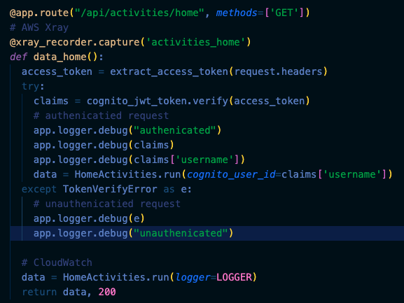

- Now in your `backend-flask/services/home_activities.py` file, let's add the following contents:

```py
# below the code but before return results
if cognito_user_id != None:
        extra_crud = {
          'uuid': '248959df-3079-4947-b847-9e0892d1bab4',
          'handle':  'Lore',
          'message': 'My dear brother, it the humans that are the problem',
          'created_at': (now - timedelta(hours=1)).isoformat(),
          'expires_at': (now + timedelta(hours=12)).isoformat(),
          'likes': 1042,
          'replies': []
        }
        results.insert(0,extra_crud)
```

**Expire Our Token Once Signed Out**
- To expire our token once we are signed out, add this line to your `frontend-react-js/src/components/ProfileInfo.js` file

```js
localStorage.removeItem("access_token")
```

Here's a code sample:

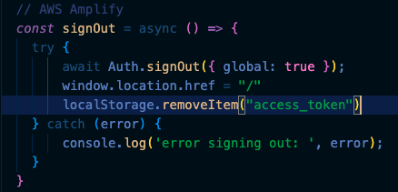

Now you should not see the post you made while signed in after you have signed out. 


## Misc Notes
As best practices, I saved the value of my **Cognito** environment variables to my shell session and `Gitpod`.

```bash
export REACT_APP_AWS_USER_POOLS_ID="us-west-2_*****"
gp env REACT_APP_AWS_USER_POOLS_ID="us-west-2_*****"

export REACT_APP_CLIENT_ID="********"
gp env REACT_APP_CLIENT_ID="********"
```
