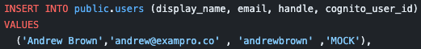
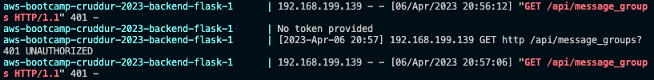
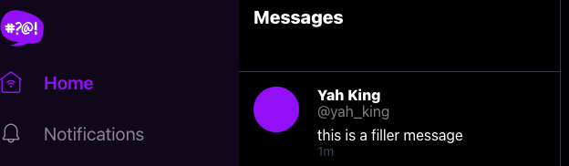
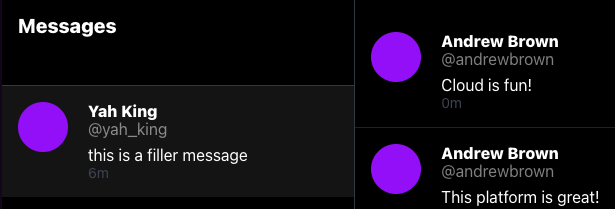
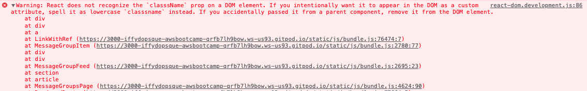
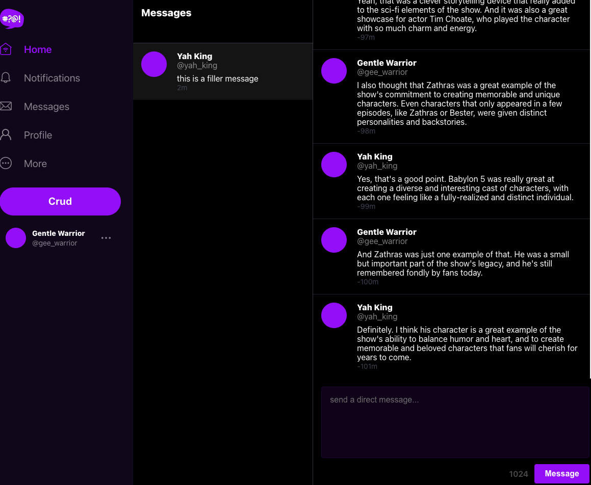
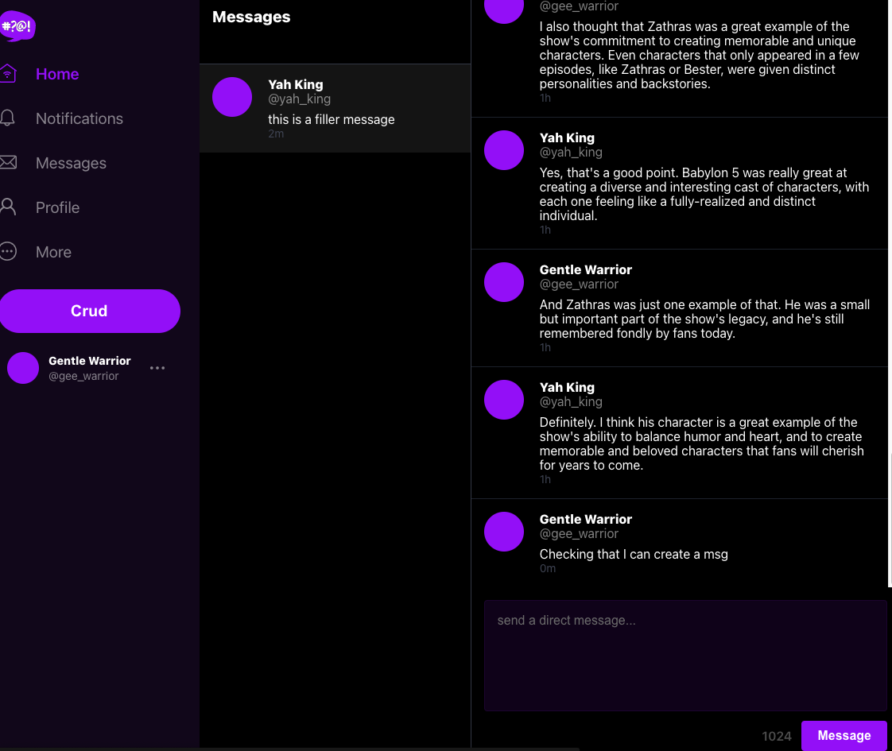

# Week 5 — DynamoDB and Serverless Caching

## Required Homework/Tasks

All the tasks under this section is done using `Gitpod` workspace.

### 1. Implement DynamoDB Utility

We will need to install `boto3` libraries into our application.

**Boto3** is the Amazon Web Services (AWS) Software Development Kit (SDK) for Python, which allows Python developers to write software that makes use of services like Amazon S3 and Amazon EC2. It simply makes it easy to integrate your Python application, library, or script with AWS services. You can find the most up-to-date documentation at their [doc site](https://boto3.amazonaws.com/v1/documentation/api/latest/index.html), including a list of services that are supported.

<details><summary>Install Boto3</summary>
<p>
To install the `boto3` library onto our application, add the following line to your `backend-flask/requirements.txt` file:

```bash
# add this to your requirements.txt file
boto3

# install the library you've just added 
pip install -r backend-flask/requirements.txt
```

After the installation, start up your application by doing a `docker compose up`. This is required for us to be able to use our `dynamodb-local` we had installed the previous weeks. 
</p>
</details>

<details><summary>Files re-organization</summary>
<p>
For our re-organization, let’s move our DB operations script to a folder `../bin/db/` and remove the `db-` prefix on those scripts since they will now be in a `db` folder. Also create a `../bin/rds/` folder to move the `rds-security-grp` file into there and don’t forget to remove the `rds-` prefix on the file as well. 
  
```bash
# In your backend-flask/bin directory create a db, rds, & ddb directory
mkdir backend-flask/bin/db
mkdir backend-flask/bin/rds
mkdir backend-flask/bin/ddb
```

**After these changes, don’t forget to change them in the scripts they’ve been mentioned.** 

To move those files to the right directories and rename them, use these commands:
```bash
# copy files to destination and rename them at the same time
mv backend-flask/bin/db-connect backend-flask/bin/db/connect
mv backend-flask/bin/db-create backend-flask/bin/db/create
mv backend-flask/bin/db-drop backend-flask/bin/db/drop
mv backend-flask/bin/db-schema-load backend-flask/bin/db/schema-load
mv backend-flask/bin/db-seed backend-flask/bin/db/seed
mv backend-flask/bin/db-sessions backend-flask/bin/db/sessions
mv backend-flask/bin/db-setup backend-flask/bin/db/setup
mv backend-flask/bin/rds-update-sg-rule backend-flask/bin/rds/update-sg-rule
```

Now let’s make the corresponding changes to our files that referenced the old files we changed. 

- In the setup script, change the path to reference the correct file:
```bash
# change these 
bin_path="$(realpath .)/backend-flask/bin"

source "$bin_path/db-drop"
source "$bin_path/db-create"
source "$bin_path/db-schema-load"
source "$bin_path/db-seed"

# to these 
bin_path="$(realpath .)/backend-flask/bin/db"

source "$bin_path/drop"
source "$bin_path/create"
source "$bin_path/schema-load"
source "$bin_path/seed"
```

Don’t forget to change the `security_group` path in your `gitpod.yml` file. Make these changes:
```yaml
# change this 
source "$THEIA_WORKSPACE_ROOT/backend-flask/bin/rds-update-sg-rule"

# to this 
source "$THEIA_WORKSPACE_ROOT/backend-flask/bin/rds/update-sg-rule"
```
</p>
</details>

**Implement Schema Load Script**

This script loads your schema to DynamoDB. It has a conditional that allows you to use the script either for your local `dev` environment or `prd` which is our DynamoDB in AWS. We went for the default options so as to stay within the AWS free tier. For example, ReadCapacityUnits and WriteCapacityUnits can't be above certain values for the free tier.

<details><summary>Implementation</summary>
<p>

In the `backend-flask/bin/ddb/` folder, create a `schema-load` script for our DynamoDB. 

```bash
# create the schema load script
touch backend-flask/bin/ddb/schema-load 
```

In the `ddb/schema-load` file, add the following:

```python
#!/usr/bin/env python3

import boto3
import sys

attrs = {
  'endpoint_url': 'http://localhost:8000'
}

if len(sys.argv) == 2:
  if "prd" in sys.argv[1]:
    attrs = {}

ddb = boto3.client('dynamodb',**attrs)

table_name = 'cruddur-messages'

response = ddb.create_table(
  TableName=table_name,
  AttributeDefinitions=[
    {
      'AttributeName': 'pk',
      'AttributeType': 'S'
    },
    {
      'AttributeName': 'sk',
      'AttributeType': 'S'
    },
  ],
  KeySchema=[
    {
      'AttributeName': 'pk',
      'KeyType': 'HASH'
    },
    {
      'AttributeName': 'sk',
      'KeyType': 'RANGE'
    },
  ],
  #GlobalSecondaryIndexes=[
  #],
  BillingMode='PROVISIONED',
  ProvisionedThroughput={
      'ReadCapacityUnits': 5,
      'WriteCapacityUnits': 5
  }
)

print(response)
```
  
To ensure you have the right permissions to execute the newly created script, run the following commands:

```bash
# by default, you will get a permission denied when trying to run a script you just created
# run this command to grant it permission - https://www.tutorialspoint.com/unix/unix-file-permission.htm
chmod 555 backend-flask/bin/ddb/schema-load
  
# execute the script 
./backend-flask/bin/ddb/schema-load
```

<details><summary>List Tables</summary>
<p>

To be able to view/list our tables, let’s create a bash script for that. 

```bash
# create the list tables script
touch backend-flask/bin/ddb/list-tables 
```

In the `ddb/list-tables`, add the following:

```bash
#! /usr/bin/bash
set -e # stop if it fails at any point

if [ "$1" = "prd" ]; then
  ENDPOINT_URL=""
else
  ENDPOINT_URL="--endpoint-url=http://localhost:8000"
fi

aws dynamodb list-tables $ENDPOINT_URL \
--query TableNames \
--output table
```
  
To ensure you have the right permissions to execute the newly created script, run the following commands:

```bash
# by default, you will get a permission denied when trying to run a script you just created
# run this command to grant it permission - https://www.tutorialspoint.com/unix/unix-file-permission.htm
chmod 555 backend-flask/bin/ddb/list-tables
  
# execute the script 
./backend-flask/bin/ddb/list-tables
```
</p>
</details>

</p>
</details>

**Implement Drop Script**

This script is used to delete our DynamoDB. It checks for a table-name argument, if none is provided, it prompts you a command sample to use instead. It also has a conditional that allows you to use the script to drop your DB if it is the local `dev` environment.

<details><summary>Implementation</summary>
<p>

In the `backend-flask/bin/ddb/` folder, create a `drop` script for our DynamoDB. 

```bash
# create the drop script
touch backend-flask/bin/ddb/drop 
```

In your `ddb/drop` file, add the following:

```python
#! /usr/bin/bash

set -e # stop if it fails at any point

if [ -z "$1" ]; then
  echo "No TABLE_NAME argument supplied eg ./backend-flask/bin/ddb/drop cruddur-messages prd"
  exit 1
fi
TABLE_NAME=$1

if [ "$2" = "prd" ]; then
  ENDPOINT_URL=""
else
  ENDPOINT_URL="--endpoint-url=http://localhost:8000"
fi

echo "Deleting table: $TABLE_NAME"

aws dynamodb delete-table $ENDPOINT_URL \
  --table-name $TABLE_NAME
```
  
To ensure you have the right permissions to execute the newly created script, run the following commands:

```bash
# by default, you will get a permission denied when trying to run a script you just created
# run this command to grant it permission - https://www.tutorialspoint.com/unix/unix-file-permission.htm
chmod 555 backend-flask/bin/ddb/drop
  
# execute the script 
./backend-flask/bin/ddb/drop cruddur-messages
```
</p>
</details>

**Implement Seed Script**

This script has the option to be used for either `dev` or `prd`. To create the script, a function in SQL is needed to get the user uuid from RDS. Once the uuid is obtained, the seed script can be used to populate the DynamoDB tables.

This script has two functions, `create_message_group` and `create_message`. 
- The `create_message` function adds a message to DynamoDB and uses the `user` details obtained in the SQL query. 
- The `create_message_group` function is used to create a new message group. It will be called twice, one for `my_user` and the other for the `other_user`.

The script also has some mock data to populate the message group. 

<details><summary>Implementation</summary>
<p>

```python
#!/usr/bin/env python3

import boto3
import os
import sys
from datetime import datetime, timedelta, timezone
import uuid

current_path = os.path.dirname(os.path.abspath(__file__))
parent_path = os.path.abspath(os.path.join(current_path, '..', '..'))
sys.path.append(parent_path)
from lib.db import db

attrs = {
  'endpoint_url': 'http://localhost:8000'
}
# unset endpoint url for use with production database
if len(sys.argv) == 2:
  if "prd" in sys.argv[1]:
    attrs = {}
ddb = boto3.client('dynamodb',**attrs)

def get_user_uuids():
  sql = """
    SELECT 
      users.uuid,
      users.display_name,
      users.handle
    FROM users
    WHERE
      users.handle IN(
        %(my_handle)s,
        %(other_handle)s
        )
  """
  users = db.query_array_json(sql,{
    'my_handle':  'gee_warrior',        # based on data in your seed.sql file
    'other_handle': 'godofthunder'      # based on data in your seed.sql file
  })
  my_user    = next((item for item in users if item["handle"] == 'gee_warrior'), None)
  other_user = next((item for item in users if item["handle"] == 'godofthunder'), None)
  results = {
    'my_user': my_user,
    'other_user': other_user
  }
  print('get_user_uuids')
  print(results)
  return results

def create_message_group(client,message_group_uuid, my_user_uuid, last_message_at=None, message=None, other_user_uuid=None, other_user_display_name=None, other_user_handle=None):
  table_name = 'cruddur-messages'
  record = {
    'pk':   {'S': f"GRP#{my_user_uuid}"},
    'sk':   {'S': last_message_at},
    'message_group_uuid': {'S': message_group_uuid},
    'message':  {'S': message},
    'user_uuid': {'S': other_user_uuid},
    'user_display_name': {'S': other_user_display_name},
    'user_handle': {'S': other_user_handle}
  }

  response = client.put_item(
    TableName=table_name,
    Item=record
  )
  print(response)

def create_message(client,message_group_uuid, created_at, message, my_user_uuid, my_user_display_name, my_user_handle):
  table_name = 'cruddur-messages'
  record = {
    'pk':   {'S': f"MSG#{message_group_uuid}"},
    'sk':   {'S': created_at },
    'message_uuid': { 'S': str(uuid.uuid4()) },
    'message': {'S': message},
    'user_uuid': {'S': my_user_uuid},
    'user_display_name': {'S': my_user_display_name},
    'user_handle': {'S': my_user_handle}
  }
  # insert the record into the table
  response = client.put_item(
    TableName=table_name,
    Item=record
  )
  # print the response
  print(response)

message_group_uuid = "5ae290ed-55d1-47a0-bc6d-fe2bc2700399" 
now = datetime.now(timezone.utc).astimezone()
users = get_user_uuids()

create_message_group(
  client=ddb,
  message_group_uuid=message_group_uuid,
  my_user_uuid=users['my_user']['uuid'],
  other_user_uuid=users['other_user']['uuid'],
  other_user_handle=users['other_user']['handle'],
  other_user_display_name=users['other_user']['display_name'],
  last_message_at=now.isoformat(),
  message="this is a filler message"
)

create_message_group(
  client=ddb,
  message_group_uuid=message_group_uuid,
  my_user_uuid=users['other_user']['uuid'],
  other_user_uuid=users['my_user']['uuid'],
  other_user_handle=users['my_user']['handle'],
  other_user_display_name=users['my_user']['display_name'],
  last_message_at=now.isoformat(),
  message="this is a filler message"
)

conversation = """
Person 1: Have you ever watched Babylon 5? It's one of my favorite TV shows!
Person 2: Yes, I have! I love it too. What's your favorite season?
Person 1: I think my favorite season has to be season 3. So many great episodes, like "Severed Dreams" and "War Without End."
Person 2: Yeah, season 3 was amazing! I also loved season 4, especially with the Shadow War heating up and the introduction of the White Star.
Person 1: Agreed, season 4 was really great as well. I was so glad they got to wrap up the storylines with the Shadows and the Vorlons in that season.
Person 2: Definitely. What about your favorite character? Mine is probably Londo Mollari.
Person 1: Londo is great! My favorite character is probably G'Kar. I loved his character development throughout the series.
Person 2: G'Kar was definitely a standout character. I also really liked Delenn's character arc and how she grew throughout the series.
Person 1: Delenn was amazing too, especially with her role in the Minbari Civil War and her relationship with Sheridan. Speaking of which, what did you think of the Sheridan character?
Person 2: I thought Sheridan was a great protagonist. He was a strong leader and had a lot of integrity. And his relationship with Delenn was so well-done.
Person 1: I totally agree! I also really liked the dynamic between Garibaldi and Bester. Those two had some great scenes together.
Person 2: Yes! Their interactions were always so intense and intriguing. And speaking of intense scenes, what did you think of the episode "Intersections in Real Time"?
Person 1: Oh man, that episode was intense. It was so well-done, but I could barely watch it. It was just too much.
Person 2: Yeah, it was definitely hard to watch. But it was also one of the best episodes of the series in my opinion.
Person 1: Absolutely. Babylon 5 had so many great episodes like that. Do you have a favorite standalone episode?
Person 2: Hmm, that's a tough one. I really loved "The Coming of Shadows" in season 2, but "A Voice in the Wilderness" in season 1 was also great. What about you?
Person 1: I think my favorite standalone episode might be "The Long Twilight Struggle" in season 2. It had some great moments with G'Kar and Londo.
Person 2: Yes, "The Long Twilight Struggle" was definitely a standout episode. Babylon 5 really had so many great episodes and moments throughout its run.
Person 1: Definitely. It's a shame it ended after only five seasons, but I'm glad we got the closure we did with the series finale.
Person 2: Yeah, the series finale was really well-done. It tied up a lot of loose ends and left us with a great sense of closure.
Person 1: It really did. Overall, Babylon 5 is just such a great show with fantastic characters, writing, and world-building.
Person 2: Agreed. It's one of my favorite sci-fi shows of all time and I'm always happy to revisit it.
Person 1: Same here. I think one of the things that makes Babylon 5 so special is its emphasis on politics and diplomacy. It's not just a show about space battles and aliens, but about the complex relationships between different species and their political maneuvering.
Person 2: Yes, that's definitely one of the show's strengths. And it's not just about big-picture politics, but also about personal relationships and the choices characters make.
Person 1: Exactly. I love how Babylon 5 explores themes of redemption, forgiveness, and sacrifice. Characters like G'Kar and Londo have such compelling arcs that are driven by their choices and actions.
Person 2: Yes, the character development in Babylon 5 is really top-notch. Even minor characters like Vir and Franklin get their moments to shine and grow over the course of the series.
Person 1: I couldn't agree more. And the way the show handles its themes is so nuanced and thought-provoking. For example, the idea of "the one" and how it's used by different characters in different ways.
Person 2: Yes, that's a really interesting theme to explore. And it's not just a one-dimensional concept, but something that's explored in different contexts and with different characters.
Person 1: And the show also does a great job of balancing humor and drama. There are so many funny moments in the show, but it never detracts from the serious themes and the high stakes.
Person 2: Absolutely. The humor is always organic and never feels forced. And the show isn't afraid to go dark when it needs to, like in "Intersections in Real Time" or the episode "Sleeping in Light."
Person 1: Yeah, those episodes are definitely tough to watch, but they're also some of the most powerful and memorable episodes of the series. And it's not just the writing that's great, but also the acting and the production values.
Person 2: Yes, the acting is fantastic across the board. From Bruce Boxleitner's performance as Sheridan to Peter Jurasik's portrayal of Londo, every actor brings their A-game. And the production design and special effects are really impressive for a TV show from the 90s.
Person 1: Definitely. Babylon 5 was really ahead of its time in terms of its visuals and special effects. And the fact that it was all done on a TV budget makes it even more impressive.
Person 2: Yeah, it's amazing what they were able to accomplish with the limited resources they had. It just goes to show how talented the people behind the show were.
Person 1: Agreed. It's no wonder that Babylon 5 has such a devoted fanbase, even all these years later. It's just such a well-crafted and timeless show.
Person 2: Absolutely. I'm glad we can still appreciate it and talk about it all these years later. It really is a show that stands the test of time.
Person 1: One thing I really appreciate about Babylon 5 is how it handles diversity and representation. It has a really diverse cast of characters from different species and backgrounds, and it doesn't shy away from exploring issues of prejudice and discrimination.
Person 2: Yes, that's a great point. The show was really ahead of its time in terms of its diverse cast and the way it tackled issues of race, gender, and sexuality. And it did so in a way that felt natural and integrated into the story.
Person 1: Definitely. It's great to see a show that's not afraid to tackle these issues head-on and address them in a thoughtful and nuanced way. And it's not just about representation, but also about exploring different cultures and ways of life.
Person 2: Yes, the show does a great job of world-building and creating distinct cultures for each of the species. And it's not just about their physical appearance, but also about their customs, beliefs, and values.
Person 1: Absolutely. It's one of the things that sets Babylon 5 apart from other sci-fi shows. The attention to detail and the thought that went into creating this universe is really impressive.
Person 2: And it's not just the aliens that are well-developed, but also the human characters. The show explores the different factions and political ideologies within EarthGov, as well as the different cultures and traditions on Earth.
Person 1: Yes, that's another great aspect of the show. It's not just about the conflicts between different species, but also about the internal struggles within humanity. And it's all tied together by the overarching plot of the Shadow War and the fate of the galaxy.
Person 2: Definitely. The show does a great job of balancing the episodic stories with the larger arc, so that every episode feels important and contributes to the overall narrative.
Person 1: And the show is also great at building up tension and suspense. The slow burn of the Shadow War and the mystery of the Vorlons and the Shadows kept me on the edge of my seat throughout the series.
Person 2: Yes, the show is really good at building up anticipation and delivering satisfying payoffs. Whether it's the resolution of a character arc or the climax of a season-long plotline, Babylon 5 always delivers.
Person 1: Agreed. It's just such a well-crafted and satisfying show, with so many memorable moments and characters. I'm really glad we got to talk about it today.
Person 2: Me too. It's always great to geek out about Babylon 5 with someone who appreciates it as much as I do!
Person 1: Yeah, it's always fun to discuss our favorite moments and characters from the show. And there are so many great moments to choose from!
Person 2: Definitely. I think one of the most memorable moments for me was the "goodbye" scene between G'Kar and Londo in the episode "Objects at Rest." It was such a poignant and emotional moment, and it really showed how far their characters had come.
Person 1: Yes, that was a really powerful scene. It was great to see these two former enemies come together and find common ground. And it was a great way to wrap up their character arcs.
Person 2: Another memorable moment for me was the speech that Sheridan gives in "Severed Dreams." It's such an iconic moment in the show, and it really encapsulates the themes of the series.
Person 1: Yes, that speech is definitely one of the highlights of the series. It's so well-written and well-delivered, and it really captures the sense of hope and defiance that the show is all about.
Person 2: And speaking of great speeches, what did you think of the "Ivanova is always right" speech from "Moments of Transition"?
Person 1: Oh man, that speech gives me chills every time I watch it. It's such a powerful moment for Ivanova, and it really shows her strength and determination as a leader.
Person 2: Yes, that speech is definitely a standout moment for Ivanova's character. And it's just one example of the great writing and character development in the show.
Person 1: Absolutely. It's a testament to the talent of the writers and actors that they were able to create such rich and complex characters with so much depth and nuance.
Person 2: And it's not just the main characters that are well-developed, but also the supporting characters like Marcus, Zack, and Lyta. They all have their own stories and struggles, and they all contribute to the larger narrative in meaningful ways.
Person 1: Definitely. Babylon 5 is just such a well-rounded and satisfying show in every way. It's no wonder that it's still beloved by fans all these years later.
Person 2: Agreed. It's a show that has stood the test of time, and it will always hold a special place in my heart as one of my favorite TV shows of all time.
Person 1: One of the most interesting ethical dilemmas presented in Babylon 5 is the treatment of the Narn by the Centauri. What do you think about that storyline?
Person 2: Yeah, it's definitely a difficult issue to grapple with. On the one hand, the Centauri were portrayed as the aggressors, and their treatment of the Narn was brutal and unjust. But on the other hand, the show also presented some nuance to the situation, with characters like Londo and Vir struggling with their own complicity in the conflict.
Person 1: Exactly. I think one of the strengths of the show is its willingness to explore complex ethical issues like this. It's not just about good guys versus bad guys, but about the shades of grey in between.
Person 2: Yeah, and it raises interesting questions about power and oppression. The Centauri had more advanced technology and military might than the Narn, which allowed them to dominate and subjugate the Narn people. But at the same time, there were also political and economic factors at play that contributed to the conflict.
Person 1: And it's not just about the actions of the Centauri government, but also about the actions of individual characters. Londo, for example, was initially portrayed as a somewhat sympathetic character, but as the series progressed, we saw how his choices and actions contributed to the suffering of the Narn people.
Person 2: Yes, and that raises interesting questions about personal responsibility and accountability. Can an individual be held responsible for the actions of their government or their society? And if so, to what extent?
Person 1: That's a really good point. And it's also interesting to consider the role of empathy and compassion in situations like this. Characters like G'Kar and Delenn showed compassion towards the Narn people and fought against their oppression, while others like Londo and Cartagia were more indifferent or even sadistic in their treatment of the Narn.
Person 2: Yeah, and that raises the question of whether empathy and compassion are innate traits, or whether they can be cultivated through education and exposure to different cultures and perspectives.
Person 1: Definitely. And it's also worth considering the role of forgiveness and reconciliation. The Narn and Centauri eventually came to a sort of reconciliation in the aftermath of the Shadow War, but it was a difficult and painful process that required a lot of sacrifice and forgiveness on both sides.
Person 2: Yes, and that raises the question of whether forgiveness is always possible or appropriate in situations of oppression and injustice. Can the victims of such oppression ever truly forgive their oppressors, or is that too much to ask?
Person 1: It's a tough question to answer. I think the show presents a hopeful message in the end, with characters like G'Kar and Londo finding a measure of redemption and reconciliation. But it's also clear that the scars of the conflict run deep and that healing takes time and effort.
Person 2: Yeah, that's a good point. Ultimately, I think the show's treatment of the Narn-Centauri conflict raises more questions than it answers, which is a testament to its complexity and nuance. It's a difficult issue to grapple with, but one that's worth exploring and discussing.
Person 1: Let's switch gears a bit and talk about the character of Natasha Alexander. What did you think about her role in the series?
Person 2: I thought Natasha Alexander was a really interesting character. She was a tough and competent security officer, but she also had a vulnerable side and a complicated past.
Person 1: Yeah, I agree. I think she added a lot of depth to the show and was a great foil to characters like Garibaldi and Zack.
Person 2: And I also appreciated the way the show handled her relationship with Garibaldi. It was clear that they had a history and a lot of unresolved tension, but the show never made it too melodramatic or over-the-top.
Person 1: That's a good point. I think the show did a good job of balancing the personal drama with the larger political and sci-fi elements. And it was refreshing to see a female character who was just as tough and competent as the male characters.
Person 2: Definitely. I think Natasha Alexander was a great example of a well-written and well-rounded female character. She wasn't just there to be eye candy or a love interest, but had her own story and agency.
Person 1: However, I did feel like the show could have done more with her character. She was introduced fairly late in the series, and didn't have as much screen time as some of the other characters.
Person 2: That's true. I think the show had a lot of characters to juggle, and sometimes that meant some characters got sidelined or didn't get as much development as they deserved.
Person 1: And I also thought that her storyline with Garibaldi could have been developed a bit more. They had a lot of history and tension between them, but it felt like it was resolved too quickly and neatly.
Person 2: I can see where you're coming from, but I also appreciated the way the show didn't drag out the drama unnecessarily. It was clear that they both had feelings for each other, but they also had to focus on their jobs and the larger conflicts at play.
Person 1: I can see that perspective as well. Overall, I think Natasha Alexander was a great addition to the show and added a lot of value to the series. It's a shame we didn't get to see more of her.
Person 2: Agreed. But at least the show was able to give her a satisfying arc and resolution in the end. And that's a testament to the show's strength as a whole.
Person 1: One thing that really stands out about Babylon 5 is the quality of the special effects. What did you think about the show's use of CGI and other visual effects?
Person 2: I thought the special effects in Babylon 5 were really impressive, especially for a show that aired in the 90s. The use of CGI to create the spaceships and other sci-fi elements was really innovative for its time.
Person 1: Yes, I was really blown away by the level of detail and realism in the effects. The ships looked so sleek and futuristic, and the space battles were really intense and exciting.
Person 2: And I also appreciated the way the show integrated the visual effects with the live-action footage. It never felt like the effects were taking over or overshadowing the characters or the story.
Person 1: Absolutely. The show had a great balance of practical effects and CGI, which helped to ground the sci-fi elements in a more tangible and realistic world.
Person 2: And it's also worth noting the way the show's use of visual effects evolved over the course of the series. The effects in the first season were a bit rough around the edges, but by the end of the series, they had really refined and perfected the look and feel of the show.
Person 1: Yes, I agree. And it's impressive how they were able to accomplish all of this on a TV budget. The fact that the show was able to create such a rich and immersive sci-fi universe with limited resources is a testament to the talent and creativity of the production team.
Person 2: Definitely. And it's one of the reasons why the show has aged so well. Even today, the visual effects still hold up and look impressive, which is a rarity for a show that's almost 30 years old.
Person 1: Agreed. And it's also worth noting the way the show's use of visual effects influenced other sci-fi shows that came after it. Babylon 5 really set the bar for what was possible in terms of sci-fi visuals on TV.
Person 2: Yes, it definitely had a big impact on the genre as a whole. And it's a great example of how innovative and groundbreaking sci-fi can be when it's done right.
Person 1: Another character I wanted to discuss is Zathras. What did you think of his character?
Person 2: Zathras was a really unique and memorable character. He was quirky and eccentric, but also had a lot of heart and sincerity.
Person 1: Yes, I thought he was a great addition to the show. He added some much-needed comic relief, but also had some important moments of character development.
Person 2: And I appreciated the way the show used him as a sort of plot device, with his knowledge of time and space being instrumental in the resolution of some of the show's major storylines.
Person 1: Definitely. It was a great way to integrate a seemingly minor character into the larger narrative. And it was also interesting to see the different versions of Zathras from different points in time.
Person 2: Yeah, that was a clever storytelling device that really added to the sci-fi elements of the show. And it was also a great showcase for actor Tim Choate, who played the character with so much charm and energy.
Person 1: I also thought that Zathras was a great example of the show's commitment to creating memorable and unique characters. Even characters that only appeared in a few episodes, like Zathras or Bester, were given distinct personalities and backstories.
Person 2: Yes, that's a good point. Babylon 5 was really great at creating a diverse and interesting cast of characters, with each one feeling like a fully-realized and distinct individual.
Person 1: And Zathras was just one example of that. He was a small but important part of the show's legacy, and he's still remembered fondly by fans today.
Person 2: Definitely. I think his character is a great example of the show's ability to balance humor and heart, and to create memorable and beloved characters that fans will cherish for years to come.
"""

lines = conversation.lstrip('\n').rstrip('\n').split('\n')
for i in range(len(lines)):
  if lines[i].startswith('Person 1: '):
    key = 'my_user'
    message = lines[i].replace('Person 1: ', '')
  elif lines[i].startswith('Person 2: '):
    key = 'other_user'
    message = lines[i].replace('Person 2: ', '')
  else:
    print(lines[i])
    raise 'invalid line'

  created_at = (now + timedelta(minutes=i)).isoformat()
  create_message(
    client=ddb,
    message_group_uuid=message_group_uuid,
    created_at=created_at,
    message=message,
    my_user_uuid=users[key]['uuid'],
    my_user_display_name=users[key]['display_name'],
    my_user_handle=users[key]['handle']
  )
```

To ensure you have the right permissions to execute the newly created script, run the following commands:

```bash
# by default, you will get a permission denied when trying to run a script you just created
# run this command to grant it permission - https://www.tutorialspoint.com/unix/unix-file-permission.htm
chmod 555 backend-flask/bin/ddb/seed

# Test out your configuration by inserting some mock data in your `seed.sql` file and then run this command:
# to setup our database
./backend-flask/bin/db/setup

# execute the script 
./backend-flask/bin/ddb/seed
```
</p>
</details>


**Implement Scan Script**

This script easily scans your database and ensures your data is there. This implementation is only for `dev` it can be expensive for a `prd` env. This is to be used after seeding your DB as this returns all data included in your seed script.

<details><summary>Implementation</summary>
<p>

In the `backend-flask/bin/ddb/` folder, create a `scan` script for our DynamoDB. 

```bash
# create the scan script
touch backend-flask/bin/ddb/scan 
```

In your `ddb/scan` file, add the following:

```python
#!/usr/bin/env python3

import boto3

attrs = {
  'endpoint_url': 'http://localhost:8000'
}
ddb = boto3.resource('dynamodb',**attrs)
table_name = 'cruddur-messages'

table = ddb.Table(table_name)
response = table.scan()

items = response['Items']
for item in items:
  print(item)
```
  
To ensure you have the right permissions to execute the newly created script, run the following commands:

```bash
# by default, you will get a permission denied when trying to run a script you just created
# run this command to grant it permission - https://www.tutorialspoint.com/unix/unix-file-permission.htm
chmod 555 backend-flask/bin/ddb/scan

# execute the script 
./backend-flask/bin/ddb/scan
```  
</p>
</details>


### 2. Implement Pattern Scripts for Read and List Conversations

We will be creating two scripts in this section to read conversation, `get-conversation`, and list conversations, `list-conversations`. These are for our access patterns A & B. 
- In the `get-conversation` script, we will be getting conversation based on a particular year
- In the `list-conversations` script, we will be listing conversations of a particular user

<details><summary>Implementation</summary>
<p>

In the `backend-flask/bin/ddb/` folder, create a folder `patterns` with the following scripts inside `get-conversation` and `list-conversations`:

```bash
# create the "patterns" directory
mkdir backend-flask/bin/ddb/patterns

# create the "get-conversation" and "list-conversations" scripts
touch backend-flask/bin/ddb/patterns/get-conversation
touch backend-flask/bin/ddb/patterns/list-conversations 
```

In your `/ddb/patterns/get-conversation` file, add the following:
```python
#!/usr/bin/env python3

import boto3
import sys
import json
import datetime

attrs = {
  'endpoint_url': 'http://localhost:8000'
}

if len(sys.argv) == 2:
  if "prd" in sys.argv[1]:
    attrs = {}

dynamodb = boto3.client('dynamodb',**attrs)
table_name = 'cruddur-messages'

message_group_uuid = "5ae290ed-55d1-47a0-bc6d-fe2bc2700399"

# define the query parameters
current_year = datetime.datetime.now().year
query_params = {
  'TableName': table_name,
  'ScanIndexForward': False,
  'Limit': 20,
  'ReturnConsumedCapacity': 'TOTAL',
  'KeyConditionExpression': 'pk = :pk AND begins_with(sk,:year)',
  #'KeyConditionExpression': 'pk = :pk AND sk BETWEEN :start_date AND :end_date',
  'ExpressionAttributeValues': {
    ':year': {'S': '2023'},
    #":start_date": { "S": "2023-03-01T00:00:00.000000+00:00" },
    #":end_date": { "S": "2023-03-19T23:59:59.999999+00:00" },
    ':pk': {'S': f"MSG#{message_group_uuid}"}
  }
}

# query the table
response = dynamodb.query(**query_params)

# print the items returned by the query
print(json.dumps(response, sort_keys=True, indent=2))

# print the consumed capacity
print(json.dumps(response['ConsumedCapacity'], sort_keys=True, indent=2))

items = response['Items']
items.reverse()

for item in items:
  sender_handle = item['user_handle']['S']
  message       = item['message']['S']
  timestamp     = item['sk']['S']
  dt_object = datetime.datetime.strptime(timestamp, '%Y-%m-%dT%H:%M:%S.%f%z')
  formatted_datetime = dt_object.strftime('%Y-%m-%d %I:%M %p')
  print(f'{sender_handle: <12}{formatted_datetime: <22}{message[:40]}...')
```

To ensure you have the right permissions to execute the newly created script, run the following commands:

```bash
# by default, you will get a permission denied when trying to run a script you just created
# run this command to grant it permission - https://www.tutorialspoint.com/unix/unix-file-permission.htm
chmod 555 backend-flask/bin/ddb/patterns/get-conversation
  
# execute the script 
./backend-flask/bin/ddb/patterns/get-conversation
```

In your `/ddb/patterns/list-conversations` file, add the following:
```python
#!/usr/bin/env python3

import boto3
import sys
import json
import os
import datetime

current_path = os.path.dirname(os.path.abspath(__file__))
parent_path = os.path.abspath(os.path.join(current_path, '..', '..', '..'))
sys.path.append(parent_path)
from lib.db import db

attrs = {
  'endpoint_url': 'http://localhost:8000'
}

if len(sys.argv) == 2:
  if "prd" in sys.argv[1]:
    attrs = {}

dynamodb = boto3.client('dynamodb',**attrs)
table_name = 'cruddur-messages'

def get_my_user_uuid():
  sql = """
    SELECT 
      users.uuid
    FROM users
    WHERE
      users.handle =%(handle)s
  """
  uuid = db.query_value(sql,{
    'handle':  'gee_warrior'
  })
  return uuid

my_user_uuid = get_my_user_uuid()
print(f"my-uuid: {my_user_uuid}")

current_year = datetime.datetime.now().year

# define the query parameters
query_params = {
  'TableName': table_name,
      'KeyConditionExpression': 'pk = :pk AND begins_with(sk,:year)',
  'ScanIndexForward': False,
  'ExpressionAttributeValues': {
    ':year': {'S': str(current_year) },
    ':pk': {'S': f"GRP#{my_user_uuid}"}
  },
  'ReturnConsumedCapacity': 'TOTAL'
}

# query the table
response = dynamodb.query(**query_params)

# print the items returned by the query
print(json.dumps(response, sort_keys=True, indent=2))
```
  
To ensure you have the right permissions to execute the newly created script, run the following commands:

```bash
# by default, you will get a permission denied when trying to run a script you just created
# run this command to grant it permission - https://www.tutorialspoint.com/unix/unix-file-permission.htm
chmod 555 backend-flask/bin/ddb/patterns/list-conversations
  
# execute the script 
./backend-flask/bin/ddb/patterns/list-conversations
```
</p>
</details>

<details><summary>Troubleshooting</summary>
<p>
To avoid getting the `AttributeError: 'Db' object has no attribute 'query_value'` error, follow the steps below.

Add to your `backend-flask/lib/db.py` file:
```python
# add to your "db.py" file 
def query_value(self,sql,params={}):
    self.print_sql('value',sql,params)
    with self.pool.connection() as conn:
      with conn.cursor() as cur:
        cur.execute(sql,params)
        json = cur.fetchone()
        return json[0]

# in the "print_sql" method, make the following changes 
# BEFORE
def print_sql(self,title,sql):

#another line 
print(sql)

# UPDATED
def print_sql(self,title,sql,params={}):

# another line 
print(sql,params)


# make the following changes in these methods 
# in "def query_object_json(self,sql,params={}):"
self.print_sql('json',sql,params)

# in "def query_array_json(self,sql,params={}):"
self.print_sql('array',sql,params)
```

After the modifications, run this command again:
```bash
# list conversations
./backend-flask/bin/ddb/patterns/list-conversations
```
</p>
</details>


### 3. Implement Conversations with DynamoDB 

This should be our default page before any conversation implementation.


<details><summary>Implementation</summary>
<p>

To implement the access patterns for our conversations, we need to create a new file, `ddb.py` which is our DynamoDB library file.
  
In `backend-flask/lib/` folder, create the file:
```bash
# create file
touch backend-flask/lib/ddb.py
```
  
Add the following contents to your file:
```python
import boto3
import sys
from datetime import datetime, timedelta, timezone
import uuid
import os
import botocore.exceptions

class Ddb:
  def client():
    endpoint_url = os.getenv("AWS_ENDPOINT_URL")
    if endpoint_url:
      attrs = { 'endpoint_url': endpoint_url }
    else:
      attrs = {}
    dynamodb = boto3.client('dynamodb',**attrs)
    return dynamodb

  def list_message_groups(client,my_user_uuid):
    year = str(datetime.now().year)
  # hardcoding the table name here 
  # best practice -> use env variable of the respective environments
  # like stg, sbx or prd
    table_name = 'cruddur-messages'
    query_params = {
      'TableName': table_name,
      'KeyConditionExpression': 'pk = :pk AND begins_with(sk,:year)',
      'ScanIndexForward': False,
      'Limit': 20,
      'ExpressionAttributeValues': {
        ':year': {'S': year },
        ':pk': {'S': f"GRP#{my_user_uuid}"}
      }
    }
    print('query-params:',query_params)
    print(query_params)
    # query the table
    response = client.query(**query_params)
    items = response['Items']
    
    results = []
    for item in items:
      last_sent_at = item['sk']['S']
      results.append({
        'uuid': item['message_group_uuid']['S'],
        'display_name': item['user_display_name']['S'],
        'handle': item['user_handle']['S'],
        'message': item['message']['S'],
        'created_at': last_sent_at
      })
    return results

  def list_messages(client,message_group_uuid):
    year = str(datetime.now().year)
    table_name = 'cruddur-messages'
    query_params = {
      'TableName': table_name,
      'KeyConditionExpression': 'pk = :pk AND begins_with(sk,:year)',
      'ScanIndexForward': False,
      'Limit': 20,
      'ExpressionAttributeValues': {
        ':year': {'S': year },
        ':pk': {'S': f"MSG#{message_group_uuid}"}
      }
    }

    response = client.query(**query_params)
    items = response['Items']
    items.reverse()
    results = []
    for item in items:
      created_at = item['sk']['S']
      results.append({
        'uuid': item['message_uuid']['S'],
        'display_name': item['user_display_name']['S'],
        'handle': item['user_handle']['S'],
        'message': item['message']['S'],
        'created_at': created_at
      })
    return results

  def create_message(client,message_group_uuid, message, my_user_uuid, my_user_display_name, my_user_handle):
    now = datetime.now(timezone.utc).astimezone().isoformat()
    created_at = now
    message_uuid = str(uuid.uuid4())

    record = {
      'pk':   {'S': f"MSG#{message_group_uuid}"},
      'sk':   {'S': created_at },
      'message': {'S': message},
      'message_uuid': {'S': message_uuid},
      'user_uuid': {'S': my_user_uuid},
      'user_display_name': {'S': my_user_display_name},
      'user_handle': {'S': my_user_handle}
    }
  
    # insert the record into the table
    table_name = 'cruddur-messages'
    response = client.put_item(
      TableName=table_name,
      Item=record
    )
  
    # print the response
    print(response)
    return {
      'message_group_uuid': message_group_uuid,
      'uuid': my_user_uuid,
      'display_name': my_user_display_name,
      'handle':  my_user_handle,
      'message': message,
      'created_at': created_at
    }

  def create_message_group(client, message,my_user_uuid, my_user_display_name, my_user_handle, other_user_uuid, other_user_display_name, other_user_handle):
    print('== create_message_group.1')
    table_name = 'cruddur-messages'

    message_group_uuid = str(uuid.uuid4())
    message_uuid = str(uuid.uuid4())
    now = datetime.now(timezone.utc).astimezone().isoformat()
    last_message_at = now
    created_at = now
    print('== create_message_group.2')

    my_message_group = {
      'pk': {'S': f"GRP#{my_user_uuid}"},
      'sk': {'S': last_message_at},
      'message_group_uuid': {'S': message_group_uuid},
      'message': {'S': message},
      'user_uuid': {'S': other_user_uuid},
      'user_display_name': {'S': other_user_display_name},
      'user_handle':  {'S': other_user_handle}
    }

    print('== create_message_group.3')
    other_message_group = {
      'pk': {'S': f"GRP#{other_user_uuid}"},
      'sk': {'S': last_message_at},
      'message_group_uuid': {'S': message_group_uuid},
      'message': {'S': message},
      'user_uuid': {'S': my_user_uuid},
      'user_display_name': {'S': my_user_display_name},
      'user_handle':  {'S': my_user_handle}
    }

    print('== create_message_group.4')
    message = {
      'pk':   {'S': f"MSG#{message_group_uuid}"},
      'sk':   {'S': created_at },
      'message': {'S': message},
      'message_uuid': {'S': message_uuid},
      'user_uuid': {'S': my_user_uuid},
      'user_display_name': {'S': my_user_display_name},
      'user_handle': {'S': my_user_handle}
    }

    items = {
      table_name: [
        {'PutRequest': {'Item': my_message_group}},
        {'PutRequest': {'Item': other_message_group}},
        {'PutRequest': {'Item': message}}
      ]
    }

    try:
      print('== create_message_group.try')
      # Begin the transaction
      response = client.batch_write_item(RequestItems=items)
      return {
        'message_group_uuid': message_group_uuid
      }
    except botocore.exceptions.ClientError as e:
      print('== create_message_group.error')
      print(e)
```

After those configurations, set your DynamoDB endpoint in your `docker-compose.yml` file like so:

```yaml
# under the backend-flask environments 
AWS_ENDPOINT_URL: "http://dynamodb-local:8000"

# the dynamodb-local is the container name we gave it below the docker compose file
```
</p>
</details>


### 4. Update Cognito ID Script for Postgres Database

In our `seed.sql` file, we will see that we called our `cognito_user_id` ’MOCK’ instead of the real user id. Like so,



Now, we want to start pulling the real user information from Cognito and populating our actual `cognito_user_id` that contains the right user handles into our application. So let’s create a script to help us better pull and populate those IDs. 

<details><summary>Implementation</summary>
<p>

Create a folder `backend-flask/bin/cognito` with a script called `list-users`

```bash
# create directory
mkdir backend-flask/bin/cognito

# create script file 
touch backend-flask/bin/cognito/list-users
```

Add the following content to the script file:

```python
#!/usr/bin/env python3

import boto3
import os
import json

userpool_id = os.getenv("AWS_COGNITO_USER_POOL_ID")
client = boto3.client('cognito-idp')
params = {
  'UserPoolId': userpool_id,
  'AttributesToGet': [
      'preferred_username',
      'sub'
  ]
}
response = client.list_users(**params)
users = response['Users']

print(json.dumps(users, sort_keys=True, indent=2, default=str))

dict_users = {}
for user in users:
  attrs = user['Attributes']
  sub    = next((a for a in attrs if a["Name"] == 'sub'), None)
  handle = next((a for a in attrs if a["Name"] == 'preferred_username'), None)
  dict_users[handle['Value']] = sub['Value']

print(json.dumps(dict_users, sort_keys=True, indent=2, default=str))
```
  
To ensure you have the right permissions to execute the newly created script, run the following commands:

```bash
# by default, you will get a permission denied when trying to run a script you just created
# run this command to grant it permission - https://www.tutorialspoint.com/unix/unix-file-permission.htm
chmod 555 backend-flask/bin/cognito/list-users
  
# execute the script 
./backend-flask/bin/cognito/list-users
```

To check if you can pull the data from `cognito` run the following command:
```bash
# list users in cognito
aws cognito-idp list-users --user-pool-id=<USER_POOL_ID>
```
  
Don’t forget to set your `cognito_user_pool_id` as an environment variable. Check if you have it already. 
```bash
export AWS_COGNITO_USER_POOL_ID="..."
gp env AWS_COGNITO_USER_POOL_ID="..." 
```

Now let's update those `cognito_user_id`s. Create a script in the `backend-flask/bin/db` directory called `update_cognito_user_ids`. This script gets all our users from Cognito and then updates the user ID. 

```bash
# create file 
touch backend-flask/bin/db/update_cognito_user_ids
```

Add the following content to the created file:
```python
#!/usr/bin/env python3

import boto3
import os
import sys

print("== Update Cognito User IDs")

current_path = os.path.dirname(os.path.abspath(__file__))
parent_path = os.path.abspath(os.path.join(current_path, '..', '..'))
sys.path.append(parent_path)
from lib.db import db

def update_users_with_cognito_user_id(handle,sub):
  sql = """
    UPDATE public.users
    SET cognito_user_id = %(sub)s
    WHERE
      users.handle = %(handle)s;
  """
  db.query_commit(sql,{
    'handle' : handle,
    'sub' : sub
  })

def get_cognito_user_ids():
  userpool_id = os.getenv("AWS_COGNITO_USER_POOL_ID")
  client = boto3.client('cognito-idp')
  params = {
    'UserPoolId': userpool_id,
    'AttributesToGet': [
        'preferred_username',
        'sub'
    ]
  }
  response = client.list_users(**params)
  users = response['Users']
  dict_users = {}
  for user in users:
    attrs = user['Attributes']
    sub    = next((a for a in attrs if a["Name"] == 'sub'), None)
    handle = next((a for a in attrs if a["Name"] == 'preferred_username'), None)
    dict_users[handle['Value']] = sub['Value']
  return dict_users


users = get_cognito_user_ids()

for handle, sub in users.items():
  print('----',handle,sub)
  update_users_with_cognito_user_id(
    handle=handle,
    sub=sub
  )
```
  
To ensure you have the right permissions to execute the newly created script, run the following commands:

```bash
# by default, you will get a permission denied when trying to run a script you just created
# run this command to grant it permission - https://www.tutorialspoint.com/unix/unix-file-permission.htm
chmod 555 backend-flask/bin/db/update_cognito_user_ids
  
# execute the script 
./backend-flask/bin/db/update_cognito_user_ids
```
  
Now go back to your `backend-flask/bin/db/setup` file and update it with the following line:

```bash
# add this line last 
python "$bin_path/update_cognito_user_ids"
```

Also, in your `backend-flask/lib/db.py` file, edit this line of code to this:
```bash
# in the "def query_commit(self,sql,params={}):" section
# add "params" as one of the arguments
self.print_sql('commit with returning',sql,params)
```

Make sure to use the local Postgres DB, not the RDS one; else, you will encounter some errors because it won’t be running. Check your `docker-compose.yml` file and comment the one for `prd` and uncomment the one for `local` environment. 

When you have your `docker-compose.yml` file updated, do a `./backend-flask/bin/db/setup` to set up the Postgres DB. Now go ahead and do a `./backend-flask/bin/db/update_cognito_user_ids`. 

Instead of using hardcoded `handles`, let's use our Cognito user ids. Go into your `backend-flask/app.py` file, and make the following changes:
  
```python
# in the @app.route("/api/message_groups", methods=['GET']) section
  
# DELETE THESE
@app.route("/api/message_groups", methods=['GET'])
def data_message_groups():
  user_handle  = 'andrewbrown'
  model = MessageGroups.run(user_handle=user_handle)
  if model['errors'] is not None:
    return model['errors'], 422
  else:
    return model['data'], 200 

# ADD THESE 
@app.route("/api/message_groups", methods=['GET'])
def data_message_groups():
  access_token = extract_access_token(request.headers)
  try:
    claims = cognito_jwt_token.verify(access_token)
    # authenicatied request
    app.logger.debug("authenicated")
    app.logger.debug(claims)
    cognito_user_id = claims['sub']
    model = MessageGroups.run(cognito_user_id=cognito_user_id)
    if model['errors'] is not None:
      return model['errors'], 422
    else:
      return model['data'], 200
  except TokenVerifyError as e:
    # unauthenicatied request
    app.logger.debug(e)
    return {}, 401
```
</p>
</details>


### 5. Access Patterns Implementation - Implementing Patterns A & B

In pattern A, we will be listing messages in a message group and pattern B will just be listing message groups. 

The original content of the `message_groups.py` file returned `MOCK` data, but now it returns actual data from DynamoDB.

The `list_message_groups` function is quite similar to the `list-conversations` script that was created earlier. The only difference is that it doesn't simply dump JSON but iterates through the items.

<details><summary>Implementating Pattern A</summary>
<p>

Go ahead into your `backend-flask/services/message_groups.py` file, and add the following content:
```python
# DELETE THESE
class MessageGroups:
  def run(user_handle):
    model = {
      'errors': None,
      'data': None
    }

    now = datetime.now(timezone.utc).astimezone()
    results = [
      {
        'uuid': '24b95582-9e7b-4e0a-9ad1-639773ab7552',
        'display_name': 'Andrew Brown',
        'handle':  'andrewbrown',
        'created_at': now.isoformat()
      },
      {
        'uuid': '417c360e-c4e6-4fce-873b-d2d71469b4ac',
        'display_name': 'Worf',
        'handle':  'worf',
        'created_at': now.isoformat()
    }]
    model['data'] = results
    return model

# ADD THESE 
from lib.ddb import Ddb
from lib.db import db

class MessageGroups:
  def run(cognito_user_id):
    model = {
      'errors': None,
      'data': None
    }

    sql = db.template('users','uuid_from_cognito_user_id')
    my_user_uuid = db.query_value(sql,{
      'cognito_user_id': cognito_user_id
    })

    print(f"UUID: {my_user_uuid}")

    ddb = Ddb.client()
    data = Ddb.list_message_groups(ddb, my_user_uuid)
    print("list_message_groups:",data)

    model['data'] = data
    return model
```
  
Now, in our `backend-flask/db/sql/` folder, we will be creating another folder `users` and `uuid_from_cognito_user_id.sql` file inside the newly created folder.
  
```bash
# create directory 
mkdir backend-flask/db/sql/users

# create file 
touch backend-flask/db/sql/users/uuid_from_cognito_user_id.sql
```
  
Add the following content to the file:
```sql
  SELECT
  users.uuid
FROM public.users
WHERE 
  users.cognito_user_id = %(cognito_user_id)s
LIMIT 1
```
  
After the above configurations, if you try to start up your `frontend` application, you will encounter a `Cookies` and `token authorization` error which can be fixed by following the steps below.

<details><summary>Fix Cookies and token authorization</summary>
<p>

In your `frontend-react-js/src/pages/HomeFeedPage.js` file, make the following code changes:

```js
// DELETE THIS 
// [TODO] Authenication
import Cookies from 'js-cookie'
```

In your `frontend-react-js/src/`, create a dircetory `/lib/` with a file `CheckAuth.js`

```bash
# create lib directory
mkdir frontend-react-js/src/lib

# create file 
touch frontend-react-js/src/lib/CheckAuth.js
```

Add the following content to the file:
```js
import { Auth } from 'aws-amplify';

const checkAuth = async (setUser) => {
  Auth.currentAuthenticatedUser({
    // Optional, By default is false. 
    // If set to true, this call will send a 
    // request to Cognito to get the latest user data
    bypassCache: false 
  })
  .then((user) => {
    console.log('user',user);
    return Auth.currentAuthenticatedUser()
  }).then((cognito_user) => {
      setUser({
        display_name: cognito_user.attributes.name,
        handle: cognito_user.attributes.preferred_username
      })
  })
  .catch((err) => console.log(err));
};

export default checkAuth;


// DELETE THESE from HomeFeedPage.js
const checkAuth = async () => {
    console.log('checkAuth')
    // [TODO] Authenication
    if (Cookies.get('user.logged_in')) {
      setUser({
        display_name: Cookies.get('user.name'),
        handle: Cookies.get('user.username')
      })
    }
  };

  
// ADD THESE to HomeFeedPage.js
import DesktopNavigation  from '../components/DesktopNavigation';
import DesktopSidebar     from '../components/DesktopSidebar';
import ActivityFeed from '../components/ActivityFeed';
import ActivityForm from '../components/ActivityForm';
import ReplyForm from '../components/ReplyForm';
import checkAuth from '../lib/CheckAuth';

// change this 
checkAuth();
  
// to this 
checkAuth(setUser);
```
  
Now let's make some changes to handle our token authorization problems. 
  
Make the following changes to your `frontend-react-js/src/pages/MessageGroupsPage.js`, `frontend-react-js/src/pages/MessageGroupPage.js` and `frontend-react-js/src/components/MessageForm.js` files:

```js
  
// DELETE THIS 
// [TODO] Authenication
import Cookies from 'js-cookie'

// DELETE THESE from MessageGroupsPage.js & MessageGroupPage.js
const checkAuth = async () => {
    console.log('checkAuth')
    // [TODO] Authenication
    if (Cookies.get('user.logged_in')) {
      setUser({
        display_name: Cookies.get('user.name'),
        handle: Cookies.get('user.username')
      })
    }
  };

  
// change this in each files
checkAuth();
  
// to this 
checkAuth(setUser);


// ADD THESE
import checkAuth from '../lib/CheckAuth';

// MAKE SURE YOU ADD ALL THESE HEADERS TO THE MENTIONED FILES 
// check HomeFeedPage.js for proper indentation
// in the "const" section of each file - "MessageGroupsPage.js" & "MessageGroupPage.js"
  
headers: {
          Authorization: `Bearer ${localStorage.getItem("access_token")}`
        },

// this is how the "MessageForm" file will look like after the changes

headers: {
          'Authorization': `Bearer ${localStorage.getItem("access_token")}`,
          'Accept': 'application/json',
          'Content-Type': 'application/json'
        },
```
  
Let's test out our configurations. If there are no messages showing up in your `frontend` UI, use the ***troubleshooting*** section to resolve the problem.
  
<details><summary>Troubleshooting</summary>
<p>
Run the following commands to resolve the error:
```bash
# confirm table doesn't already exist
./backend-flask/bin/ddb/list-tables

# run the schema load script if table DOES NOT EXIST
./backend-flask/bin/ddb/schema-load

# set up postgres DB 
./backend-flask/bin/db/setup

# seed the DB
./backend-flask/bin/ddb/seed
```
  
If nothing is still showing up, run this command below to be sure that any record is actually returned. 

```bash
./backend-flask/bin/ddb/patterns/list-conversations
```

If it shows that a record is being returned, but we are just not able to view it on our UI due to this error, go ahead and continue to resolve it. 
  

  
1. Make sure you have the `headers` set properly in each of these files: `frontend-react-js/src/pages/MessageGroupsPage.js` and  `frontend-react-js/src/pages/MessageGroupPage.js`.
  
If the error persists and now it is a `500` error. Check your DB and confirm if the `cognito_user_ids` are correctly populated or still says `MOCK`. If you still have `MOCK` showing up, exit from DB and run the commands below:
  
```bash
# connect to DB 
./backend-flask/bin/db/connect

# check inside DB if "cognito_user_ids" are correctly populated 
\x
SELECT * FROM USERS;

# repopulate them
./backend-flask/bin/db/update_cognito_user_ids

# check back your DB and you should have the correct IDs now
```
  
You should refresh your UI and see this page 

  
And when you click on the user, you should see this screen

</p>
</details>
  
</p>
</details>
  
</p>
</details>

<details><summary>Implementating Pattern B</summary>
<p>

In `frontend-react-js/src/App.js` file, make the following changes:

```js
// under "path: "/messages"" section, add this below it
  {
    path: "/messages/:message_group_uuid",
    element: <MessageGroupPage />
  },
```

Now go into `frontend-react-js/src/pages/MessageGroupPage.js` file and make the following changes:

```js
// delete this line
const handle = `@${params.handle}`;

// change this line 
const backend_url = `${process.env.REACT_APP_BACKEND_URL}/api/messages/${handle}`

// to this 
const backend_url = `${process.env.REACT_APP_BACKEND_URL}/api/messages/${params.message_group_uuid}`
```

In `frontend-react-js/src/components/MessageGroupItem.js` file, edit this line of code:
  
```js
// change "+props.message_group.handle" with this 
{`/messages/`+props.message_group.uuid}> 

// change "if (params.handle == props.message_group.handle)" with this
if (params.message_group_uuid == props.message_group.uuid)
```
  
After the modifications, log in and see if you are encountering any errors. If you are encountering this error, follow the steps below to resolve it.
  

  
**Resolve**

Go into these files and change `classsName` to `className`

```bash
# files to check
MessageItem.js
MessageGroupItem.js
```

After the changes, log in as a user and see if any message is showing up. 

Make sure that when you click on the message, nothing is meant to be populated on your right like so.
  

  

**Continue Configuration**
  
In your `backend-flask/app.py` file, make the following changes:

```python
# delete these lines
@app.route("/api/messages/@<string:handle>", methods=['GET'])
def data_messages(handle):
  user_sender_handle = 'andrewbrown'
  user_receiver_handle = request.args.get('user_reciever_handle')

  model = Messages.run(user_sender_handle=user_sender_handle, user_receiver_handle=user_receiver_handle)
  if model['errors'] is not None:
    return model['errors'], 422
  else:
    return model['data'], 200
  return

@app.route("/api/messages", methods=['POST','OPTIONS'])
@cross_origin()
def data_create_message():
  user_sender_handle = 'andrewbrown'
  user_receiver_handle = request.json['user_receiver_handle']
  message = request.json['message']

  model = CreateMessage.run(message=message,user_sender_handle=user_sender_handle,user_receiver_handle=user_receiver_handle)
  if model['errors'] is not None:
    return model['errors'], 422
  else:
    return model['data'], 200
  return


# add these lines
@app.route("/api/messages/<string:message_group_uuid>", methods=['GET'])
def data_messages(message_group_uuid):
  access_token = extract_access_token(request.headers)
  try:
    claims = cognito_jwt_token.verify(access_token)
    # authenicatied request
    app.logger.debug("authenicated")
    app.logger.debug(claims)
    cognito_user_id = claims['sub']
    model = Messages.run(
        cognito_user_id=cognito_user_id,
        message_group_uuid=message_group_uuid
      )
    if model['errors'] is not None:
      return model['errors'], 422
    else:
      return model['data'], 200
  except TokenVerifyError as e:
    # unauthenicatied request
    app.logger.debug(e)
    return {}, 401

@app.route("/api/messages", methods=['POST','OPTIONS'])
@cross_origin()
def data_create_message():
  message_group_uuid   = request.json.get('message_group_uuid',None)
  user_receiver_handle = request.json.get('handle',None)
  message = request.json['message']
  access_token = extract_access_token(request.headers)
  try:
    claims = cognito_jwt_token.verify(access_token)
    # authenicatied request
    app.logger.debug("authenicated")
    app.logger.debug(claims)
    cognito_user_id = claims['sub']
    if message_group_uuid == None:
      # Create for the first time
      model = CreateMessage.run(
        mode="create",
        message=message,
        cognito_user_id=cognito_user_id,
        user_receiver_handle=user_receiver_handle
      )
    else:
      # Push onto existing Message Group
      model = CreateMessage.run(
        mode="update",
        message=message,
        message_group_uuid=message_group_uuid,
        cognito_user_id=cognito_user_id
      )
    if model['errors'] is not None:
      return model['errors'], 422
    else:
      return model['data'], 200
  except TokenVerifyError as e:
    # unauthenicatied request
    app.logger.debug(e)
    return {}, 401
```
  
For the `backend-flask/services/messages.py` file, make the following changes:
  
```python
from datetime import datetime, timedelta, timezone
from lib.ddb import Ddb
from lib.db import db

class Messages:
  def run(message_group_uuid,cognito_user_id):
    model = {
      'errors': None,
      'data': None
    }

    sql = db.template('users','uuid_from_cognito_user_id')
    my_user_uuid = db.query_value(sql,{
      'cognito_user_id': cognito_user_id
    })

    print(f"UUID: {my_user_uuid}")

    ddb = Ddb.client()
    data = Ddb.list_messages(ddb, message_group_uuid)
    print("list_messages")
    print(data)

    model['data'] = data
    return model
```
  
Now, go into your `frontend-react-js/src/pages/MessageGroupPage.js` file and add another `header` authorization for the `loadMessageGroupData` section.
  
```js
// add this in the "const loadMessageGroupData" section
headers: {
          Authorization: `Bearer ${localStorage.getItem("access_token")}`
        },
```
  
Now try logging back in if your token hasn't expired yet. 
  

  
</p>
</details>
  
  

### 6. Access Patterns Implementation - Implementing Pattern C

In Pattern C, we will be creating a message for an existing message group. 

The first step is to modify `MessageForm.js` in the `frontend`, which is used for sending messages. We added codes for two scenarios. 
- If a user is starting a brand new conversation, there won’t be any `message_group_uuid`, which means a `handle` will be used. 
- If a `handle` is present, a brand new message group is created; otherwise, the message is added to an existing message group.
  
<details><summary>Implementattion</summary>
<p>

In your `frontend-react-js/src/components/MessageForm.js` file, make the following changes:

```js
// delete these
const onsubmit = async (event) => {
    event.preventDefault();
    try {
      const backend_url = `${process.env.REACT_APP_BACKEND_URL}/api/messages`
      console.log('onsubmit payload', message)
      const res = await fetch(backend_url, {
        method: "POST",
        headers: {
          'Accept': 'application/json',
          'Content-Type': 'application/json'
        },
        body: JSON.stringify({
          message: message,
          user_receiver_handle: params.handle
        }),
      });
      let data = await res.json();
      if (res.status === 200) {
        props.setMessages(current => [...current,data]);
      } else {
        console.log(res)
      }
    } catch (err) {
      console.log(err);
    }
  }

// add these 
const onsubmit = async (event) => {
    event.preventDefault();
    try {
      const backend_url = `${process.env.REACT_APP_BACKEND_URL}/api/messages`
      console.log('onsubmit payload', message)
      let json = { 'message': message }
      if (params.handle) {
        json.handle = params.handle
      } else {
        json.message_group_uuid = params.message_group_uuid
      }

      const res = await fetch(backend_url, {
        method: "POST",
        headers: {
          'Authorization': `Bearer ${localStorage.getItem("access_token")}`,
          'Accept': 'application/json',
          'Content-Type': 'application/json'
        },
        body: JSON.stringify(json)
      });
      let data = await res.json();
      if (res.status === 200) {
        console.log('data:',data)
        if (data.message_group_uuid) {
          console.log('redirect to message group')
          window.location.href = `/messages/${data.message_group_uuid}`
        } else {
          props.setMessages(current => [...current,data]);
        }
      } else {
        console.log(res)
      }
    } catch (err) {
      console.log(err);
    }
  }
```

In the backend, the function `data_create_message` in `app.py` has to be modified with the following code below. As the application is not using hardcoded data anymore, it was changed to use `message_group_uuid` and `cognito_user_ids`. 

A conditional statement was added for two purposes.
- To create a brand new message and/or 
- To push a message to an existing message group (updating the message group).

In `app.py` make the following changes:
```python

# replace this "@app.route("/api/messages", methods=['POST',..." 
# section with this 
@app.route("/api/messages", methods=['POST','OPTIONS'])
@cross_origin()
def data_create_message():
  message_group_uuid   = request.json.get('message_group_uuid',None)
  user_receiver_handle = request.json.get('handle',None)
  message = request.json['message']
  access_token = extract_access_token(request.headers)
  try:
    claims = cognito_jwt_token.verify(access_token)
    # authenicatied request
    app.logger.debug("authenicated")
    app.logger.debug(claims)
    cognito_user_id = claims['sub']
    if message_group_uuid == None:
      # Create for the first time
      model = CreateMessage.run(
        mode="create",
        message=message,
        cognito_user_id=cognito_user_id,
        user_receiver_handle=user_receiver_handle
      )
    else:
      # Push onto existing Message Group
      model = CreateMessage.run(
        mode="update",
        message=message,
        message_group_uuid=message_group_uuid,
        cognito_user_id=cognito_user_id
      )
    if model['errors'] is not None:
      return model['errors'], 422
    else:
      return model['data'], 200
  except TokenVerifyError as e:
    # unauthenicatied request
    app.logger.debug(e)
    return {}, 401
```
  
Now we add a `CreateMessage` class with 2 modes:
- `update` mode and,
- `create` mode

In your `backend-flask/services/create_message.py` file, make the following changes: 

```python
from datetime import datetime, timedelta, timezone

from lib.db import db
from lib.ddb import Ddb

class CreateMessage:
  # mode indicates if we want to create a new message_group or use an existing one
  def run(mode, message, cognito_user_id, message_group_uuid=None, user_receiver_handle=None):
    model = {
      'errors': None,
      'data': None
    }

    if (mode == "update"):
      if message_group_uuid == None or len(message_group_uuid) < 1:
        model['errors'] = ['message_group_uuid_blank']

    if cognito_user_id == None or len(cognito_user_id) < 1:
      model['errors'] = ['cognito_user_id_blank']

    if (mode == "create"):
      if user_receiver_handle == None or len(user_receiver_handle) < 1:
        model['errors'] = ['user_reciever_handle_blank']

    if message == None or len(message) < 1:
      model['errors'] = ['message_blank'] 
    elif len(message) > 1024:
      model['errors'] = ['message_exceed_max_chars'] 

    if model['errors']:
      # return what we provided
      model['data'] = {
        'display_name': 'Gentle Warrior',
        'handle':  user_sender_handle,
        'message': message
      }
    else:
      sql = db.template('users','create_message_users')

      if user_receiver_handle == None:
        rev_handle = ''
      else:
        rev_handle = user_receiver_handle
      users = db.query_array_json(sql,{
        'cognito_user_id': cognito_user_id,
        'user_receiver_handle': rev_handle
      })
      print("USERS =-=-=-=-==")
      print(users)

      my_user    = next((item for item in users if item["kind"] == 'sender'), None)
      other_user = next((item for item in users if item["kind"] == 'recv')  , None)

      print("USERS=[my-user]==")
      print(my_user)
      print("USERS=[other-user]==")
      print(other_user)

      ddb = Ddb.client()

      if (mode == "update"):
        data = Ddb.create_message(
          client=ddb,
          message_group_uuid=message_group_uuid,
          message=message,
          my_user_uuid=my_user['uuid'],
          my_user_display_name=my_user['display_name'],
          my_user_handle=my_user['handle']
        )
      elif (mode == "create"):
        data = Ddb.create_message_group(
          client=ddb,
          message=message,
          my_user_uuid=my_user['uuid'],
          my_user_display_name=my_user['display_name'],
          my_user_handle=my_user['handle'],
          other_user_uuid=other_user['uuid'],
          other_user_display_name=other_user['display_name'],
          other_user_handle=other_user['handle']
        )
      model['data'] = data
    return model
```

Go ahead and add a new function `create_message` in the `ddb.py` file to insert the message into DynamoDB.

```python

 # create message in an existing msg grp
  def create_message(client,message_group_uuid, message, my_user_uuid, my_user_display_name, my_user_handle):
    now = datetime.now(timezone.utc).astimezone().isoformat()
    created_at = now
    message_uuid = str(uuid.uuid4())

    record = {
      'pk':   {'S': f"MSG#{message_group_uuid}"},
      'sk':   {'S': created_at },
      'message': {'S': message},
      'message_uuid': {'S': message_uuid},
      'user_uuid': {'S': my_user_uuid},
      'user_display_name': {'S': my_user_display_name},
      'user_handle': {'S': my_user_handle}
    }
    # insert the record into the table
    table_name = 'cruddur-messages'
    response = client.put_item(
      TableName=table_name,
      Item=record
    )
    # print the response
    print(response)
    return {
      'message_group_uuid': message_group_uuid,
      'uuid': my_user_uuid,
      'display_name': my_user_display_name,
      'handle':  my_user_handle,
      'message': message,
      'created_at': created_at
    }
```

After that, create a file `create_message_users.sql` to get the user IDs from RDS to add to the messages. Now in your `backend-flask/db/sql/users` folder, create a file `create_message_users.sql` with the following contents:

```bash
# create file
touch backend-flask/db/sql/users/create_message_users.sql
```

Content of `create_message_users.sql`

```sql
SELECT 
  users.uuid,
  users.display_name,
  users.handle,
  CASE users.cognito_user_id = %(cognito_user_id)s
  WHEN TRUE THEN
    'sender'
  WHEN FALSE THEN
    'recv'
  ELSE
    'other'
  END as kind
FROM public.users
WHERE
  users.cognito_user_id = %(cognito_user_id)s
  OR 
  users.handle = %(user_receiver_handle)s
```

After configuration, do a `docker compose up` again to refresh your token in the frontend UI.
  
**Note:** If there are no messages showing up, run these commands:
```bash
# confirm table doesn't already exist
./backend-flask/bin/ddb/list-tables

# run the schema load script if table DOES NOT EXIST
./backend-flask/bin/ddb/schema-load

# set up postgres DB 
./backend-flask/bin/db/setup

# seed the DB
./backend-flask/bin/ddb/seed
```
  
If nothing is still showing up, run this command below to be sure that any record is actually returned. 

```bash
./backend-flask/bin/ddb/patterns/list-conversations
```

If the error persists, check your DB and confirm if the `cognito_user_ids` are correctly populated or still say `MOCK`. If you still have `MOCK` showing up, exit from DB and run the commands below:

```bash
# connect to DB 
./backend-flask/bin/db/connect

# check inside DB if cognito_user_ids are correctly populated 
\x
SELECT * FROM USERS;

# repopulate them
./backend-flask/bin/db/update_cognito_user_ids

# check back and you should have the correct IDs now
```

If afterwards, you are not still able to create a message for the existing message group. Add this line of code to your DynamoDB seed script, `../ddb/seed`.
  
```python
# comment out or delete the previous one you have 
# this configuration delays the time by 3 hours 
  
created_at = (now + timedelta(hours=-3) + timedelta(minutes=i)).isoformat()
```
  
Then, drop your DynamoDB to recreate with new changes. 
```bash
./backend-flask/bin/ddb/drop cruddur-messages

# to recreate table
./backend-flask/bin/ddb/schema-load

# confirm table exist
./backend-flask/bin/ddb/list-tables

# set up Postgres DB 
./backend-flask/bin/db/setup

# seed the DB
./backend-flask/bin/ddb/seed
```
  
Now try writing a message like so:

  
</p>
</details>

  
  
### 7. Access Patterns Implementation - Implementing Pattern D

In Pattern D, we will be creating a message for a new message group. We will start by adding a new URL to our `App.js` file
  
<details><summary>Implementation</summary>
<p>

</p>
</details>


### 8. Access Patterns Implementation - 

<details><summary>Solution</summary>
<p>

</p>
</details>


### 9. Access Patterns Implementation - 

<details><summary>Solution</summary>
<p>

</p>
</details>


