# Week 6 — Deploying Containers

## Required Homework/Tasks

All the tasks under this section are done using the `Gitpod` workspace.

### 1. Provision ECS Cluster 

Before we start provisioning our ECS cluster, let's create a script to always test our RDS connection. We will also need a way to perform health checks at the load balancer and container level.

<details><summary>Test RDS Connection</summary>
<p> 

Let's create a script that will help us test the connection in our RDS instance.

In the `backend-flask/bin/db/` directory, create a script file named `test`. This script easily checks our connection from our container. so we just need to run the script from our container to test that our RDS instance (database) is connected. 

```python
#!/usr/bin/env python3

import psycopg
import os
import sys

connection_url = os.getenv("CONNECTION_URL")

# use this one to test if it works
# connection_url = os.getenv("PRD_CONNECTION_URL")

conn = None
try:
  print('attempting connection')
  conn = psycopg.connect(connection_url)
  print("Connection successful!")
except psycopg.Error as e:
  print("Unable to connect to the database:", e)
finally:
  conn.close()
```

**NOTE:** Make sure your RDS instance in AWS is started before executing the above script. 

To ensure you have the right permissions to execute the newly created script, run the following commands:

```bash
# By default, you will get permission denied when trying to run a script you just created
# run this command to grant it permission - https://www.tutorialspoint.com/unix/unix-file-permission.htm
chmod 555 backend-flask/bin/db/test
  
# execute the script 
./backend-flask/bin/db/test
```

</p>
</details>

<details><summary>Health Check</summary>
<p> 

Now let's do a health check for our `Flask` app. We'll add the following endpoint in our `app.py` file. This could be added at the top or bottom of where the other endpoints go, your preference. 

```python
@app.route('/api/health-check')
def health_check():
  return {'success': True}, 200
```

In the `backend-flask/bin/` directory, create a folder named `flask` and a file inside the folder called `health-check`.

```bash
# creates the "flask" folder
mkdir backend-flask/bin/flask

# creates the "health-check" file
touch backend-flask/bin/flask/health-check
```

We are using a `python` script for our `health-check` because we don't want to package network utilities like `curl` and `wget` in our script to avoid someone easily getting into our containers. 

Content of the `health-check` script:

```python
#!/usr/bin/env python3

import urllib.request

try:
  response = urllib.request.urlopen('http://localhost:4567/api/health-check')
  if response.getcode() == 200:
    print("[OK] Flask server is running")
    exit(0) # success
  else:
    print("[BAD] Flask server is not running")
    exit(1) # error

# This "except ConnectionRefusedError as e:" for some reason, is not capturing the error...
# So we'll just catch on all, even though this is a bad practice

except Exception as e:
  print(e)
  exit(1) # false


# If the exit codes aren't explicitly called, 
# It will automatically exit with a code 0, even if it exited with an error.
```

To ensure you have the right permissions to execute the newly created script, run the following commands:

```bash
# By default, you will get permission denied when trying to run a script you just created
# run this command to grant it permission - https://www.tutorialspoint.com/unix/unix-file-permission.htm
chmod 555 backend-flask/bin/flask/health-check
  
# execute the script 
./backend-flask/bin/flask/health-check
```

</p>
</details>

Let's briefly create a CloudWatch log group for our Fargate cluster. Run the following commands in your terminal. 

```bash
# create CloudWatch Log grp
aws logs create-log-group --log-group-name "/cruddur/fargate-cluster"

# add a 1 day retention for the logs - for cost 
aws logs put-retention-policy --log-group-name "/cruddur/fargate-cluster" --retention-in-days 1
```

<details><summary>Create Our ECS Cluster</summary>
<p> 

We will be using `service-connect` to create our ECS cluster. `Service-Connect` uses namespaces, and these namespaces can be viewed in your AWS Cloud Map. AWS Cloud Map is a way to name your resources dynamically. It’s sort of a way to map your AWS resources. [Read more here](https://blog.kerosene.cloud/using-aws-cloudmap-with-ecs-for-service-discovery-e9c04808e33b) 

```bash
aws ecs create-cluster \
--cluster-name cruddur \
--service-connect-defaults namespace=cruddur
```

After creation, go to your AWS console to confirm that your cluster was created or is being created. 

If you encounter this error while trying to create your ECS cluster, simply retry a couple of times. 

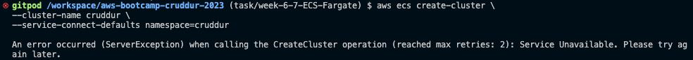

Here's the reason for the error: [ServerException](https://repost.aws/knowledge-center/ecs-api-common-errors) 

</p>
</details>

### 2. Create ECR repo and push image - BASE image

ECR is our container image registry. We will be using it to store the container images in our application - backend & frontend.

<details><summary>Base Image - Python</summary>
<p> 

Check the `Dockerfile` of your `backend` folder and see what image it’s using. Let's create our repo for the base image.

```bash
# create the repo
aws ecr create-repository \
  --repository-name cruddur-python \
  --image-tag-mutability MUTABLE
```

### Login to ECR 

To be able to pull and push images to ECR, we need to log in to ECR. So to retrieve an authentication token and authenticate your Docker client to your registry, run the following command in your terminal.

```bash
aws ecr get-login-password --region $AWS_DEFAULT_REGION | docker login --username AWS --password-stdin "$AWS_ACCOUNT_ID.dkr.ecr.$AWS_DEFAULT_REGION.amazonaws.com"
```

### Set URL

This is a way to map to our new repo’s URI.

```bash
# set your URL as an environment variable 
export ECR_PYTHON_URL="$AWS_ACCOUNT_ID.dkr.ecr.$AWS_DEFAULT_REGION.amazonaws.com/cruddur-python"

# set your URL as an environment variable - GitPod
gp env ECR_PYTHON_URL="$AWS_ACCOUNT_ID.dkr.ecr.$AWS_DEFAULT_REGION.amazonaws.com/cruddur-python"

# ensure it matches the one in your AWS console
echo $ECR_PYTHON_URL
```

### Pull Image 

Now, let’s pull our image from docker.

```bash
docker pull python:3.10-slim-buster
```

### Tag Image 

Let’s tag the image we just pulled.

```bash
docker tag python:3.10-slim-buster $ECR_PYTHON_URL:3.10-slim-buster

# to confirm the image was properly tagged
docker images 
```

### Push Image 

Now, go ahead and push the image to ECR.

```bash
docker push $ECR_PYTHON_URL:3.10-slim-buster
```

</p>
</details>

Now, we have to update our `Dockerfile` to use our image on ECR. 

In `backend-flask/Dockerfile`, update your image URI (the first line in the file) to use the ECR image URI now. You can get it by going to your AWS console and navigating to ECR.

```bash
# change this 
FROM python:3.10-slim-buster

# to this 
FROM <YOUR_ECR_IMAGE_URI>:3.10-slim-buster

# to avoid getting those errors when we start up our backend
# change this line 
ENV FLASK_ENV=development

# to this 
ENV FLASK_DEBUG=1
```

To ensure our configuration works, make sure you run the ECR login command to be sure your image is rightly pulled from ECR. Also, make sure that you don’t have that image locally on your machine by running `docker images`. Now do a `docker compose up` to start up your application and then a `docker compose down`. 

To do a `docker compose up` for selected services, you just have to list the services name like so:

```bash
# check your docker-compose.yml for the services name
docker compose up backend-flask db 
# that will only spin up backend and the DB
```

When it’s all spun up, you can make sure your health check is running by appending `/api/health-check` to your backend URL.


### 3. Create ECR repo and push image - `backend-flask` image

For our backend image, we will also be using `python`. 

<details><summary>Backend Image - Python</summary>
<p> 

Check the `Dockerfile` of your backend folder and see what image it’s using. Let's create our repo for the `backend-flask` image.

```bash
# create the repo
aws ecr create-repository \
  --repository-name backend-flask \
  --image-tag-mutability MUTABLE
```

### Login to ECR 

To be able to pull and push images to ECR, we need to log in to ECR. So to retrieve an authentication token and authenticate your Docker client to your registry, run the following command in your terminal.

```bash
aws ecr get-login-password --region $AWS_DEFAULT_REGION | docker login --username AWS --password-stdin "$AWS_ACCOUNT_ID.dkr.ecr.$AWS_DEFAULT_REGION.amazonaws.com"
```

### Set URL

This is a way to map to our new repo’s URI.

```bash
# set our URL as an environment variable 
export ECR_BACKEND_FLASK_URL="$AWS_ACCOUNT_ID.dkr.ecr.$AWS_DEFAULT_REGION.amazonaws.com/backend-flask"

# set our URL as an environment variable - GitPod
gp env ECR_BACKEND_FLASK_URL="$AWS_ACCOUNT_ID.dkr.ecr.$AWS_DEFAULT_REGION.amazonaws.com/backend-flask"

# ensure it matches the one in your AWS console
echo $ECR_BACKEND_FLASK_URL
```

### Build Image 

Now, let’s build our image.

```bash
# make sure to be in your backend-flask folder 
docker build -t backend-flask .
```

### Tag Image 

Let’s tag the image we just built.

```bash
docker tag backend-flask:latest $ECR_BACKEND_FLASK_URL:latest

# to confirm the image was properly tagged
docker images 
```

### Push Image 

Now, go ahead and push the image to ECR.

```bash
docker push $ECR_BACKEND_FLASK_URL:latest
```

</p>
</details>


### 4. Deploy the Backend Flask app as a service to FARGATE

Let’s go ahead and deploy our `backend-flask` application as a service to FARGATE. The difference between a `service` and a `task` is that a **task** runs and terminates when it’s done (like a batch job), ***while*** a **service** runs continuously, which is what we need because we are running a web app. 

If you want to do this in the AWS console, navigate to the ECS service and create a `service`, not a `task`.

Before we can deploy our app to FARGATE, we have to create a `task definition`. It is sort of a way to provision an application; it is like creating a ***docker compose*** file. Again, you can choose to do this creation through the AWS console under the ECS service.

<details><summary>Creating Our Task Definition</summary>
<p> 
  
In the `aws/` directory, create a folder named `task-definitions` with a file called `backend-flask.json` for the task definitions. 

```bash
# create folder
mkdir aws/task-definitions

# create file
touch aws/task-definitions/backend-flask.json
```

Content of the `backend-flask.json` file:

```json
{
  "family": "backend-flask",
  // REMEMBER to change the AWS account id
  "executionRoleArn": "arn:aws:iam::387543059434:role/CruddurServiceExecutionRole",
  "taskRoleArn": "arn:aws:iam::387543059434:role/CruddurTaskRole",
  "networkMode": "awsvpc",
  "cpu": "256",
  "memory": "512",
  "requiresCompatibilities": [ 
    "FARGATE" 
  ],
  "containerDefinitions": [
    {
      "name": "backend-flask",
      // REMEMBER to change the AWS account id & region
      // make sure you grab yours from your ECR
      "image": "387543059434.dkr.ecr.ca-central-1.amazonaws.com/backend-flask",
      "essential": true,
      "healthCheck": {
        "command": [
          "CMD-SHELL",
          "python /backend-flask/bin/flask/health-check"
        ],
        "interval": 30,
        "timeout": 5,
        "retries": 3,
        "startPeriod": 60
      },
      "portMappings": [
        {
          "name": "backend-flask",
          "containerPort": 4567,
          "protocol": "tcp", 
          "appProtocol": "http"
        }
      ],
      "logConfiguration": {
        "logDriver": "awslogs",
        "options": {
            "awslogs-group": "cruddur",
            // REMEMBER to change the AWS region
            "awslogs-region": "ca-central-1",
            "awslogs-stream-prefix": "backend-flask"
        }
      },

      // REMEMBER to change the values to yours
      "environment": [
        {"name": "OTEL_SERVICE_NAME", "value": "backend-flask"},
        {"name": "OTEL_EXPORTER_OTLP_ENDPOINT", "value": "https://api.honeycomb.io"},
        {"name": "AWS_COGNITO_USER_POOL_ID", "value": "ca-central-1_CQ4wDfnwc"},
        {"name": "AWS_COGNITO_USER_POOL_CLIENT_ID", "value": "5b6ro31g97urk767adrbrdj1g5"},
        
        // we won't be leaving our origin open to the internet (*)
        {"name": "FRONTEND_URL", "value": "*"},
        {"name": "BACKEND_URL", "value": "*"},
        {"name": "AWS_DEFAULT_REGION", "value": "ca-central-1"}
      ],
      // REMEMBER to change the AWS account ids & regions
      "secrets": [
        {"name": "AWS_ACCESS_KEY_ID"    , "valueFrom": "arn:aws:ssm:ca-central-1:387543059434:parameter/cruddur/backend-flask/AWS_ACCESS_KEY_ID"},
        {"name": "AWS_SECRET_ACCESS_KEY", "valueFrom": "arn:aws:ssm:ca-central-1:387543059434:parameter/cruddur/backend-flask/AWS_SECRET_ACCESS_KEY"},
        {"name": "CONNECTION_URL"       , "valueFrom": "arn:aws:ssm:ca-central-1:387543059434:parameter/cruddur/backend-flask/CONNECTION_URL" },
        {"name": "ROLLBAR_ACCESS_TOKEN" , "valueFrom": "arn:aws:ssm:ca-central-1:387543059434:parameter/cruddur/backend-flask/ROLLBAR_ACCESS_TOKEN" },
        {"name": "OTEL_EXPORTER_OTLP_HEADERS" , "valueFrom": "arn:aws:ssm:ca-central-1:387543059434:parameter/cruddur/backend-flask/OTEL_EXPORTER_OTLP_HEADERS" }
      ]
    }
  ]
}
```

Make sure to create a log group in your AWS console - CloudWatch, called `cruddur` to match our configuration in this task definition file. 

```bash
# create a log group with retention days of 1 
aws logs create-log-group --log-group-name cruddur
aws logs put-retention-policy --log-group-name cruddur --retention-in-days 1
```

Also, we have to make sure both `AWS roles` (execution & task role) mentioned above already exist. 

In a **task definition** file, 

- a `TaskRole` is the IAM role that grants permissions to the actual application once the container is started (the permissions the container will have when it’s running), and
- an `ExecutionRole` is the IAM role that executes ECS actions, such as pulling the image, storing the application logs in CloudWatch, and making many more AWS API calls. This role grants permissions to start the containers defined in a task.

<details><summary>Task and Execution Roles</summary>
<p> 

### Task Execution Role

Now we will be creating the [task execution role](https://docs.aws.amazon.com/AmazonECS/latest/developerguide/task_execution_IAM_role.html). This is simply allowing ECS tasks to assume the execution role to be able to launch tasks. 

In the `aws/policies/` directory, add a file `service-assume-role-execution-policy.json` with the following content:

```json
{
  "Version":"2012-10-17",
  "Statement":[{
      "Action":["sts:AssumeRole"],
      "Effect":"Allow",
      "Principal":{
        "Service":["ecs-tasks.amazonaws.com"]
    }}]
}
```

In the `aws/policies/` directory, add another file `service-execution-policy.json` with the following content:

```bash
// REMEMBER TO CHANGE to your own ARN
{
  "Version":"2012-10-17",
  "Statement":[{
    "Effect": "Allow",
    "Action": [
      "ssm:GetParameters",
      "ssm:GetParameter"
    ],
    "Resource": "arn:aws:ssm:ca-central-1:387543059434:parameter/cruddur/backend-flask/*"
  }]
}
```

Let’s create the role now in AWS using these commands:

```bash
# create role
# make sure to be in the root directory 
aws iam create-role \
    --role-name CruddurServiceExecutionRole \
    --assume-role-policy-document "file://aws/policies/service-assume-role-execution-policy.json"

# add inline policy to role
aws iam put-role-policy \
  --policy-name CruddurServiceExecutionPolicy \
  --role-name CruddurServiceExecutionRole \
  --policy-document "file://aws/policies/service-execution-policy.json"
```

Go back to your AWS console and navigate to IAM Role to confirm it was created. 

### Task Role

Now let’s create our `task` role. 

Run the following commands to create a role and attach a policy to it.

```bash
# create role
aws iam create-role \
    --role-name CruddurTaskRole \
    --assume-role-policy-document "{
  \"Version\":\"2012-10-17\",
  \"Statement\":[{
    \"Action\":[\"sts:AssumeRole\"],
    \"Effect\":\"Allow\",
    \"Principal\":{
      \"Service\":[\"ecs-tasks.amazonaws.com\"]
    }
  }]
}"

# add inline policy to role 
aws iam put-role-policy \
  --policy-name SSMAccessPolicy \
  --role-name CruddurTaskRole \
  --policy-document "{
  \"Version\":\"2012-10-17\",
  \"Statement\":[{
    \"Action\":[
      \"ssmmessages:CreateControlChannel\",
      \"ssmmessages:CreateDataChannel\",
      \"ssmmessages:OpenControlChannel\",
      \"ssmmessages:OpenDataChannel\"
    ],
    \"Effect\":\"Allow\",
    \"Resource\":\"*\"
  }]
}
"
```

Grant CloudWatch and X-ray access:

```bash
aws iam attach-role-policy --policy-arn arn:aws:iam::aws:policy/CloudWatchFullAccess --role-name CruddurTaskRole
aws iam attach-role-policy --policy-arn arn:aws:iam::aws:policy/AWSXRayDaemonWriteAccess --role-name CruddurTaskRole
```

Confirm that these policies are attached to the `CruddurTaskRole` in your AWS console. 

</p>
</details>

AWS has 2 different services for secret storage, **Secrets Manager** and **Parameter Store**. Using the **Secrets Manager** costs money compared to the **Parameter Store**, which is free. They are both easy to use and integrate with applications. 

<details><summary>Storing Our Secrets </summary>
<p> 

This feature is found under the **Systems Manager** service in the AWS console if you want to create them through the console. 

Before running each of these lines, make sure they exist as an environment variable in your bash terminal, not just your `docker compose` file. 

**For example:** Instead of hardcoding your environment variables this way `ACCESS_KEY: hdrgsdgcr` in your docker file, do this instead `ACCESS_KEY: $ACCESS_KEY` and make sure that value has been exported already to your terminal using the `export` command. 

Using the CLI, let’s store our sensitive data in the parameter store:

```bash
aws ssm put-parameter --type "SecureString" --name "/cruddur/backend-flask/AWS_ACCESS_KEY_ID" --value $AWS_ACCESS_KEY_ID
aws ssm put-parameter --type "SecureString" --name "/cruddur/backend-flask/AWS_SECRET_ACCESS_KEY" --value $AWS_SECRET_ACCESS_KEY
aws ssm put-parameter --type "SecureString" --name "/cruddur/backend-flask/CONNECTION_URL" --value $PRD_CONNECTION_URL
aws ssm put-parameter --type "SecureString" --name "/cruddur/backend-flask/ROLLBAR_ACCESS_TOKEN" --value $ROLLBAR_ACCESS_TOKEN
aws ssm put-parameter --type "SecureString" --name "/cruddur/backend-flask/OTEL_EXPORTER_OTLP_HEADERS" --value "x-honeycomb-team=$HONEYCOMB_API_KEY"
```

Afterward, go into your AWS console and confirm these were properly set. Check each of the values and ensure they are all correct.

</p>
</details>

Before we can create our task, we need to register the task definition. Let's do that using this command:

```bash
aws ecs register-task-definition --cli-input-json file://aws/task-definitions/backend-flask.json
```

Confirm in your AWS console by navigating to your ECS service and clicking `task definitions`.

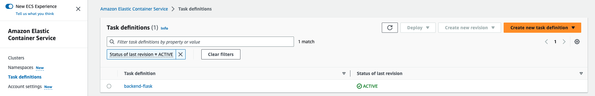

</p>
</details>

<details><summary>Create the Backend Service</summary>
<p> 
  
Now, we can create our `backend-flask` service. Let's use the CLI to deploy this service. Remember it is your choice to either create it through the console or CLI. 

If we are creating this service through the CLI, we will need to create a JSON configuration file for the service. This enables us easily launch the service. 

```bash
# create file
touch aws/json/service-backend-flask.json
```

Content of the `service-backend-flask.json` file:

```json
{
  "cluster": "cruddur",
  "launchType": "FARGATE",
  "desiredCount": 1,
  "enableECSManagedTags": true,
  "enableExecuteCommand": true,
  "networkConfiguration": {
    "awsvpcConfiguration": {
      "assignPublicIp": "ENABLED",
      "securityGroups": [
        "sg-04bdc8d5443cc8283" // replace with yours
      ],
      "subnets": [
        // replace with yours
        "subnet-0462b87709683ccaa",
        "subnet-066a53dd88d557e05",
        "subnet-021a6adafb79249e3"
      ]
    }
  },
  "propagateTags": "SERVICE",
  "serviceName": "backend-flask",
  "taskDefinition": "backend-flask"
}
```

Make sure the `crud-srv-SG` security group exists; if not, use the commands below to create one. This will serve as the security group for our ECS services. 

```bash
# run in your terminal
export CRUD_SERVICE_SG=$(aws ec2 create-security-group \
  --group-name "crud-srv-SG" \
  --description "Security group for Cruddur services on ECS" \
  --vpc-id $DEFAULT_VPC_ID \
  --query "GroupId" --output text)

echo $CRUD_SERVICE_SG

# authorize port 80
aws ec2 authorize-security-group-ingress \
  --group-id $CRUD_SERVICE_SG \
  --protocol tcp \
  --port 80 \
  --cidr 0.0.0.0/0
```

To grab the `ID's` of the security group and subnets, use the following commands:

```bash
# grab the custom security grp ID
export CRUD_SERVICE_SG=$(aws ec2 describe-security-groups \
  --filters Name=group-name,Values=crud-srv-SG \
  --query 'SecurityGroups[*].GroupId' \
  --output text)
# MAKE SURE NAME(Values) MATCHES YOUR OWN security grp

# grab the DEFAULT subnets 
export DEFAULT_SUBNET_IDS=$(aws ec2 describe-subnets  \
 --filters Name=vpc-id,Values=$DEFAULT_VPC_ID \
 --query 'Subnets[*].SubnetId' \
 --output json | jq -r 'join(",")')

echo $DEFAULT_SUBNET_IDS
```

Let’s go ahead and get our `VPC ID` from AWS and then set it as an environment variable in our terminal. 

```bash
# run in your terminal
export DEFAULT_VPC_ID=$(aws ec2 describe-vpcs \
--filters "Name=isDefault, Values=true" \
--query "Vpcs[0].VpcId" \
--output text)

echo $DEFAULT_VPC_ID
```

Navigate to your AWS console to make sure everything is properly created. 

Now, we can create our service 

```bash
aws ecs create-service --cli-input-json file://aws/json/service-backend-flask.json
```

Give the task some time to deploy. 

If you are encountering this error, it is due to some permissions issues with our roles. Let's go ahead and resolve that. 

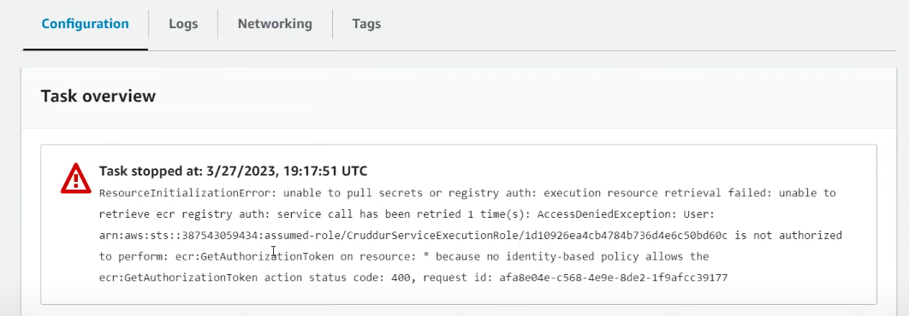

<details><summary>Troubleshooting ECS Roles</summary>
<p> 

Make the following updates to your `CruddurServiceExecutionRole` in AWS. That will be your `service-execution-policy.json` file in your source code. 

```json
// Modify your code with these new changes

{
  "Version":"2012-10-17",
  "Statement":[
  {
    "Effect": "Allow",
    "Action": [
      "ecr:GetAuthorizationToken",
      "ecr:BatchCheckLayerAvailability",
      "ecr:GetDownloadUrlForLayer",
      "ecr:BatchGetImage",
      "logs:CreateLogStream",
      "logs:PutLogEvents"
    ],
    "Resource": "*"
  },
  {
    "Effect": "Allow",
    "Action": [
      "ssm:GetParameters",
      "ssm:GetParameter"
    ],
    // REMEMBER to change the acct id & region
    "Resource": "arn:aws:ssm:ca-central-1:387543059434:parameter/cruddur/backend-flask/*"
  }]
}
```

After the modifications, try recreating the roles and creating the service again through the CLI. For some reason, creating the service through the console doesn’t give us a `health-check` status, and we can’t ssh (shell) into the container either to check it out. So it is best to create the `fargate` services through the CLI. 

</p>
</details>

After that permissions issue has been resolved, go over to your AWS console to confirm the service is created and the task in it is `running` successfully. If the `health-check` status is still `unknown`, let’s follow the steps below to resolve it.

<details><summary>Troubleshooting ECS Unknown Health Check</summary>
<p> 

We need to download a session manager plugin to enable us to shell into our container. To make that easy for us, add this to your `gitpod.yml` file to install it for us on startup. 

```yaml
# add after backend-flask
- name: fargate
    before: | # if you use "init", u won't c it wen u start up ur env 
      curl "https://s3.amazonaws.com/session-manager-downloads/plugin/latest/ubuntu_64bit/session-manager-plugin.deb" -o "session-manager-plugin.deb"
      sudo dpkg -i session-manager-plugin.deb
      cd backend-flask
```

To verify the `session-manager` is working, run this command:

```bash
session-manager-plugin
```

Now to resolve the `unknown` health check error, run this command to shell into the container and investigate the problem.

```bash
aws ecs execute-command  \
	--region $AWS_DEFAULT_REGION \
	--cluster cruddur \
	--task 467e033cabe94949a05d844b449976da \ # replace with your TASK_ID
	--container backend-flask \
	--command "/bin/bash" \
	--interactive
```

To list your ECS tasks, use this command:

```bash
aws ecs list-tasks --cluster cruddur
```

I keep getting this error:

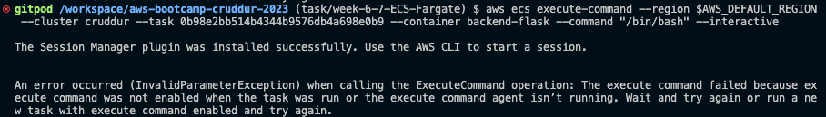

```bash
aws ecs update-service --force-new-deployment --cluster cruddur --task-definition backend-flask --service backend-flask --enable-execute-command
```

<details><summary>Script to Connect to the backend service Container</summary>
<p> 

In the `backend-flask/bin/` directory, create a folder `ecs` with a file `connect-to-service`:

```bash
# create folder 
mkdir backend-flask/bin/ecs

# create file
touch backend-flask/bin/ecs/connect-to-service
```

Content of the `connect-to-service` file:

```bash
#! /usr/bin/bash

if [ -z "$1" ]; then
  echo "No TASK_ID argument supplied eg ./bin/ecs/connect-to-service 99b2f8953616495e99545e5a6066fbb5d backend-flask"
  exit 1
fi
TASK_ID=$1

if [ -z "$2" ]; then
  echo "No CONTAINER_NAME argument supplied eg ./bin/ecs/connect-to-service 99b2f8953616495e99545e5a6066fbb5d backend-flask"
  exit 1
fi
CONTAINER_NAME=$2

echo "TASK ID : $TASK_ID"
echo "Container Name: $CONTAINER_NAME"

aws ecs execute-command  \
--region $AWS_DEFAULT_REGION \
--cluster cruddur \
--task $TASK_ID \
--container $CONTAINER_NAME \
--command "/bin/bash" \
--interactive
```

To ensure you have the right permissions to execute the newly created script, run the following commands:

```bash
# By default, you will get permission denied when trying to run a script you just created
# run this command to grant it permission - https://www.tutorialspoint.com/unix/unix-file-permission.htm
chmod 555 backend-flask/bin/ecs/connect-to-service

# execute the script 
./backend-flask/bin/ecs/connect-to-service
```

</p>
</details>

Inside your backend container, run the command below to confirm the `health-check` status of the app server.

```bash
# check the status of the application server
./bin/flask/health-check
```

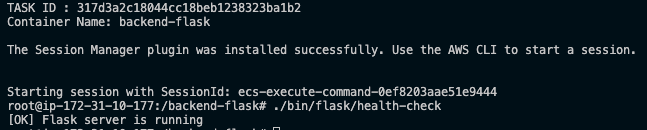

After confirming the server is running, go into your AWS console and refresh. It should have a **green checkmark** that says `healthy`. 

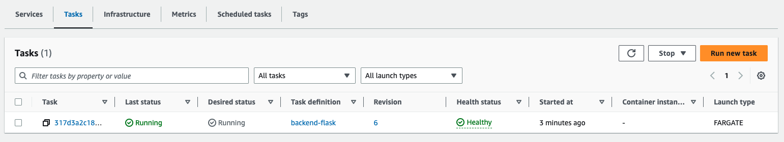

</p>
</details>

Now let's try out our configuration in the browser. In the ECS service console, navigate to the **Configurations** tab, then select the `task`. You should now see a **public IP**, go ahead and copy that and then append `:4567` to see if you can access the backend. If you are not able to access the backend, follow these steps to resolve it. 

- In the AWS console, navigate to the security group attached to the ECS service. Go ahead and edit it. Change the `security group rule ID` to have a **Custom TCP** with port range `4567` and source as **Anywhere**.
  
- You can also check to see if a **Network Interface**(eni) was created for your ECS service.

Now try out the URL again; it should work. 

- `public IP:4567`

- You can also check the health status by appending the `health-check` endpoint like `public IP:4567/api/health-check`. 

</p>
</details>

<details><summary>Update RDS Security Group</summary>
<p> 

Let’s make sure our security group, `CRUD_SERVICE_SG` has access to our RDS instance. 

First, we have to modify the security group, and create a connection script that tests out our connection inside the ECS service containers. 

```python
# create test file 
touch backend-flask/bin/db/test

# file content 

#!/usr/bin/env python3
import psycopg
import os
import sys

connection_url = os.getenv("CONNECTION_URL")

conn = None
try:
  print('attempting connection')
  conn = psycopg.connect(connection_url)
  print("Connection successful!")
except psycopg.Error as e:
  print("Unable to connect to the database:", e)
finally:
  conn.close()
```

Before implementing this solution, try typing the public IP of your ECS container (IP:4567) and then append `/api/activities/home`. You shouldn’t be getting any results displayed. 

Our RDS instance uses the default SG, so we should add another inbound rule to accept our `CRUD_SERVICE_SG` used for our ECS services.

For our default security group (which is the one connected to our RDS instance)

- Add a new rule,
- Add **Type** as `PostgreSQL`
- Source as `Custom` and then select the security group of your ECS service
- By choice, you can add a **Description** as `ECS-CruddurServices`

After the modification, shell back into your ECS `backend-flask` service container. 

```bash
# get task_ID
aws ecs list-tasks --cluster cruddur

# connect to task container
./backend-flask/bin/ecs/connect-to-service 317d3a2c18044cc18beb1238323ba1b2 backend-flask
```

Inside the container, run this script to ensure we have a database connection. 

```bash
./bin/db/test
```

You should have a **Connection successful!** message displayed.

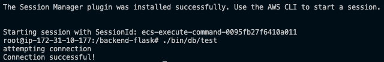

Now, try typing the public IP of your ECS container `(IP:4567)` again and appending `/api/activities/home`. You should get some JSON back. 

</p>
</details>

<details><summary>Add a Service Connect Configuration</summary>
<p> 

In the `aws/json/service-backend-flask.json` file, make these modifications to add the `service-connect` configurations.

```json
{
  "cluster": "cruddur",
  "launchType": "FARGATE",
  "desiredCount": 1,
  "enableECSManagedTags": true,
  "enableExecuteCommand": true,
  "networkConfiguration": {
    "awsvpcConfiguration": {
      "assignPublicIp": "ENABLED",
      "securityGroups": [
        "sg-04bdc8d5443cc8283" // replace with yours
      ],
      "subnets": [
        // replace with yours
        "subnet-0462b87709683ccaa",
        "subnet-066a53dd88d557e05",
        "subnet-021a6adafb79249e3"
      ]
    }
  },
  // NEW configuration added
  "serviceConnectConfiguration": {
    "enabled": true,
    "namespace": "cruddur",
    "services": [
      {
        // portName is same as what we called it in our task definitions
        "portName": "backend-flask",
        "discoveryName": "backend-flask",
        "clientAliases": [{"port": 4567}]
      }
    ]
  },
  "propagateTags": "SERVICE",
  "serviceName": "backend-flask",
  "taskDefinition": "backend-flask"
}
```

Use these commands below to find your `security grp` and `subnets`

```bash
# grab the custom security grp ID
export CRUD_SERVICE_SG=$(aws ec2 describe-security-groups \
  --filters Name=group-name,Values=crud-srv-sg \
  --query 'SecurityGroups[*].GroupId' \
  --output text)

# grab the DEFAULT security grp
export DEFAULT_VPC_ID=$(aws ec2 describe-vpcs \
--filters "Name=isDefault, Values=true" \
--query "Vpcs[0].VpcId" \
--output text)

echo $DEFAULT_VPC_ID

# grab the DEFAULT subnets 
export DEFAULT_SUBNET_IDS=$(aws ec2 describe-subnets  \
 --filters Name=vpc-id,Values=$DEFAULT_VPC_ID \
 --query 'Subnets[*].SubnetId' \
 --output json | jq -r 'join(",")')

echo $DEFAULT_SUBNET_IDS
```

Now, we can recreate our service to be sure every configuration checks out. 

```bash
aws ecs create-service --cli-input-json file://aws/json/service-backend-flask.json
```

Go over to your AWS console to confirm the service is created and the task in it is `running` successfully.

Also, check the endpoint on the browser to be sure; everything is still okay `public IP:4567/api/health-check` OR `public IP:4567/api/activities/home`. Any of the endpoints should work.

</p>
</details>


### 5. Provision and Configure Application Load Balancer (ALB) along with Target Groups

We will be provisioning our ALB through the AWS console.

<details><summary>Steps to Provision an ALB</summary>
<p> 

Let's navigate to **Load Balancers** located under the **EC2** service. 

- Select the **Application Load Balancers** - these are used for web applications and HTTPS requests. Because of the `service-connect` feature in our ECS service, we are able to use ALB and not NLB (Network Load Balancer).
  
- Choose a name for the load balancer; mine is `cruddur-alb`.
  
- Leave the **Scheme** as `Internet-facing` and the **IP address type** as `IPv4`

- For the **Network Mapping**, select all 3 of your subnets in each of the AZs
  
- For the **Security Group**, we will be creating a new one, select `Create a new one`
  
    - New security group name: `cruddur-alb-sg`
      
    - Description: `cruddur-alb-sg`
      
    - VPC: **Leave as is**
    
    - Inbound rules:
        - HTTP, source = Anywhere
        - HTTPS, source = Anywhere
          
    - Outbound rules: **Leave as is**
      
    - Now go ahead and **Create**

***Important!*** - We need to add this new security group (SG) to our ECS service SG so that instead of hitting an IP address, it will now be a load balancer. 

- Go into your SG for ECS located under the **EC2** service and edit its inbound rules
  
- Add another rule with **Type** = Custom TCP, **Port range** = 4567,  **Source** = sg_of_alb and **Description** = CruddurALB
  
- Now, only through the LB can we gain access to our services. Yay!!! 🎉
  
- For the **Listeners and routing**, let’s create a target group by clicking the blue link that says `Create target group`
  
    - In this section, select `IP addresses` as the **target type** (because we are using FARGATE and we are pointing to an IP address)
      
    - Target group name: `cruddur-backend-flask-tg`
      
    - Protocol & Port: `HTTP` and `4567`. The listener listens on port `80`, and the target group points to the port of the container, in our case is `4567`
      
    - Leave the **IP address type** and **Protocol version** as is.
      
    - For the **Health checks**, our path will be `/api/health-check`
      
        - Go on and expand the **Advanced health check settings**
          
        - Leave the **Port** as `traffic port`
          
        - Healthy threshold: `3`
          
        - Unhealthy threshold: `2`
          
        - Timeout: `5`
          
        - Interval: `30`
          
        - Success codes: `200`
        
        - Now go on and click **Next,** then **Create.**
        
- Now back to our **Listeners and routing**, let’s select our target group
  
    - Protocol: `HTTP`
    
    - Port: `4567`
  
    - Let’s add one for our `frontend` as well
      
        - Click **Add listener**
          
        - Protocol: `HTTP`
          
        - Port: `3000`
          
        - Default action: select the frontend target group
          
            - Let’s create the `cruddur-frontend-react-js-tg`
              
            - Use the same configurations for the backend, **EXCEPT*** adding a health check path
              
- Now, after those configurations, go ahead and click **Create load balancer**

</p>
</details>

<details><summary>Add ALB Configs to our backend service</summary>
<p> 

Now we need to add our ALB configurations to our backend service; go to your `aws/json/service-backend-flask.json` file and make the following updates. 

```json
{
  "cluster": "cruddur",
  "launchType": "FARGATE",
  "desiredCount": 1,
  "enableECSManagedTags": true,
  "enableExecuteCommand": true,

  // NEW configuration added
  "loadBalancers": [
    {
        // REPLACE "targetGroupArn" with yours 
        "targetGroupArn": "arn:aws:elasticloadbalancing:ca-central-1:387543059434:targetgroup/cruddur-backend-flask-tg/87ed2a3daf2d2b1d",
        "containerName": "backend-flask",
        "containerPort": 4567
    }
  ],

  "networkConfiguration": {
    "awsvpcConfiguration": {
      "assignPublicIp": "ENABLED",
      "securityGroups": [
        "sg-04bdc8d5443cc8283" // replace with yours
      ],
      "subnets": [
        // replace with yours
        "subnet-0462b87709683ccaa",
        "subnet-066a53dd88d557e05",
        "subnet-021a6adafb79249e3"
      ]
    }
  },
  "serviceConnectConfiguration": {
    "enabled": true,
    "namespace": "cruddur",
    "services": [
      {
        "portName": "backend-flask",
        "discoveryName": "backend-flask",
        "clientAliases": [{"port": 4567}]
      }
    ]
  },
  "propagateTags": "SERVICE",
  "serviceName": "backend-flask",
  "taskDefinition": "backend-flask"
}
```

Now you can go ahead and launch another backend service with the new features using this command:

```bash
# launch service 
aws ecs create-service --cli-input-json file://aws/json/service-backend-flask.json
```

In your **Load balancer** page, if your endpoints say ***Not reachable***, let’s go and edit our inbound rules for our load balancer security group, `cruddur-alb-sg`

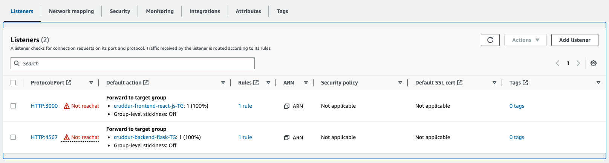

- Add a new rule with the following configurations for the **backend**
  
    - Type: `Custom TCP`
      
    - Port range: `4567`
      
    - Source: `Anywhere`
      
    - Description: `TEMP1`  means temporary
      
- Add a new rule with the following configurations for the **frontend**
  
    - Type: `Custom TCP`
      
    - Port range: `3000`
      
    - Source: `Anywhere`
      
    - Description: `TEMP2` meaning temporary

Go back to your **load balancer** under the **EC2** service to confirm the error is gone. You can also check the **Targets** if they say `healthy` or `unhealthy`. 

Also, check your ECS service tasks. You can view the logs of the container by clicking the logs in the running container in ECS. 

**Important:** If your **target group** keeps saying `unhealthy`, but your ECS tasks say `healthy`. Just check the **outbound rules** for your **ALB*** security group. Make sure that there is a **rule** to allow all traffic from **anywhere**. That should resolve that error. 

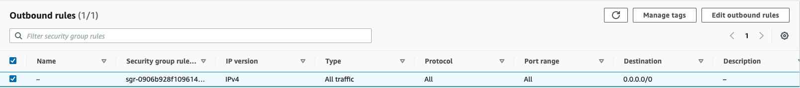

In your load balancer, copy the `DNS name:4567` or `DNS name:4567/api/health-check` to your browser.
 
</p>
</details>


### 6. Create ECR repo and push image - `fronted-react-js` image

For our frontend image, we will be using `react` and `javascript`. 

<details><summary>Backend Image - Python</summary>
<p> 

Check the `Dockerfile` of your frontend folder and see what image it’s using. Let's create our repo for the `frontend-react-js` image.

```bash
# create the repo
aws ecr create-repository \
  --repository-name frontend-react-js \
  --image-tag-mutability MUTABLE
```

### Login to ECR 

To be able to pull and push images to ECR, we need to log in to ECR. So to retrieve an authentication token and authenticate your Docker client to your registry, run the following command in your terminal.

```bash
aws ecr get-login-password --region $AWS_DEFAULT_REGION | docker login --username AWS --password-stdin "$AWS_ACCOUNT_ID.dkr.ecr.$AWS_DEFAULT_REGION.amazonaws.com"
```

### Set URL

This is a way to map to our new repo’s URI.

```bash
# set our URL as an environment variable 
export ECR_FRONTEND_REACT_URL="$AWS_ACCOUNT_ID.dkr.ecr.$AWS_DEFAULT_REGION.amazonaws.com/frontend-react-js"

# set our URL as an environment variable - GitPod
gp env ECR_FRONTEND_REACT_URL="$AWS_ACCOUNT_ID.dkr.ecr.$AWS_DEFAULT_REGION.amazonaws.com/frontend-react-js"

# ensure it matches the one in your AWS console
echo $ECR_FRONTEND_REACT_URL
```

### Build Image 

Now, let’s build our image.

```bash
# DON'T if you've run this already
# make sure to be in your frontend-react-js folder 
docker build \
--build-arg REACT_APP_BACKEND_URL="https://4567-$GITPOD_WORKSPACE_ID.$GITPOD_WORKSPACE_CLUSTER_HOST" \
--build-arg REACT_APP_AWS_PROJECT_REGION="$AWS_DEFAULT_REGION" \
--build-arg REACT_APP_AWS_COGNITO_REGION="$AWS_DEFAULT_REGION" \
--build-arg REACT_APP_AWS_USER_POOLS_ID="$REACT_APP_AWS_USER_POOLS_ID" \
--build-arg REACT_APP_CLIENT_ID="$REACT_APP_CLIENT_ID" \
-t frontend-react-js \
-f Dockerfile.prod \
.
```

### Tag Image 

Let’s tag the image we just built.

```bash
docker tag frontend-react-js:latest $ECR_FRONTEND_REACT_URL:latest

# to confirm the image was properly tagged
docker images  
```

### Push Image 

Now, go ahead and push the image to ECR.

```bash
docker push $ECR_FRONTEND_REACT_URL:latest
```

To test locally,

```bash
# start up app [only start up backend & db],
# make sure not to include "frontend" cuz we want to test if it can start up
docker compose up

# locally test
docker run --rm -p 3000:3000 -it frontend-react-js
```

</p>
</details>


### 7. Deploy Frontend React JS app as a service to FARGATE

Let’s go ahead and deploy our `frontend-react-js` application as a service to FARGATE. 

Before we can deploy our app to FARGATE, we have to create a **task definition**. It is sort of a way to provision an application; it is like creating a **docker-compose*** file. Again, you can choose to do this creation through the AWS console under the ECS service. 

<details><summary>Create Frontend Task Definition</summary>
<p> 

In the `aws/` folder, create a file `frontend-react-js.json` for your task definitions. 

```bash
# create file
touch aws/task-definitions/frontend-react-js.json
```

Content of the `frontend-react-js.json` file:

```json
{
  "family": "frontend-react-js",
  // change AWS acct ID
  "executionRoleArn": "arn:aws:iam::387543059434:role/CruddurServiceExecutionRole",
  "taskRoleArn": "arn:aws:iam::387543059434:role/CruddurTaskRole",
  "networkMode": "awsvpc",
  "cpu": "256",
  "memory": "512",
  "requiresCompatibilities": [ 
    "FARGATE" 
  ],
  "containerDefinitions": [
    {
      "name": "frontend-react-js",
      // change to YOURS
      "image": "387543059434.dkr.ecr.ca-central-1.amazonaws.com/frontend-react-js",
      "essential": true,
      "healthCheck": {
        "command": [
          "CMD-SHELL",
          "curl -f http://localhost:3000 || exit 1"
        ],
        "interval": 30,
        "timeout": 5,
        "retries": 3
      },
      "portMappings": [
        {
          "name": "frontend-react-js",
          "containerPort": 3000,
          "protocol": "tcp", 
          "appProtocol": "http"
        }
      ],

      "logConfiguration": {
        "logDriver": "awslogs",
        "options": {
            "awslogs-group": "cruddur",
            // change region
            "awslogs-region": "ca-central-1",
            "awslogs-stream-prefix": "frontend-react-js"
        }
      }
    }
  ]
}
```

</p>
</details>

Since we didn’t pass an environment variable as we did in our `backend`, we need to do a 2-build step or multi-stage stage for our docker files. 

<details><summary>Create Dockerfile for Production</summary>
<p> 

Now let’s  create a separate `Dockerfile` for production. 

In `frontend-react-js` folder, create a `Dockerfile.prod` file

```bash
# create file
touch frontend-react-js/Dockerfile.prod
```

Content of the `Dockerfile.prod` file:

```bash
# Base Image ~~~~~~~~~~~~~~~~~~~~~~~~~~~~~~~~~~
FROM node:16.18 AS build

# This is to assign environment variables
ARG REACT_APP_BACKEND_URL
ARG REACT_APP_AWS_PROJECT_REGION
ARG REACT_APP_AWS_COGNITO_REGION
ARG REACT_APP_AWS_USER_POOLS_ID
ARG REACT_APP_CLIENT_ID

# This is to call our assigned environment variables
ENV REACT_APP_BACKEND_URL=$REACT_APP_BACKEND_URL
ENV REACT_APP_AWS_PROJECT_REGION=$REACT_APP_AWS_PROJECT_REGION
ENV REACT_APP_AWS_COGNITO_REGION=$REACT_APP_AWS_COGNITO_REGION
ENV REACT_APP_AWS_USER_POOLS_ID=$REACT_APP_AWS_USER_POOLS_ID
ENV REACT_APP_CLIENT_ID=$REACT_APP_CLIENT_ID

COPY . ./frontend-react-js
WORKDIR /frontend-react-js
RUN npm install
RUN npm run build

# New Base Image ~~~~~~~~~~~~~~~~~~~~~~~~~~~~~~
FROM nginx:1.23.3-alpine

# --from=build is coming from the Base Image
COPY --from=build /frontend-react-js/build /usr/share/nginx/html
COPY --from=build /frontend-react-js/nginx.conf /etc/nginx/nginx.conf

EXPOSE 3000
```

Because of the `nginx` configuration, we have in our new `Dockerfile`, we now have to create an `nginx.conf` file. The `nginx.conf` file in the `Dockerfile` is used to configure the Nginx web server that is being used to serve the static content generated by our react application.

In the `frontend-react-js` folder, create a `nginx.conf` file

```bash
# Set the worker processes
# 1 task, 1 container -> always have this practice 
worker_processes 1;

# Set the events module
events {
  worker_connections 1024;
}

# Set the http module
http {
  # Set the MIME types
  include /etc/nginx/mime.types;
  default_type application/octet-stream;

  # Set the log format
  log_format  main  '$remote_addr - $remote_user [$time_local] "$request" '
                    '$status $body_bytes_sent "$http_referer" '
                    '"$http_user_agent" "$http_x_forwarded_for"';

  # Set the access log
  access_log  /var/log/nginx/access.log main;

  # Set the error log
  error_log /var/log/nginx/error.log;

  # Set the server section
  server {
    # Set the listen port
    listen 3000;

    # Set the root directory for the app
    root /usr/share/nginx/html;

    # Set the default file to serve
    index index.html;

    location / {
        # First attempt to serve request as file, then
        # as directory, then fall back to redirecting to index.html
        try_files $uri $uri/ $uri.html /index.html;
    }

    # Set the error page
    error_page  404 /404.html;
    location = /404.html {
      internal;
    }

    # Set the error page for 500 errors
    error_page  500 502 503 504  /50x.html;
    location = /50x.html {
      internal;
    }
  }
}
```

This configuration file sets up the server to listen on port `3000` and serves the static files located in the `/usr/share/nginx/html` directory. It also sets up error pages and logging.

The `location / block` in the configuration file is particularly important as it specifies how `nginx` will handle incoming requests. In this case, it uses the `try_files` directive to first attempt to serve the request as a file, then as a directory, and finally fall back to redirecting to `index.html`.

In the `frontend-react-js` directory, do an `npm run build` to build our configuration.

If you encounter a `setCognitoErrors` error, go into the mentioned files and change `setCognitoErrors` to `setErrors` instead. 

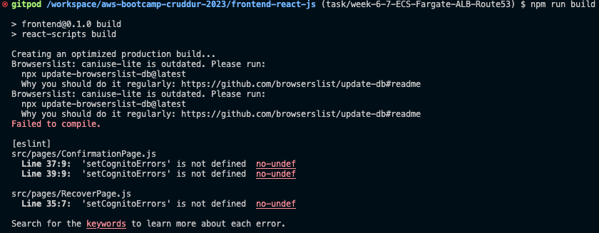

After you have resolved the above error, your build should be successful now. 

In your `.gitignore` file, you can add these file paths so as to not commit them. 

```bash
docker/**/*
frontend-react-js/build/*
```

Now let’s build our new docker image from `Dockerfile.prod`. 

```bash
# remember to replace with your own values
docker build \
--build-arg REACT_APP_BACKEND_URL="http://cruddur-alb-402134244.us-west-2.elb.amazonaws.com:4567" \
--build-arg REACT_APP_AWS_PROJECT_REGION="$AWS_DEFAULT_REGION" \
--build-arg REACT_APP_AWS_COGNITO_REGION="$AWS_DEFAULT_REGION" \
--build-arg REACT_APP_AWS_USER_POOLS_ID="$REACT_APP_AWS_USER_POOLS_ID" \
--build-arg REACT_APP_CLIENT_ID="$REACT_APP_CLIENT_ID" \
-t frontend-react-js \
-f Dockerfile.prod \
.
```
  
</p>
</details>

<details><summary>Create the Frontend Service</summary>
<p> 

Now let’s create a JSON file for our frontend service to enable us easily launch the service. 

```bash
# create file
touch aws/json/service-frontend-react-js.json
```

Add the following content to the file:

```json
{
  "cluster": "cruddur",
  "launchType": "FARGATE",
  "desiredCount": 1,
  "enableECSManagedTags": true,
  "enableExecuteCommand": true,

  // NEW configuration added
  "loadBalancers": [
    {
        // replace with yours [frontend] 
        "targetGroupArn": "arn:aws:elasticloadbalancing:ca-central-1:387543059434:targetgroup/FRONTEND_TARGET_GRP/87ed2a3daf2d2b1d",
        "containerName": "frontend-react-js",
        "containerPort": 3000
    }
  ],

  "networkConfiguration": {
    "awsvpcConfiguration": {
      "assignPublicIp": "ENABLED",
      // replace with yours 
      "securityGroups": [
        "sg-04bdc8d5443cc8283"
      ],
      // replace with yours
      "subnets": [
        "subnet-0462b87709683ccaa",
        "subnet-066a53dd88d557e05",
        "subnet-021a6adafb79249e3"
      ]
    }
  },
  "propagateTags": "SERVICE",
  "serviceName": "frontend-react-js",
  "taskDefinition": "frontend-react-js",
  "serviceConnectConfiguration": {
    "enabled": true,
    "namespace": "cruddur",
    "services": [
      {
        "portName": "frontend-react-js",
        "discoveryName": "frontend-react-js",
        "clientAliases": [{"port": 3000}]
      }
    ]
  }
}
```

Use these commands below to find your `security grp` and `subnets` ids.

```bash
# grab the custom security grp ID
export CRUD_SERVICE_SG=$(aws ec2 describe-security-groups \
  --filters Name=group-name,Values=crud-srv-sg \
  --query 'SecurityGroups[*].GroupId' \
  --output text)

# grab the DEFAULT security grp
export DEFAULT_VPC_ID=$(aws ec2 describe-vpcs \
--filters "Name=isDefault, Values=true" \
--query "Vpcs[0].VpcId" \
--output text)

echo $DEFAULT_VPC_ID

# grab the DEFAULT subnets 
export DEFAULT_SUBNET_IDS=$(aws ec2 describe-subnets  \
 --filters Name=vpc-id,Values=$DEFAULT_VPC_ID \
 --query 'Subnets[*].SubnetId' \
 --output json | jq -r 'join(",")')

echo $DEFAULT_SUBNET_IDS
```

Now we can go ahead to register our task definition.

```bash
aws ecs register-task-definition --cli-input-json file://aws/task-definitions/frontend-react-js.json
```

Confirm in your AWS console by navigating to your **ECS service** and selecting `task definitions`.

Now, we can create our service: 

```bash
aws ecs create-service --cli-input-json file://aws/json/service-frontend-react-js.json
```

Go over to your AWS console to confirm the service is created and the task in it is `running` successfully.

But in our case, we are getting `unhealthy` status for our `frontend` task.

<details><summary>Troubleshooting Unhealthy Status of the Frontend</summary>
<p> 

Go ahead and stop the `frontend` service from the AWS console. Now we will edit our `frontend-react-js.json` service file to remove the load balancer configuration so we can shell into our container to troubleshoot. Detaching the load balancer from our service enables us to shell into the container to debug. 

```json
// REMOVE
  "loadBalancers": [
    {
        // replace with yours [frontend] 
        "targetGroupArn": "arn:aws:elasticloadbalancing:ca-central-1:387543059434:targetgroup/FRONTEND_TARGET_GRP/87ed2a3daf2d2b1d",
        "containerName": "frontend-react-js",
        "containerPort": 3000
    }
  ],
```

After that update, relaunch the service again and check the AWS console to be sure the service started up alright and `healthy`.

Now let’s connect/shell into our frontend service container using the scripts we created for this purpose.

```bash
# enter into the task container 
./bin/ecs/connect-to-service TASK_ID frontend-react-js
```

This still fails with this error:

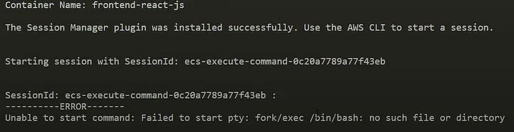

Let’s run a couple of debugging steps to resolve the error.

1. Let’s rebuild our `prd` environment locally to debug further 

```bash
# using our BACKEND_URL means we are building it locally
# be sure to be in the "frontend-react-js" directory
docker build \
--build-arg REACT_APP_BACKEND_URL="https://4567-$GITPOD_WORKSPACE_ID.$GITPOD_WORKSPACE_CLUSTER_HOST" \
--build-arg REACT_APP_AWS_PROJECT_REGION="$AWS_DEFAULT_REGION" \
--build-arg REACT_APP_AWS_COGNITO_REGION="$AWS_DEFAULT_REGION" \
--build-arg REACT_APP_AWS_USER_POOLS_ID="ca-central-1_CQ4wDfnwc" \
--build-arg REACT_APP_CLIENT_ID="5b6ro31g97urk767adrbrdj1g5" \
-t frontend-react-js \
-f Dockerfile.prod \
.
```

Now let’s run and test it:

```bash
docker run --rm -p 3000:3000 -it frontend-react-js
```

Let’s do an `inspect` inside the docker container to further debug. 

```bash
# check container ID
docker ps 

# inspect container 
docker inspect CONTAINER_ID
```

Check for the CMD and see what commands it has. You would notice there aren’t `bash` commands indicated, and it also says `daemon off`

Because of that, we had to make sure the image version, `alpine`, actually uses `bash`. But we found out that, by default, `bash` is not included with `BusyBox` and `Alpine` images. Because of this, we cannot shell into the container. But you can use the `sh` shell instead of `bash` for the `alpine` images.

Because we can't use `bash`, we need to hardcode `bin/sh` into our `connect-to-service` script in `backend-flask/bin/ecs` and create separate ones for frontend and backend services.

Now rename the `connect-to-service` file to `connect-to-backend-flask` and create another one for the frontend service, `connect-to-frontend-react-js`.

Content of the `connect-to-backend-flask` file:

```bash
#! /usr/bin/bash

if [ -z "$1" ]; then
  echo "No TASK_ID argument supplied eg ./bin/ecs/connect-to-backend-flask 99b2f8953616495e99545e5a6066fbb5d"
  exit 1
fi
TASK_ID=$1

CONTAINER_NAME=backend-flask

echo "TASK ID : $TASK_ID"
echo "Container Name: $CONTAINER_NAME"

aws ecs execute-command  \
--region $AWS_DEFAULT_REGION \
--cluster cruddur \
--task $TASK_ID \
--container $CONTAINER_NAME \
--command "/bin/bash" \
--interactive
```

Content of the `connect-to-frontend-react-js` file:

```bash
#! /usr/bin/bash

if [ -z "$1" ]; then
  echo "No TASK_ID argument supplied eg ./bin/ecs/connect-to-frontend-react-js 99b2f8953616495e99545e5a6066fbb5d"
  exit 1
fi
TASK_ID=$1

CONTAINER_NAME=frontend-react-js

echo "TASK ID : $TASK_ID"
echo "Container Name: $CONTAINER_NAME"

aws ecs execute-command  \
--region $AWS_DEFAULT_REGION \
--cluster cruddur \
--task $TASK_ID \
--container $CONTAINER_NAME \
--command "/bin/sh" \
--interactive
```

Don’t forget to give permission to script files. 

```bash
# by default, you will get a permission denied when trying to run a script you just created
# run this command to grant it permission - https://www.tutorialspoint.com/unix/unix-file-permission.htm
chmod 555 backend-flask/bin/ecs/connect-to-frontend-react-js
chmod 555 backend-flask/bin/ecs/connect-to-backend-flask
  
# execute the script for frontend
./backend-flask/bin/ecs/connect-to-frontend-react-js TASK_ID
```

Now inside the container, do a `curl` to be sure our app is there.

```bash
curl localhost:3000
```

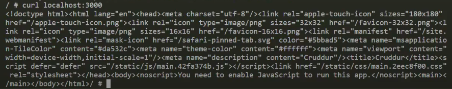

Let’s write a health check for our frontend service using `curl`. Go to your `aws/task-definitions/frontend-react-js.json` file and add this segment of code:

```bash
# add in the "containerDefinitions" section after "essential"
"healthCheck": {
        "command": [
          "CMD-SHELL",
          "curl -f http://localhost:3000 || exit 1"
        ],
        "interval": 30,
        "timeout": 5,
        "retries": 3
      },
```

This is to check if our application is running locally. 

After this configuration, let’s re-register our frontend task definitions.

```bash
aws ecs register-task-definition --cli-input-json file://aws/task-definitions/frontend-react-js.json
```

Now add back the `load balancer` config we removed earlier to debug.

In the `aws/json/service-frontend-react-js.json` file, 

```json
// ADD BACK
  "loadBalancers": [
    {
        // replace with yours [frontend] 
        "targetGroupArn": "arn:aws:elasticloadbalancing:ca-central-1:387543059434:targetgroup/FRONTEND_TARGET_GRP/87ed2a3daf2d2b1d",
        "containerName": "frontend-react-js",
        "containerPort": 3000
    }
  ],
```

Now re-launch the service again. Make sure there’s no running or draining one in your console. If there is, tear it down. 

```json
aws ecs create-service --cli-input-json file://aws/json/service-frontend-react-js.json
```

If the task still says `unhealthy`, `failed deployment` or `healthy`. Check the frontend target group to confirm this. If it truly says either of those, go ahead and investigate the security group associated with the front-end app.

When you navigate to the `security group`, edit the inbound rule and add one for the frontend. 

- Type: `Custom TCP`
  
- Port range: `3000`
  
- Source: same source as the backend one
  
- Description: `ALBfrontend`
  
- Change the description for the backend one to `ALBbackend`

Save your changes; now, you should have a `healthy` status. 

Copy your LB’s DNS name in your load balancer page and append `3000` to it as so - `DNS_name:3000`. You should now see data. 

You can confirm the address of your frontend by right-clicking on your browser, then selecting `Inspect` and navigating to the `Networks` tab to view the URL.

</p>
</details>

</p>
</details>


### 8. Manage your Domain using Route53 

Now we need to configure the custom domain we set up at the beginning of the BootCamp. Navigate to **Route53** on your AWS console, go to **Hosted zones**, and you should see one for the domain you created earlier - if you created this domain with Route53. If your domain wasn’t created with Route53, you will have to create a **hosted zone** in AWS for that domain. 

<details><summary>Create an SSL certificate via ACM (Certificate Manager)</summary>
<p> 

We need to **create records** for our domain. But before that, we need to create SSL certificates. 

- Navigate to **Certificate Manager (ACM)**

- Select **Request a certificate**
  
- Under the **Certification type**, select `Request a public certificate`. This is a free option as well.
  
- Click **Next**, and enter your `Fully qualified domain name` FQDN, which should be your domain name
  
    - Click on **Add another name to this certificate**
      
    - Enter `*.mydomain.com` - this is usually for subdomains
      
- Under the **Validation method**, leave `DNS validation` selected
  
- Under the **Key algorithm**, leave `RSA 2048` selected
  
- Now go ahead and click **Request**

After you request, you will find out that it says `pending validation`. 

- Go ahead and click on the certificate you just requested.
  
- Scroll down to the **Domains** section, and click `Create records in Route 53` to create records for the domains we just requested.
  
    - Select both domains and click **Create**
    
- Be patient; it’s going to take a while to propagate those domains.
  
    - On your ACM page, after a while, you should now see a `Success` status for both FQDNs you requested.
      
- After some time, go back to Route53 and check if a record with a `CNAME` has been added.

</p>
</details>


### 9. Set Up a Record Set for a Naked Domain to point to the Frontend

Now we have our certificates ready, let’s navigate to our load balancers to re-route our applications. 

- On the load balancers page, select our load balancer, `cruddur-alb`
  
- Scroll down and select the **Listeners** tab to edit our listeners.
  
    - Click on `Add listener`
      
    - Under the **Listener details**, leave the port and protocol configurations as is.
    
    - For the default actions, add an action **Redirect** to redirect our port to the `HTTPS` protocol and `443` port - since we now have an SSL certificate
      
    - You can change the **status code** to `302 - Found`
      
- Now go ahead and **Add**

Let’s add another listener to forward our `HTTPS` port to our frontend app.

- Under the **Listener details**, change the protocol and port to `HTTPS` and `443`
  
- For the default actions, add an action **Forward** to forward our port to the `frontend-react-js` target group - this forwards the HTTPS port to our frontend app.
  
- Under the **Secure Listener settings**, add the SSL certificate we created.

- Now go ahead and **Add**

After those configurations, go ahead and delete the listeners we have for `3000` and `4567`.

<details><summary>Manage rules for HTTPS port</summary>
<p> 

Our `HTTPS` port already forwards to our frontend. 

- Select the `HTTPS:443` listener you just created, and click on **Actions** at the top left of the page.
  
- Click on **Manage rules**
  
- Click the **+** and then click the blue link that says **Insert Rule**
  
- In the **IF (all match)** column, click the `Add condition` and select **Host headers** with the value `api.mydomain.com`
  
- In the **THEN** column, click the `Add action` and select **Forward** with value backend target group.
    
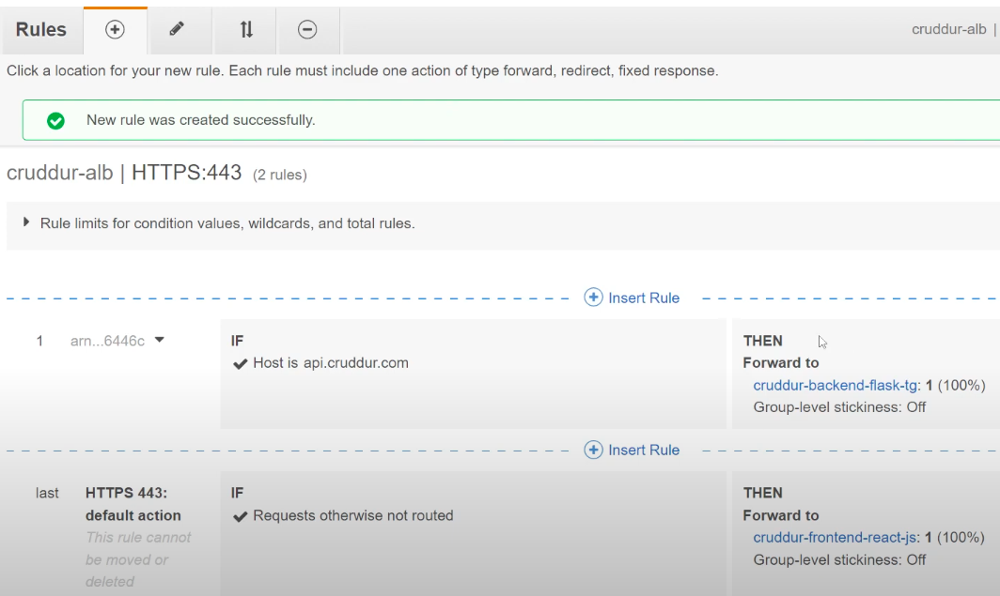

After this configuration, it is not going to work because we need to update our origins and rebuild our images. Also, we need to point our domain to our load balancer. 

- Navigate to **Route53**, and select your hosted zone to create another record.
  
    - Record type: `A - Routes traffic to an IPv4 address and some AWS resources`
      
    - Toggle on `Alias`
      
    - Route traffic to: `Alias to Application and Classic Load Balancer`, your_region, select your load balancer
      
    - Routing policy: `Simple routing`
      
    - Make sure the **Evaluate target health** is toggled on
      
    - Now go ahead and click **Create records**

</p>
</details>


### 10. Set Up a Record Set for API Subdomain to point to the Backend

We need to point our API subdomain to our backend in the load balancer. 

<details><summary>Set Up API Subdomain</summary>
<p> 

Let's navigate to **Route53** and select your hosted zone to create another record.

- Record name: `api`
  
- Record type: `A - Routes traffic to an IPv4 address and some AWS resources`
  
- Toggle on `Alias`
  
- Route traffic to: `Alias to Application and Classic Load Balancer`, your_region, select your load balancer
  
- Routing policy: `Simple routing`
  
- Make sure the **Evaluate target health** is toggled on

- Now go ahead and click **Create records**

To test out our subdomain, run this command in your CLI

```bash
ping api.mydomain.com
curl https://api.mydomain.com/api/health-check

# The URL might not work in the browser, but you can try 
# If it works in Firefox but not Chrome - try clearing the cache
https://api.mydomain.com/api/health-check
```

</p>
</details>


### 11. Configure CORS to Only Permit Traffic from our Domain 

Now let’s configure CORS only to allow traffic from our domain.

<details><summary>Configure CORS</summary>
<p> 

In your `aws/json/task-definitions/backend-flask.json` file, edit your `FRONTEND_URL` and `BACKEND_URL`:

```json
{"name": "FRONTEND_URL", "value": "mydomain.com"},
{"name": "BACKEND_URL", "value": "api.mydomain.com"},
```

Now let’s add these changes to our ECS by re-registering it:

```bash
aws ecs register-task-definition --cli-input-json file://aws/task-definitions/backend-flask.json
```

### Login to ECR

We need to log in to ECR to retrieve an authentication token and authenticate your Docker client to your registry; run the following command in your terminal.

```bash
aws ecr get-login-password --region $AWS_DEFAULT_REGION | docker login --username AWS --password-stdin "$AWS_ACCOUNT_ID.dkr.ecr.$AWS_DEFAULT_REGION.amazonaws.com"
```

### Set URL

This is a way to map to our new repo’s URI. 

```bash
# set our URL as an environment variable 
export ECR_FRONTEND_REACT_URL="$AWS_ACCOUNT_ID.dkr.ecr.$AWS_DEFAULT_REGION.amazonaws.com/frontend-react-js"

# set our URL as an environment variable - GitPod
gp env ECR_FRONTEND_REACT_URL="$AWS_ACCOUNT_ID.dkr.ecr.$AWS_DEFAULT_REGION.amazonaws.com/frontend-react-js"

# ensure it matches the one in your AWS console
echo $ECR_FRONTEND_REACT_URL
```

### Build Image

Now, let’s build our image. Be sure to change your `REACT_APP_BACKEND_URL` to your own subdomain for the backend. 

```bash
# make sure to be in your frontend-react-js folder 
docker build \
--build-arg REACT_APP_BACKEND_URL="https://api.simplynaturell.com" \
--build-arg REACT_APP_AWS_PROJECT_REGION="$AWS_DEFAULT_REGION" \
--build-arg REACT_APP_AWS_COGNITO_REGION="$AWS_DEFAULT_REGION" \
--build-arg REACT_APP_AWS_USER_POOLS_ID="$REACT_APP_AWS_USER_POOLS_ID" \
--build-arg REACT_APP_CLIENT_ID="$REACT_APP_CLIENT_ID" \
-t frontend-react-js \
-f Dockerfile.prod \
.
```

### Tag Image

Let’s tag the image we just built

```bash
docker tag frontend-react-js:latest $ECR_FRONTEND_REACT_URL:latest

# to confirm the image was properly tagged
docker images 
```

### Push Image

Now, go ahead and push the image to ECR

```bash
docker push $ECR_FRONTEND_REACT_URL:latest
```

If your ECS services were already running during the new update you made to the backend `task-definition` file, in your ECS service, update each of the services (frontend & backend).

### Update service - backend

- Click the backend service, then select an **Action** from the top right corner of your page
  
- Under the **Deployment configuration**, check the box for `Force new deployment`
  
    - Scroll down to **Revision** and change that to the `LATEST` - 11 (LATEST)
      
- Go ahead and click **Update**

### Update service - frontend

- Click the frontend service, then select an **Action** from the top right corner of your page
  
- Under the **Deployment configuration**, check the box for `Force new deployment`
  
    - Scroll down to **Revision** and change that to the `LATEST` - 7 (LATEST)
      
- Go ahead and click **Update**

After the updates, wait for a while for the services to finish deploying. When done, you should see a `healthy` status for the tasks. 

Also, make your way to the load balancer to be sure they are both passing their health checks - `healthy` status. 

Now go ahead and check your domain in the browser to be sure they work. 

**NOTE:** Chrome might or might not work. You can try another browser. 

*URLs to try:*

- `https://api.mydomain.com`
  
- `https://api.mydomain.com/api/health-check`
  
- `https://mydomain.com`

For the frontend, the app sure displays in the browser but no returned data. Also, doing an `Inspect` on that browser page, you should see a CORS error for your subdomain, `api.mydomain.com`.

<details><summary>Troubleshooting CORS on Subdomain</summary>
<p> 

Let’s investigate why the CORS error on our subdomain is happening. 

Grab the `TASK_ID` of your backend service to be able to connect to the container. 

```bash
# connect to my task
./bin/ecs/connect-to-backend-flask TASK_ID
```

Once inside the task, type `env` to be sure our URLs for the frontend and backend are properly set. 

You should see that our `FRONTEND_URL` is set to be `mydomain.com`, and our `BACKEND-URL` is set to be `api.mydomain.com`, with no protocols attached to it like `https://mydomain.com` and `https://api.mydomain.com` respectively.

Now navigate to your `backend-flask.json` file in your `task-definitions` folder to edit those URLs again. 

```json
{"name": "FRONTEND_URL", "value": "https://mydomain.com"},
{"name": "BACKEND_URL", "value": "https://api.mydomain.com"},
```

After these updates, we need to re-register our task definitions for our changes to be reflected. And also **force a new deployment** through ECS. 

After these changes, wait for a while for the new deployments to kick in, and then test the application again. Now, it should be returning data. You can also try signing into your app.

</p>
</details>

</p>
</details>


### 12. Secure Flask by not Running in DEBUG Mode

We don’t need the debug mode in our `backend-flask` for security purposes. It gives away too much information about our application. For our production environment, we need to remove this debugging mode. 

Check out this [documentation](https://flask.palletsprojects.com/en/2.2.x/debugging/) regarding debugging application errors in production.

Because of this information, we need to limit the IP address in our load balancer to only `My IP` for the time being. 

- Navigate to the **Security Group** of your load balancer located under the **EC2 service**
  
- Select the security group, `cruddur-alb-sg`, and edit the inbound rules
  
- Delete the port ranges `4567` and `3000`
  
- Edit the rest, `443` and `80` ports (HTTPS & HTTP protocols), with **Source** as `My IP`
  
- Go ahead and **Save** the changes.

This change will lock the application down to be accessed only from your computer.

<details><summary>Security - Backend Implementation</summary>
<p> 

Navigate to your `backend-flask` folder and edit the `Dockerfile` to add the flag `--debug` to the CMD command at the end of the file. This will allow debugging in our development environment. 

```bash
# CMD (Command)
# python3 -m flask run --host=0.0.0.0 --port=4567
CMD [ "python3", "-m" , "flask", "run", "--host=0.0.0.0", "--port=4567", "--debug"]
```

Still in the directory, create a `Dockerfile.prod` file for our backend production. The only difference with both docker files is the debugging flags in the CMD. 

Content of the `Dockerfile.prod` file:

```bash
# replace with your own ECR_PYTHON_URL
FROM 387543059434.dkr.ecr.ca-central-1.amazonaws.com/cruddur-python:3.10-slim-buster

# [TODO] For debugging, don't leave these in
#RUN apt-get update -y
#RUN apt-get install iputils-ping -y
# -----

# Inside Container
# make a new folder inside container
WORKDIR /backend-flask

# Outside Container -> Inside Container
# this contains the libraries want to install to run the app
COPY requirements.txt requirements.txt

# Inside Container
# Install the python libraries used for the app
RUN pip3 install -r requirements.txt

# Outside Container -> Inside Container
# . means everything in the current directory
# first period . - /backend-flask (outside container)
# second period . /backend-flask (inside container)
COPY . .

EXPOSE ${PORT}

# CMD (Command)
# python3 -m flask run --host=0.0.0.0 --port=4567
CMD [ "python3", "-m" , "flask", "run", "--host=0.0.0.0", "--port=4567", "--no-debug","--no-debugger","--no-reload"]
```

Let’s build our `Dockerfile.prod` file separately using the CLI. First, we have to log in to ECR again. 

### Login to ECR

Now to be able to pull and push to ECR, we need to log in to ECR. So to retrieve an authentication token and authenticate your Docker client to your registry, run the following command in your terminal.

```bash
aws ecr get-login-password --region $AWS_DEFAULT_REGION | docker login --username AWS --password-stdin "$AWS_ACCOUNT_ID.dkr.ecr.$AWS_DEFAULT_REGION.amazonaws.com"
```

Logging into ECR is now a repetitive task, so let’s create a script to make our lives easier. 

In your `backend-flask/bin` folder, create a folder `ecr` with file `login` 

```bash
mkdir backend-flask/bin/ecr

# create file
touch backend-flask/bin/ecr/login

# FILE CONTENT 

#! /usr/bin/bash
aws ecr get-login-password --region $AWS_DEFAULT_REGION | docker login --username AWS --password-stdin "$AWS_ACCOUNT_ID.dkr.ecr.$AWS_DEFAULT_REGION.amazonaws.com"
```

To ensure you have the right permissions to execute the newly created script, run the following commands:

```bash
# by default, you will get a permission denied when trying to run a script you just created
# run this command to grant it permission - https://www.tutorialspoint.com/unix/unix-file-permission.htm
chmod 555 backend-flask/bin/ecr/login
  
# execute the script 
./backend-flask/bin/ecr/login
```

Now we can build our `Dockerfile.prod`

```bash
# make sure to be in the "backend-flask" directory
docker build -f Dockerfile.prod -t backend-flask-prod .
```

Let’s test out this production build by running it with environment variables.

In your `backend-flask/bin` directory, create a folder `docker` with the file `backend-flask-prod`. 

```bash
mkdir backend-flask/bin/docker

# create file
touch backend-flask/bin/docker/backend-flask-prod

# FILE CONTENT 

#! /usr/bin/bash
docker run --rm \
-p 4567:4567 \
--env AWS_ENDPOINT_URL="http://dynamodb-local:8000" \
--env CONNECTION_URL="postgresql://postgres:password@db:5432/cruddur" \
--env FRONTEND_URL="https://3000-${GITPOD_WORKSPACE_ID}.${GITPOD_WORKSPACE_CLUSTER_HOST}" \
--env BACKEND_URL="https://4567-${GITPOD_WORKSPACE_ID}.${GITPOD_WORKSPACE_CLUSTER_HOST}" \
--env OTEL_SERVICE_NAME='backend-flask' \
--env OTEL_EXPORTER_OTLP_ENDPOINT="https://api.honeycomb.io" \
--env OTEL_EXPORTER_OTLP_HEADERS="x-honeycomb-team=${HONEYCOMB_API_KEY}" \
--env AWS_XRAY_URL="*4567-${GITPOD_WORKSPACE_ID}.${GITPOD_WORKSPACE_CLUSTER_HOST}*" \
--env AWS_XRAY_DAEMON_ADDRESS="xray-daemon:2000" \
--env AWS_DEFAULT_REGION="${AWS_DEFAULT_REGION}" \
--env AWS_ACCESS_KEY_ID="${AWS_ACCESS_KEY_ID}" \
--env AWS_SECRET_ACCESS_KEY="${AWS_SECRET_ACCESS_KEY}" \
--env ROLLBAR_ACCESS_TOKEN="${ROLLBAR_ACCESS_TOKEN}" \
--env AWS_COGNITO_USER_POOL_ID="${AWS_COGNITO_USER_POOL_ID}" \
--env AWS_COGNITO_USER_POOL_CLIENT_ID="${AWS_COGNITO_USER_POOL_CLIENT_ID}" \
-it backend-flask-prod
```

To ensure you have the right permissions to execute the newly created script, run the following commands:

```bash
# by default, you will get a permission denied when trying to run a script you just created
# run this command to grant it permission - https://www.tutorialspoint.com/unix/unix-file-permission.htm
chmod 555 backend-flask/bin/docker/backend-flask-prod
  
# execute the script 
./backend-flask/bin/docker/backend-flask-prod
```

**Note**: Make sure you are running your PostgreSQL db to avoid getting a `connection pools error`. You can do that by simply doing a `docker compose up`. You can choose to do a select service and start up only the `db` and `dynamodb`, your choice.

Now try opening your backend URL on the browser and append `/api/activities/home` in the URL; you should notice that it is hanging. That’s because we are still getting connection errors. Right now, that shouldn’t be our problem; our major concern is to see if errors are logged in debug mode. 

Navigate to the `app.py` file so we can purposely raise an error in our health check API. 

```bash
# in your app.py file
# under the health-check API, before the return statement
# add these lines to introduce an error
hello = None
hello()
```

Make sure you have your app started up - `docker compose up`. 

Now rebuild production, and let’s test it out. Let’s create some scripts to help us with those rebuilds and tests. 

In `backend-flask/bin/docker/` directory, create another folder, `build`, and `run`. Move the `backend-flask-prod` script to the `run` folder. 

```bash
# create folders
mkdir backend-flask/bin/docker/build
mkdir backend-flask/bin/docker/run

# move file
mv backend-flask/bin/docker/backend-flask-prod backend-flask/bin/docker/run/backend-flask-prod

# create files
touch backend-flask/bin/docker/build/backend-flask-prod
touch backend-flask/bin/docker/build/frontend-react-js-prod
```

To ensure you have the right permissions to execute the newly created scripts, run the following commands:

```bash
# by default, you will get a permission denied when trying to run a script you just created
# run this command to grant it permission - https://www.tutorialspoint.com/unix/unix-file-permission.htm
chmod 555 backend-flask/bin/docker/build/backend-flask-prod
chmod 555 backend-flask/bin/docker/build/frontend-react-js-prod
  
# execute the script 
./backend-flask/bin/docker/build/backend-flask-prod
./backend-flask/bin/docker/build/frontend-react-js-prod
```

Content of the `build/backend-flask-prod` file:

```bash
#! /usr/bin/bash

docker build -f Dockerfile.prod -t backend-flask-prod .
```

Now let’s check if our changes work in development. Navigate to the backend URL, and append the `/api/health-check` endpoint to your URL. You should get a `TypeError` page due to the error we introduced in the health check API. 

Because we see a `TypeError` page with some details, we know our `--debug` flag works. 

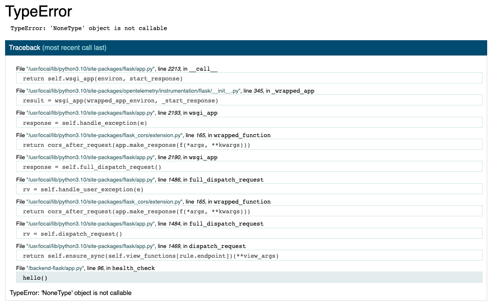

To also test that our `--no-debug` flag works in our production environment, let’s test it out in our development environment. 

In your `Dockerfile` in the `backend-flask` folder, change the `--debug` flag to a `--no-debug` flag. 

After this update, restart your app again. Once it’s started up, open the backend URL and append `/api/health-check` endpoint to it. Now, you should get this error which shows that our flags in each environment work. 

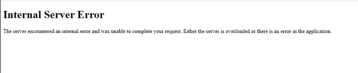

Go ahead and redo the flags to what it was. `--debug` flag for development and `--no-debug` flag for production.

**Remember to delete the extra stuff you added to your health check API.**

<details><summary>Push & Tag the New Images Created</summary>
<p> 

Instead of having always to type in our push and tag commands, let’s create scripts for those.

### Backend

In `backend-flask/bin/docker` directory, create another folder, `push` with file `backend-flask-prod` 

```bash
mkdir backend-flask/bin/docker/push
touch backend-flask/bin/docker/push/backend-flask-prod
```

```bash
#! /usr/bin/bash

ECR_BACKEND_FLASK_URL="$AWS_ACCOUNT_ID.dkr.ecr.$AWS_DEFAULT_REGION.amazonaws.com/backend-flask"
echo $ECR_BACKEND_FLASK_URL

# Tag image 
docker tag backend-flask-prod:latest $ECR_BACKEND_FLASK_URL:latest

# Push image
docker push $ECR_BACKEND_FLASK_URL:latest
```

To ensure you have the right permissions to execute the newly created script, run the following commands:

```bash
# by default, you will get a permission denied when trying to run a script you just created
# run this command to grant it permission - https://www.tutorialspoint.com/unix/unix-file-permission.htm
chmod 555 backend-flask/bin/docker/push/backend-flask-prod
  
# execute the script 
./backend-flask/bin/docker/push/backend-flask-prod
```

### Frontend

In `bin/docker/push` directory, create a file `frontend-react-js-prod`

```bash
# create file
touch backend-flask/bin/docker/push/frontend-react-js-prod
```

Content of the `frontend-react-js-prod` file:

```bash
#! /usr/bin/bash

ECR_FRONTEND_REACT_URL="$AWS_ACCOUNT_ID.dkr.ecr.$AWS_DEFAULT_REGION.amazonaws.com/frontend-react-js"
echo $ECR_FRONTEND_REACT_URL

# Tag image
docker tag frontend-react-js:latest $ECR_FRONTEND_REACT_URL:latest

# Push image
docker push $ECR_FRONTEND_REACT_URL:latest
```

</p>
</details>

<details><summary>Use Latest Task Definition for Deployment</summary>
<p> 

### Backend

To force a new deployment for our `backend-flask` service, every time we make an update to our task definition, we will create a script to do that for us.

In `backend-flask/bin/ecs` directory, create a file `force-deploy-backend-flask`

```bash
#! /usr/bin/bash

CLUSTER_NAME="cruddur"
SERVICE_NAME="backend-flask"
TASK_DEFINTION_FAMILY="backend-flask"

LATEST_TASK_DEFINITION_ARN=$(aws ecs describe-task-definition \
--task-definition $TASK_DEFINTION_FAMILY \
--query 'taskDefinition.taskDefinitionArn' \
--output text)

aws ecs update-service \
--cluster $CLUSTER_NAME \
--service $SERVICE_NAME \
--task-definition $LATEST_TASK_DEFINITION_ARN \
--force-new-deployment

#aws ecs describe-services \
#--cluster $CLUSTER_NAME \
#--service $SERVICE_NAME \
#--query 'services[0].deployments' \
#--output table
```

### Frontend

To force a new deployment for our `frontend-react-js` service, every time we make an update to our task definition, we will create a script to do that for us.

In `bin/ecs` directory, create a file `force-deploy-frontend-react-js`

```bash
# create file
touch backend-flask/bin/ecs/force-deploy-frontend-react-js
```

To ensure you have the right permissions to execute the newly created script, run the following commands:

```bash
# by default, you will get a permission denied when trying to run a script you just created
# run this command to grant it permission - https://www.tutorialspoint.com/unix/unix-file-permission.htm
chmod 555 backend-flask/bin/ecs/force-deploy-frontend-react-js
  
# execute the script 
./backend-flask/bin/ecs/force-deploy-frontend-react-js
```

Content of the `force-deploy-frontend-react-js` file:

```bash
#! /usr/bin/bash

CLUSTER_NAME="cruddur"
SERVICE_NAME="frontend-react-js"
TASK_DEFINTION_FAMILY="frontend-react-js"

LATEST_TASK_DEFINITION_ARN=$(aws ecs describe-task-definition \
--task-definition $TASK_DEFINTION_FAMILY \
--query 'taskDefinition.taskDefinitionArn' \
--output text)

aws ecs update-service \
--cluster $CLUSTER_NAME \
--service $SERVICE_NAME \
--task-definition $LATEST_TASK_DEFINITION_ARN \
--force-new-deployment
```

</p>
</details>

</p>
</details>


### 13. Refactor the `bin/` directory to be a top-level directory

Because we are experiencing some errors with pathing in our scripts, we are moving up our directories and removing some of the scripts. 

<details><summary>Refactoring the bin directory</summary>
<p> 

Let’s move our `backend-flask/bin` folder to our project root directory. 

```bash
# from the root of the project
mv backend-flask/bin/ bin/
```

Let’s start with our `frontend-react-js-prod` script,

```bash
#! /usr/bin/bash

ABS_PATH=$(readlink -f "$0")
BUILD_PATH=$(dirname $ABS_PATH)
DOCKER_PATH=$(dirname $BUILD_PATH)
BIN_PATH=$(dirname $DOCKER_PATH)
PROJECT_PATH=$(dirname $BIN_PATH)
FRONTEND_REACT_JS_PATH="$PROJECT_PATH/frontend-react-js"

docker build \
--build-arg REACT_APP_BACKEND_URL="https://4567-$GITPOD_WORKSPACE_ID.$GITPOD_WORKSPACE_CLUSTER_HOST" \
--build-arg REACT_APP_AWS_PROJECT_REGION="$AWS_DEFAULT_REGION" \
--build-arg REACT_APP_AWS_COGNITO_REGION="$AWS_DEFAULT_REGION" \
--build-arg REACT_APP_AWS_USER_POOLS_ID="$REACT_APP_AWS_USER_POOLS_ID" \
--build-arg REACT_APP_CLIENT_ID="$REACT_APP_CLIENT_ID" \
-t frontend-react-js \
-f "$FRONTEND_REACT_JS_PATH/Dockerfile.prod" \
"$FRONTEND_REACT_JS_PATH/."
```

Test out the file and see if it builds. 

To ensure you have the right permissions to execute the newly created script, run the following commands:

```bash
# by default, you will get a permission denied when trying to run a script you just created
# run this command to grant it permission - https://www.tutorialspoint.com/unix/unix-file-permission.htm
chmod 555 bin/docker/build/frontend-react-js-prod
  
# execute the script 
./bin/docker/build/frontend-react-js-prod
```

After building your frontend production image, go ahead to tag and push to ECR. 

```bash
./bin/docker/push/frontend-react-js-prod
```

Let’s move on and do the same with our `backend-flask-prod` file in the `build` directory.

```bash
#! /usr/bin/bash

ABS_PATH=$(readlink -f "$0")
BUILD_PATH=$(dirname $ABS_PATH)
DOCKER_PATH=$(dirname $BUILD_PATH)
BIN_PATH=$(dirname $DOCKER_PATH)
PROJECT_PATH=$(dirname $BIN_PATH)
BACKEND_FLASK_PATH="$PROJECT_PATH/backend-flask"

docker build \
-f "$BACKEND_FLASK_PATH/Dockerfile.prod" \
-t backend-flask-prod \
"$BACKEND_FLASK_PATH/."
```

After changes, go ahead and rebuild the image and push to ECR.

```bash
# build image 
./bin/docker/build/backend-flask-prod

# tag and push
./bin/docker/push/backend-flask-prod
```

<details><summary>The db Folder</summary>
<p> 

In this folder, we will be modifying most of its files. 

For `db/schema-load`, 

```bash
# after the color definitions
ABS_PATH=$(readlink -f "$0")
BIN_PATH=$(dirname $ABS_PATH)
PROJECT_PATH=$(dirname $BIN_PATH)
BACKEND_FLASK_PATH="$PROJECT_PATH/backend-flask"
schema_path="$BACKEND_FLASK_PATH/db/schema.sql"
echo $schema_path

# below, change to this
psql $URL cruddur < $schema_path
```

For `db/seed`,

```bash
CYAN='\033[1;36m'
NO_COLOR='\033[0m'
LABEL="db-seed"
printf "${CYAN}== ${LABEL}${NO_COLOR}\n"

ABS_PATH=$(readlink -f "$0")
BIN_PATH=$(dirname $ABS_PATH)
PROJECT_PATH=$(dirname $BIN_PATH)
BACKEND_FLASK_PATH="$PROJECT_PATH/backend-flask"
seed_path="$BACKEND_FLASK_PATH/db/seed.sql"
echo $seed_path

if [ "$1" = "prd" ]; then
  echo "Running in production mode"
  URL=$PRD_CONNECTION_URL
else
  URL=$CONNECTION_URL
fi

psql $URL cruddur < $seed_path
```

For `db/setup`,

```bash
#! /usr/bin/bash
set -e # stop if it fails at any point

CYAN='\033[1;36m'
NO_COLOR='\033[0m'
LABEL="db-setup"
printf "${CYAN}==== ${LABEL}${NO_COLOR}\n"

ABS_PATH=$(readlink -f "$0")
DB_PATH=$(dirname $ABS_PATH)

source "$DB_PATH/drop"
source "$DB_PATH/create"
source "$DB_PATH/schema-load"
source "$DB_PATH/seed"
python "$DB_PATH/update_cognito_user_ids"
```

</p>
</details>

For `gitpod.yml`, 

```bash
# remove backend-flask
source "$THEIA_WORKSPACE_ROOT/bin/rds/update-sg-rule"
```

After all the modifications, rebuild both backend and frontend images, if not rebuilt already, so we can test out our production environment. 

- Navigate to the `prd` URL using your API subdomain - `api.mydomain.com`
  
- If it says `site not reached`, that’s not true. Clear your cache or use a different browser.
  
- Check out the following URLs
  
    - `api.mydomain.com/api/health-check`
      
    - `api.mydomain.com/api/activities/home`
      
    - append some erroneous stuff to the URL to be sure our `no-debug` flag is working properly in `prd`

</p>
</details>


### 14. Fix Messaging in Production

Our DynamoDB isn’t working in production mode, so let’s debug that. 

To be sure you don’t have any data showing up on your `frontend`, go to your URL, `mydomain.com`, and try signing in in case there’s an expired token. When signed in, if you don’t still see any data, go ahead and start debugging. 

In your browser, right-click and select **Inspect** to debug the page. 

- Now navigate to the **Network** tab,
  
- You should see an error from `OPTIONS` and `GET`. The one we care about is the `GET` request.
  
- Click on it and see if it is pointed to the right URL

- If not, there you have the reason for your error

<details><summary>Error Persists</summary>
<p> 

If the error is still there, go back to your codebase and inspect your environment variables in `bin/docker/build/frontend-react-js-prod`

- Your `REACT_APP_BACKEND_URL` shouldn’t be pointing to the Gitpod workspace URL but instead to your domain name.

	```bash
	# change this 
	--build-arg REACT_APP_BACKEND_URL="https://4567-$GITPOD_WORKSPACE_ID.$GITPOD_WORKSPACE_CLUSTER_HOST" \
	
	# to this 
	--build-arg REACT_APP_BACKEND_URL="https://api.mydomain.com" \
	```

After the update, we need to rebuild our image, push, and deploy it. 

	```bash
	# rebuild my prd image 
	./bin/docker/build/frontend-react-js-prod
	
	# push my new image 
	./bin/docker/push/frontend-react-js-prod
	
	# force deployment
	./bin/ecs/force-deploy-frontend-react-js
	```

Go back to your ECS on the AWS console to confirm the deployment was successful. Check that it wasn’t continuously failing. 

- Go over to your EC2 service and check that the target groups are not still draining if they are, that’s because it’s replacing the currently running version of the container with the latest version of the deployment.
  
- The ECS `DeploymentController` is how ECS handles deployments.
  
- Every time we do a deployment, it is doing the `ECS` type deployment. And this type of deployment involves replacing the currently running version of the container with the latest version.
  
- Check out this [documentation](https://docs.aws.amazon.com/AmazonECS/latest/APIReference/API_DeploymentController.html)

While the target group is still `draining`, refresh your frontend and open up `Inspect` again. You shouldn’t be seeing any errors anymore. 

</p>
</details>

While waiting for the **target group** to finish draining, let's go ahead and restructure our script files. 

<details><summary>Restructure Script Files</summary>
<p> 

Due to the cumbersome amount of scripts we have and navigating to them, it’s a lot of overhead. So to alleviate these difficulties, let’s try restructuring again. 

In the `bin/` directory, let’s create folders for our respective apps, `frontend` and `backend`. 

```bash
mkdir bin/frontend 
mkdir bin/backend
```

Now let’s move our respective files into the right folders. 

In the `bin/frontend` directory, move the `frontend-react-js-prod` file to the `frontend` and rename it to `build`. Do the same for the `backend-flask-prod` to `backend` and rename it to `build` as well.  

```bash
# for the build folder 
mv bin/docker/build/frontend-react-js-prod bin/frontend/build
mv bin/docker/build/backend-flask-prod bin/backend/build

# for the push folder 
mv bin/docker/push/frontend-react-js-prod bin/frontend/push
mv bin/docker/push/backend-flask-prod bin/backend/push

# for the ecs folder 
mv bin/ecs/connect-to-frontend-react-js bin/frontend/connect
mv bin/ecs/connect-to-backend-flask bin/backend/connect

mv bin/ecs/force-deploy-frontend-react-js bin/frontend/deploy
mv bin/ecs/force-deploy-backend-flask bin/backend/deploy

```

Now let’s update the paths. 

In `bin/backend/build`, update the code with:

```bash
ABS_PATH=$(readlink -f "$0")
BACKEND_PATH=$(dirname $ABS_PATH)
BIN_PATH=$(dirname $BACKEND_PATH)
PROJECT_PATH=$(dirname $BIN_PATH)
BACKEND_FLASK_PATH="$PROJECT_PATH/backend-flask"
```

In `bin/frontend/build`, update the code with:

```bash
ABS_PATH=$(readlink -f "$0")
FRONTEND_PATH=$(dirname $ABS_PATH)
BIN_PATH=$(dirname $FRONTEND_PATH)
PROJECT_PATH=$(dirname $BIN_PATH)
FRONTEND_REACT_JS_PATH="$PROJECT_PATH/frontend-react-js"
```

</p>
</details>

Now our target group should be done `draining`. Reload your domain name in the browser, and now you should see some data. 

Navigate to the **Messages** page to see if your users show up. NOPE, they don’t. Do an `Inspect` to confirm there aren’t any errors. 

- If no errors, append this to your URL - `/messages/new/yah_king` and you should still see no data.
  
- That is because our seeded data exists locally and not in our production database.
  
- Let’s go ahead and seed some data into our production.

```bash
./bin/db/connect prd 

# inside database 
\x on
SELECT * FROM USERS;
```

If only one user exists in the DB, then that’s why we don’t have any users showing up. 

So to populate our production DB with some users, let’s manually add them. 

- Navigate to your `backend-flask/db/seed.sql` file and copy the command to insert a value. **Be sure not to insert a user that already exists - a duplicate.**

```sql
# make sure this is not the same user in have in the DB 
# when you connected to prd
INSERT INTO public.users (display_name, email, handle, cognito_user_id) VALUES ('Andrew Bayko','bayko@exampro.co', 'bayko','MOCK')
```

<details><summary>Errors that Could Be Encountered Due to Duplicate Users</summary>
<p> 

When you create a duplicate user, you get a `500` error for `short` when navigating to another user handle - `/new/some_handle`

Using **Inspect**, Rollbar, and CloudWatch Logs to investigate the problem. 

According to all the monitoring tools, it shows that the issue is with our `users short` data. And that is not helping because that’s not the problem. Hmmm 🤔

Okay, let’s navigate to our `/backend-flask/services/users_short.py` file; we see that everything looks fine. 

Let’s connect to our DB production and see the users we have there 

```sql
# connect to DB
./bin/db/connect prd 

# inside database 
\x on
SELECT * FROM USERS;
```

You should see that you have created a duplicate user. 

Delete one of those users using this command:

```sql
DELETE FROM USERS WHERE uuid = 'ac38cf67-1d82-4e4a-a578-f2f92c9d4944';
```

But it raises the question, why do we have a `500` error instead of another error code to tell us exactly what the issue was? I guess it could be a wrong error logging on our end. 

Let’s navigate to our `backend-flask/lib/db.py` file and see what this section of code returns 

```python
with self.pool.connection() as conn:
      with conn.cursor() as cur:
        cur.execute(wrapped_sql,params)
        json = cur.fetchone()
        if json == None:
          "{}"
          else:
            return json[0]
```

Make sure to `docker compose down` and back up again for our changes of deleting one of the duplicate users to reflect.

</p>
</details>

<details><summary>Still Fixing Messaging in Production</summary>
<p> 

Let’s seed data into our production environment. Before running the script for that, make sure the paths in the file are correct after our restructuring. 

In `bin/db/setup` file, update with the following code:

```bash
# update with this 
ABS_PATH=$(readlink -f "$0")
DB_PATH=$(dirname $ABS_PATH)

source "$DB_PATH/drop"
source "$DB_PATH/create"
source "$DB_PATH/schema-load"
source "$DB_PATH/seed"
python "$DB_PATH/update_cognito_user_ids"
```

For `schema-load`, update with the following code:

```bash
ABS_PATH=$(readlink -f "$0")
DB_PATH=$(dirname $ABS_PATH)
BIN_PATH=$(dirname $DB_PATH)
PROJECT_PATH=$(dirname $BIN_PATH)
```

For `seed`, update with the following code:

```bash
ABS_PATH=$(readlink -f "$0")
DB_PATH=$(dirname $ABS_PATH)
BIN_PATH=$(dirname $DB_PATH)
```

Now try running the `setup` script:

```bash
./bin/db/setup
```

Due to having so many open DB sessions, we will be creating a script to kill our open sessions.

In `backend-flask/db` directory, create a file `kill-all-connections.sql` with the following content:

```sql
touch backend-flask/db/kill-all-connections.sql

# file content 
SELECT pg_terminate_backend(pid)
FROM pg_stat_activity
WHERE   
-- don't kill my own connection!
pid <> pg_backend_pid()
-- don't kill the connections to other databases
AND datname = 'cruddur';
```

To be sure the SQL file works, run the above commands inside the DB 

```sql
# connect to DB
./bin/db/connect

# inside DB 
SELECT pg_terminate_backend(pid)
FROM pg_stat_activity
WHERE   
-- don't kill my own connection!
pid <> pg_backend_pid()
-- don't kill the connections to other databases
AND datname = 'cruddur';
```

Now go ahead and run the `setup` script to drop and create a new DB.

Go ahead and create a `kill-all` script for the SQL file you created. 

In `bin/db` create a file `kill-all` with the following contents:

```bash
# create file
touch bin/db/kill-all

# file content
#! /usr/bin/bash

CYAN='\033[1;36m'
NO_COLOR='\033[0m'
LABEL="Kill all open connections..."
printf "${CYAN}== ${LABEL}${NO_COLOR}\n"

ABS_PATH=$(readlink -f "$0")
DB_PATH=$(dirname $ABS_PATH)
BIN_PATH=$(dirname $DB_PATH)
PROJECT_PATH=$(dirname $BIN_PATH)
BACKEND_FLASK_PATH="$PROJECT_PATH/backend-flask"
kill_path="$BACKEND_FLASK_PATH/db/kill-all-connections.sql"
echo $kill_path

psql $CONNECTION_URL cruddur < $kill_path
```

To ensure you have the right permissions to execute the newly created script, run the following commands:

```bash
# by default, you will get a permission denied when trying to run a script you just created
# run this command to grant it permission - https://www.tutorialspoint.com/unix/unix-file-permission.htm
chmod 555 bin/db/kill-all
  
# execute the script 
./bin/db/kill-all
```

In the `kill-all` script, we made sure we didn’t do that for production, which is very important. Take note of that. 

Try running the `setup` script again. If you are encountering this error, it’s probably from the path in your `update_cognito...` file. 

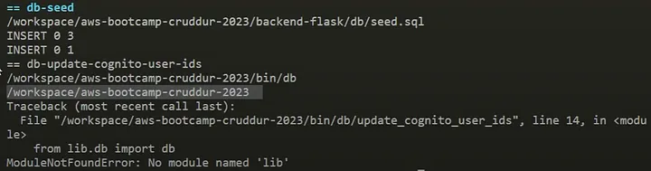

To resolve that, update the `parent_path` to include `backend-flask` like so:

```python
current_path = os.path.dirname(os.path.abspath(__file__))
parent_path = os.path.abspath(os.path.join(current_path, '..', '..','backend-flask'))
sys.path.append(parent_path)
```

Go ahead and try running the `setup` file again; there shouldn’t be any more errors. Now to load our message data, run the dynamodb `schema-load`

```bash
./bin/ddb/schema-load

# now seed data
./bin/ddb/seed
```

If you are encountering the same error as above, `ModuleNotFoundError: No module named 'lib'`, then it is probably a path problem. Do the same thing you did to fix that by adding `backend-flask` to the `parent_path`

Now go ahead and run the `ddb/seed` file again. And there should be no more errors.

</p>
</details>

With the local environment running now, open up the Gitpod backend URL on the browser and append `/api/users/@bayko/short`. Make sure the user handle you are using in the URL is the one you just manually added. 

If you are encountering this error page, follow the guide below to resolve it.

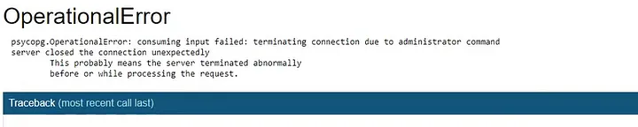

<details><summary>Troubleshooting Operational Error in the User Short</summary>
<p> 

Open up your `Gitpod` frontend URL on the browser and sign in. If you are not returning any data, simply do a quick browser refresh, and now you should see some data. It could probably be a `token expired` error. 

Let’s navigate to `/messages/new/bayko` and do an **Inspect** of the page. You should see a successful request on the `short`

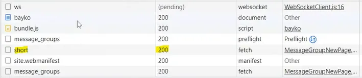

Let’s try entering an errored URL, `/messages/new/bay`, you should see an error, but that’s not what it should be doing. It should be returning nothing when there’s an error. 

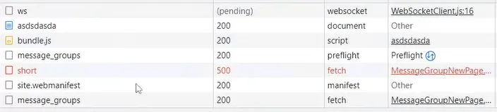

Let’s go back to our `backend-flask/lib/db.py` file and scroll down to this section of the code 

```python
# change the "{}" part 
with self.pool.connection() as conn:
      with conn.cursor() as cur:
        cur.execute(wrapped_sql,params)
        json = cur.fetchone()
        if json == None:
          "{}" # ------> why we have the error
          else:
            return json[0]

# to this 
with self.pool.connection() as conn:
      with conn.cursor() as cur:
        cur.execute(wrapped_sql,params)
        json = cur.fetchone()
        if json == None:
          return "{}" # ------> needed a return statement
          else:
            return json[0]
```

Now when you enter a bad URL, you should get this instead of the `500` error.

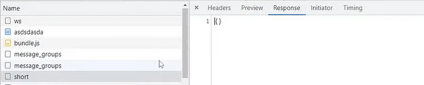

</p>
</details>

<details><summary>Update Production with Changes</summary>
<p> 

Now let’s rebuild, push and deploy.

```bash
# build image 
./bin/backend/build

# push image 
./bin/backend/push

# re-deploy
./bin/backend/deploy
```

Let’s connect to our production database 

```bash
# connect to DB
./bin/db/connect prd

# manually insert a user
# make sure it's NOT a duplicate user 
INSERT INTO public.users (display_name, email, handle, cognito_user_id) VALUES ('Andrew Bayko', 'bayko@test.com', 'bayko','MOCK');
```

After that insertion, give it a while and refresh your URL - `mydomain.com/messages/new/handle_of_user_just_added`; now you should see the user appear. You can also try your local URL.

Make sure to do an **Inspect** to be sure there are no errors. If there is one, it could probably be an expired token, just sign out and sign back in and navigate to that URL again. Check the **Inspect** page again to be sure no errors again. Yahhhh! 🎉 no more errors. 

Now let’s try sending a message to the user, that should also go through.

</p>
</details>


### 15. Implement Refresh Token for Amazon Cognito

When we make API requests, sometimes our Cognito token expires that’s because of how we built it.

If you check the `CheckAuth.js` file, there is this part of the code,  `Auth.currentAuthenticatedUser({` which does not attempt to renew our token. We thought that configuration would work, but obviously, it didn’t. To fix it, we will have to wrap it in another function to make sure it gets set properly.

<details><summary>Implementation</summary>
<p> 

Remember to login to ECR before you do a `docker compose up`.

```bash
./bin/ecr/login
```

Now let's set up our environment if it's not already set up. 

```bash
# start application
docker compose up

# set up DB
./bin/db/setup
./bin/ddb/schema-load
./bin/ddb/seed
```

After the setup, open up your local environment - frontend and login to the app let's begin some investigation. 

Let’s navigate back to our `CheckAuth.js` file and inspect it. 

```js
const checkAuth = async (setUser) => {
  Auth.currentAuthenticatedUser({
    // Optional, By default is false.
    // If set to true, this call will send a 
    // request to Cognito to get the latest user data
    bypassCache: false
  })
// THIS PART IS CALLED TWICE 
  .then((user) => {
    console.log('user',user);
    return Auth.currentAuthenticatedUser()
// THIS PART IS CALLED TWICE 
  }).then((cognito_user) => {
      console.log('cognito_user',cognito_user);
      setUser({
        display_name: cognito_user.attributes.name,
        handle: cognito_user.attributes.preferred_username
      })
```

You would see that the user is called twice. Even in the frontend **Inspect** console, you will see that a user is called twice.

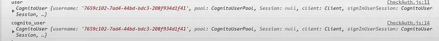

Let’s update our code to remove any redundancies 

```jsx
const checkAuth = async (setUser) => {
  Auth.currentAuthenticatedUser({
    // Optional, By default is false.
    // If set to true, this call will send a 
    // request to Cognito to get the latest user data
    bypassCache: false
  })
  .then((cognito_user) => {
    console.log('cognito_user',cognito_user);
    setUser({
        display_name: cognito_user.attributes.name,
        handle: cognito_user.attributes.preferred_username
      })
    return Auth.currentSession()
  }).then((cognito_user) => {
      console.log('cognito_user_session',cognito_user_session);
      localStorage.setItem("access_token", cognito_user_session.accessToken.jwtToken)
  })
  .catch((err) => console.log(err));
```

Apparently, we need to do this every time we make API calls to make sure our tokens are fresh. So we will probably wrap this around another function. 

In your `CheckAuth.js` file, let’s create another function called `getAccessToken`

```jsx
const getAccessToken = async () => {
  Auth.currentSession()
  .then((cognito_user_session) => {
    localStorage.setItem("access_token", cognito_user_session.accessToken.jwtToken);
    return localStorage.getItem("access_token")
    
  })   
  .catch((err) => console.log(err));
}
```

Now let’s pass along our new function, `getAccessToken` in our `HomeFeedPage.js` file

```jsx
// REMOVE THIS 
import checkAuth from '../lib/CheckAuth';

// ADD THIS
import {checkAuth, getAccessToken} from 'lib/CheckAuth';

// UPDATE THIS SECTION with the below information
  const loadData = async () => {
    try {
      const backend_url = `${process.env.REACT_APP_BACKEND_URL}/api/activities/home`
      const access_token = getAccessToken()
      console.log('access_token',access_token)
      const res = await fetch(backend_url, {
        headers: {
          Authorization: `Bearer ${access_token}`
        },
        method: "GET"
      });
```

Let’s test it out in our `dev` environment - the local web app in `Gitpod`. 

- Simply open up your frontend in the browser. If you are getting this error, follow the guidelines to resolve it.

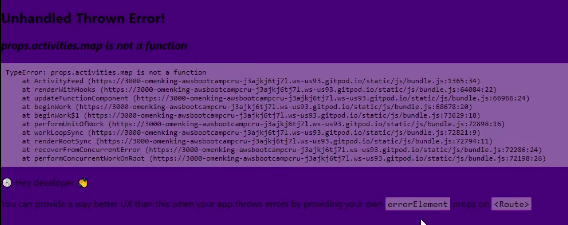

- Make the following update to your `CheckAuth.js` file:

```jsx
// Replace the "const" with "export async function"
export async function getAccessToken(){
  Auth.currentSession()
  .then((cognito_user_session) => {
    localStorage.setItem("access_token", cognito_user_session.accessToken.jwtToken);
    return localStorage.getItem("access_token")
    
  })   
  .catch((err) => console.log(err));
}

export async function checkAuth(setUser){
  Auth.currentAuthenticatedUser({
    // Optional, By default is false.
    // If set to true, this call will send a 
    // request to Cognito to get the latest user data
    bypassCache: false
  })
  .then((cognito_user) => {
    console.log('cognito_user',cognito_user);
    setUser({
        display_name: cognito_user.attributes.name,
        handle: cognito_user.attributes.preferred_username
      })
    return Auth.currentSession()
  }).then((cognito_user) => {
      console.log('cognito_user_session',cognito_user_session);
      localStorage.setItem("access_token", cognito_user_session.accessToken.jwtToken)
  })
  .catch((err) => console.log(err));
```

Go ahead and refresh your browser, and now we should be displaying our normal page. If you still get errors, try to replace every instance of `import CheckAuth` with `import {checkAuth}`. This should be located in the files under the `pages` directory and reload afterward. 

Take a look at your **Inspect** page and verify that there are no more errors. If you see an `access token undefined` error, follow the guidelines below to resolve it. 

- Go ahead and replace the code again in your `CheckAuth.js` file

```jsx
import { Auth } from 'aws-amplify';
import { resolvePath } from 'react-router-dom';

export async function getAccessToken(){
  Auth.currentSession()
  .then((cognito_user_session) => {
    const access_token = cognito_user_session.accessToken.jwtToken
    localStorage.setItem("access_token", access_token)
  })
  .catch((err) => console.log(err));
}

export async function checkAuth(setUser){
  Auth.currentAuthenticatedUser({
    // Optional, By default is false. 
    // If set to true, this call will send a 
    // request to Cognito to get the latest user data
    bypassCache: false 
  })
  .then((cognito_user) => {
    console.log('cognito_user',cognito_user);
    setUser({
      display_name: cognito_user.attributes.name,
      handle: cognito_user.attributes.preferred_username
    })
    return Auth.currentSession()
  }).then((cognito_user_session) => {
      console.log('cognito_user_session',cognito_user_session);
      localStorage.setItem("access_token", cognito_user_session.accessToken.jwtToken)
  })
  .catch((err) => console.log(err));
};

export default checkAuth;
```

- Search for the word `Authorization` and add these lines of codes to it

```jsx
// add at the top
import {getAccessToken} from '../lib/CheckAuth';
// if there is for "checkAuth" just combine like this
import {checkAuth, getAccessToken} from '../lib/CheckAuth';

// add above "const res = await fetch..."
await getAccessToken()
const access_token = localStorage.getItem("access_token")

// in the "headers" section where it says "Authorization"
'Authorization': `Bearer ${access_token}`
```

Go ahead and refresh your browser again, and now everything should be in good shape.

</p>
</details>


### 16. Configure Task Definitions to contain X-ray and Turn on Container Insights

Using AWS X-ray will give us more observability in our Fargate service, and it’s easier. Let’s go ahead and add that to our task definitions.

<details><summary>Configure Task Definitions to contain X-ray</summary>
<p> 

In your `aws/task-definitions/backend-flask.json` file, add these lines of code under the `containerDefinitions` section:

```json
{
        "name": "xray",
        "image": "public.ecr.aws/xray/aws-xray-daemon",
        "essential": true,       
        "user": "1337",
        "portMappings": [
          {
            "name": "xray",
            "containerPort": 2000,
            "protocol": "udp"
          }
        ]        
      },
```

Since we added additional configuration to the `task-definition`, we have to register the task again. To avoid always going to copy the code, let’s just create a script to make our lives easier. 

In the `bin/backend/` folder, create a file `register`:

```bash
# create file
touch bin/backend/register
touch bin/frontend/register

# FILE content 

# BACKEND
#! /usr/bin/bash
ABS_PATH=$(readlink -f "$0")
BACKEND_PATH=$(dirname $ABS_PATH)
BIN_PATH=$(dirname $BACKEND_PATH)
PROJECT_PATH=$(dirname $BIN_PATH)
TASK_DEF_PATH="$PROJECT_PATH/aws/task-definitions/backend-flask.json"

echo $TASK_DEF_PATH

aws ecs register-task-definition \
--cli-input-json "file://$TASK_DEF_PATH"

#FRONTEND
#! /usr/bin/bash

ABS_PATH=$(readlink -f "$0")
FRONTEND_PATH=$(dirname $ABS_PATH)
BIN_PATH=$(dirname $FRONTEND_PATH)
PROJECT_PATH=$(dirname $BIN_PATH)
TASK_DEF_PATH="$PROJECT_PATH/aws/task-definitions/frontend-react-js.json"

echo $TASK_DEF_PATH

aws ecs register-task-definition \
--cli-input-json "file://$TASK_DEF_PATH"
```

To ensure you have the right permissions to execute the newly created script, run the following commands:

```bash
# by default, you will get a permission denied when trying to run a script you just created
# run this command to grant it permission - https://www.tutorialspoint.com/unix/unix-file-permission.htm
chmod 555 bin/backend/register
chmod 555 bin/frontend/register
  
# execute the script 
./bin/backend/register
./bin/frontend/register
```

Taking a look at our previous scripts in the `bin/` directory, here are a couple of changes to make. 

```bash
# backend/build
ABS_PATH=$(readlink -f "$0")
BACKEND_PATH=$(dirname $ABS_PATH)
BIN_PATH=$(dirname $BACKEND_PATH)
PROJECT_PATH=$(dirname $BIN_PATH)
BACKEND_FLASK_PATH="$PROJECT_PATH/backend-flask"

# frontend/build
ABS_PATH=$(readlink -f "$0")
FRONTEND_PATH=$(dirname $ABS_PATH)
BIN_PATH=$(dirname $FRONTEND_PATH)
PROJECT_PATH=$(dirname $BIN_PATH)
FRONTEND_REACT_JS_PATH="$PROJECT_PATH/frontend-react-js"
```

Now let’s trigger a new deployment so our updates can be implemented. This is just for the `backend`

```bash
./bin/backend/deploy
```

Go to your AWS console to observe your latest deployment by navigating to the **ECS** service and clicking on the `backend-flask` service. 

- Make sure you check out how many containers it’s running - specifically, check for the x-ray container.

If the newest container, **x-ray** isn’t showing up, go back to your CLI to confirm you have the latest running. 

In your **Terminal**, run these commands below:

```bash
TASK_DEFINITION_FAMILY="backend-flask"
aws ecs describe-task-definition \
--task-definition $TASK_DEFINITION_FAMILY \
--query 'taskDefinition.taskDefinitionArn' \
--output text
```

Compare the tag number to the one running in the console (revision number) to be sure they are the same number. **If not**, go ahead and deploy again; hopefully, this time, it resolves the issue. 

```bash
./bin/backend/deploy
```

Go back to the console and confirm your deployment again. 

Deployment passed this time and with the right revision number, but our `x-ray` container is coming back with `unknown` health status. Also, our `backend-flask` is returning an `unhealthy` health status as well. 

Now, let’s troubleshoot these health checks.

<details><summary>Troubleshooting Health Check Errors</summary>
<p> 

To troubleshoot this problem, let’s have a look at our logs 

According to our logs, we find out that our tasks are returning a `200` status and passing our `api/health-check`. Not sure why we are still having an `unhealthy` health status. 

Let’s try forcing a new deployment from the console. 

Seems like the new deployment is having the same error as well. 

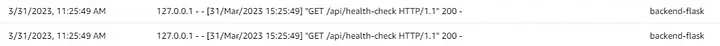

Let’s go back to our CLI and remove the x-ray definition we added in our `backend-flask` task definitions. Hopefully, this will revert our deployment to a `healthy` status. 

- Go ahead and re-register the task and deploy

NOPE!!! We are still having the same error of `Task failed container health checks`

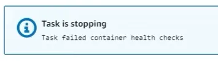

Looks like adding our x-ray definition didn’t cause any problems. Let’s go ahead and add back our x-ray definition and debug the issue locally. We want to test our health checks locally.

- First, let’s build our image locally

```bash
./bin/backend/build
```

- Then start up your application with `docker compose` for select services, `db` and `dynamodb-local`
  
- Set up our data

```bash
./bin/db/setup
```

- Start the backend production locally

```bash
# create file 
touch bin/backend/run

# FILE CONTENT
#! /usr/bin/bash

docker run --rm \
  -p 4567:4567
  -it backend-flask-prod 
```

To ensure you have the right permissions to execute the newly created script, run the following commands:

```bash
# by default, you will get a permission denied when trying to run a script you just created
# run this command to grant it permission - https://www.tutorialspoint.com/unix/unix-file-permission.htm
chmod 555 bin/backend/run
  
# execute the script 
./bin/backend/run
```

Running the new script will cause some errors because it’s missing environment variables. Instead of having to load our environment variables one at a time every time, let’s create a `.env` file in our root project.

In the root of our workspace, create the files `.env.backend-flask` and `.env.frontend-react-js`. For these files, we will cut all of our env vars from our `docker-compose.yml` and paste them into their respective `.env` file. 

```bash
# .env.backend-flask
# REPLACE the ":" with "="

# .env.frontend-react-js
# REPLACE the ":" with "="
```

Remember to update your `docker-compose.yml` to point to the new `.env` files. 

```yaml
services:
  backend-flask:
    env_file:
      - .env.backend-flask

  frontend-react-js:
    env_file:
      - .env.frontend-react-js
```

Let’s go back and update the `run` script we created earlier to call our env vars file. 

```bash
#! /usr/bin/bash 

ABS_PATH=$(readlink -f "$0")
BACKEND_PATH=$(dirname $ABS_PATH)
BIN_PATH=$(dirname $BACKEND_PATH)
PROJECT_PATH=$(dirname $BIN_PATH)
ENVFILE_PATH="$PROJECT_PATH/.env.backend-flask"

docker run --rm \
  --env-file $ENVFILE_PATH \
  --publish 4567:4567 \
  -it backend-flask-prod
```

Let’s test out our new configuration with our env vars. Go ahead and `docker compose down` your environment and start it up again, `docker compose up`. 

In your backend container, attach a shell to check if your environment variables are coming back as expected. Simply run an `env` command in the shell. 

- Make sure your `BACKEND_URL` and `FRONTEND_URL` have the right URLs locally

After checking and making sure our variables are coming back as expected, `docker compose down` and do a `docker compose up` for selected services, `db`, `dynamodb-local` and `xray-daemon`. 

Ensure you have seeded data by running the `setup` script. 

```bash
./bin/db/setup

# start up backend production locally
./bin/backend/run
```

After starting up the backend production locally, we see an `xray-daemon` error show up like so:

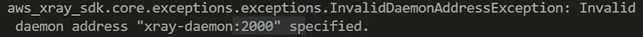

Trying to debug this error, we figured out that the problem is from how the network is handled in containers. Since `xray` runs as its own container, it uses `localhost` as its network instead of what has been defined for it. 

First of all, let’s look at the list of networks we have.

```bash
docker network list
```

We see that there’s a default that is always created. If you do a `docker compose down`, you will see that the `aws-bootcamp.._default` disappears. 

Ignore the `cruddur-net` you can choose to create it or not, but it doesn’t do anything for us here.

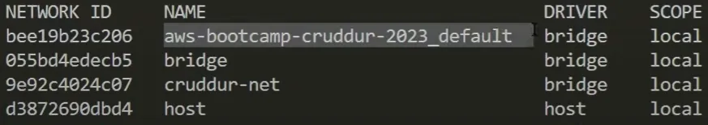

```bash
docker network create cruddur-net
```

In your `docker-compose.yml` file, edit the `networks` section with this:

```yaml
networks: 
  default:
    driver: bridge
    name: cruddur-net
```

With this modification, update your run script with the following:

```bash
#! /usr/bin/bash 

ABS_PATH=$(readlink -f "$0")
BACKEND_PATH=$(dirname $ABS_PATH)
BIN_PATH=$(dirname $BACKEND_PATH)
PROJECT_PATH=$(dirname $BIN_PATH)
ENVFILE_PATH="$PROJECT_PATH/.env.backend-flask"

docker run --rm \
  --env-file $ENVFILE_PATH \
  --network cruddur-net \
  --publish 4567:4567 \
  -it backend-flask-prod
```

Now do a `docker compose down` and up again for the selected services, `db`, `xray-daemon`, and `dynamodb-local`. After that, seed your database again using the `setup` script. 

All these updates still don’t help out our previous error message because we are still getting the same problem. 

Investigating further, we determine that the problem is how we pass our environment variables. To fix this, we have to generate our environment variables each time our environment loads, but that’s kind of frustrating. So we will be using `ruby` to generate our env variables.

<details><summary>Generate env vars using Ruby</summary>
<p> 

We start by creating a ruby script.

### Backend

In your `bin/backend/` directory, create a file `generate-env`

```ruby
#!/usr/bin/env ruby

require 'erb'

template = File.read '.env.backend-flask.erb'
script_content = ERB.new(template).result(binding)
```

The above script is going to read the environment variable from the file, `.env.backend-flask.erb`. 

In the root of the project, create a file `.env.backend-flask.erb` 

```bash
touch .env.backend-flask.erb
```

Here is the content of the file:

```bash
# copy the content of the ".env.backend-flask" file 
# make sure to follow the format and syntax for ruby
# replace "${" with " <%= ENV[' " and "}" to " '] %>"
# also uncomment some of the lines 
```

Now let’s make sure Ruby knows exactly where the file is so it can render the right one. Go ahead and update your `generate-env` file with the following:

```ruby
#!/usr/bin/env ruby

require 'erb'

template = File.read '.env.backend-flask.erb'
content = ERB.new(template).result(binding)
filename = ".env.backend-flask"
File.write(filename, content)
```

You can now go ahead and delete the `.env.backend-flask` as it is no longer needed. 

To properly organize our files, create a folder, `erb`, in the root of the project and move the `.env.backend-flask.erb` into the new folder. 

```bash
# create directory
mkdir erb

# move file to new folder
mv .env.backend-flask.erb erb/
```

Don’t forget to edit the path in the `generate-env` file.

```bash
#!/usr/bin/env ruby

require 'erb'

template = File.read 'erb/.env.backend-flask'
content = ERB.new(template).result(binding)
filename = ".env.backend-flask.erb"
File.write(filename, content)
```

To ensure you have the right permissions to execute the newly created script, run the following commands:

```bash
# by default, you will get a permission denied when trying to run a script you just created
# run this command to grant it permission - https://www.tutorialspoint.com/unix/unix-file-permission.htm
chmod 555 bin/backend/generate-env
  
# execute the script 
./bin/backend/generate-env
```

### Frontend

Let’s go ahead and create an env vars file for our frontend. 

In your `erb/` directory, create a file, `.env.frontend-react-js.erb`, and copy the content of the `.env.frontend-react-js` into it. Make sure you update the format and syntax to `ruby`'s.

```bash
touch erb/.env.frontend-react-js.erb

# make sure to edit syntax
```

In your `bin/frontend/` directory, create a file `generate-env`

```bash
#!/usr/bin/env ruby

require 'erb'

template = File.read 'erb/.env.frontend-react-js.erb'
content = ERB.new(template).result(binding)
filename = '.env.frontend-react-js.erb'
File.write(filename, content)
```

Because our `.gitignore` file is set to ignore `.env` files, we will need to change the names of our env vars files. 

```bash
mv erb/.env.backend-flask erb/backend-flask.env.erb
mv erb/.env.frontend-react-js.erb erb/frontend-react-js.env.erb
```

Update the `generate-env` files of both `backend` and `frontend` to reflect the new filenames. 

```bash
# backend

#!/usr/bin/env ruby

require 'erb'

template = File.read 'erb/backend-flask.env.erb'
content = ERB.new(template).result(binding)
filename = "backend-flask.env"
File.write(filename, content)

# frontend

#!/usr/bin/env ruby

require 'erb'

template = File.read 'erb/frontend-react-js.env.erb'
content = ERB.new(template).result(binding)
filename = 'frontend-react-js.env'
File.write(filename, content)
```

To ensure you have the right permissions to execute the newly created script, run the following commands:

```bash
# by default, you will get a permission denied when trying to run a script you just created
# run this command to grant it permission - https://www.tutorialspoint.com/unix/unix-file-permission.htm
chmod 555 bin/frontend/generate-env
  
# execute the script 
./bin/frontend/generate-env
```

### Updates

Now, to ensure that these variables are available and accessible when we spin up our workspace, we add them to our `gitpod.yml` file. 

```yaml
# in the frontend section
- name: react-js
    command: |
      ruby "$THEIA_WORKSPACE_ROOT/bin/frontend/generate-env"
			cd frontend-react-js
			npm i

# in the backend section
- name: flask 
    command: |
      ruby "$THEIA_WORKSPACE_ROOT/bin/backend/generate-env"
			cd backend-flask
			pip install -r requirements.txt
```

Remember to update your `docker-compose.yml` file with the latest environment variable files. 

```yaml
# frontend 
frontend-react-js:
    env_file:
      - frontend-react-js.env

# backend
backend-flask:
    env_file:
      - backend-flask.env
```

Also, update your `bin/backend/run` file:

```bash
#! /usr/bin/bash 

ABS_PATH=$(readlink -f "$0")
BACKEND_PATH=$(dirname $ABS_PATH)
BIN_PATH=$(dirname $BACKEND_PATH)
PROJECT_PATH=$(dirname $BIN_PATH)
ENVFILE_PATH="$PROJECT_PATH/backend-flask.env"

docker run --rm \
  --env-file $ENVFILE_PATH \
  --network cruddur-net \
  --publish 4567:4567 \
  -it backend-flask-prod
```

Go ahead and create one for the frontend as well.

In `bin/frontend` folder, create a file, `run` with the following content:

```bash
touch bin/frontend/run

# FILE CONTENT

#! /usr/bin/bash 

ABS_PATH=$(readlink -f "$0")
BACKEND_PATH=$(dirname $ABS_PATH)
BIN_PATH=$(dirname $BACKEND_PATH)
PROJECT_PATH=$(dirname $BIN_PATH)
ENVFILE_PATH="$PROJECT_PATH/frontend-react-js.env"

docker run --rm \
  --env-file $ENVFILE_PATH \
  --network cruddur-net \
  --publish 4567:4567 \
  -it frontend-react-js-prod
```

You can shell into both environments to ensure their environment variables are set properly by running the `env` command. 

Let’s also update our docker networks in our `docker-compose.yml` file. 

```yaml
networks: 
  cruddur-net:
    driver: bridge
    name: cruddur-net

# Still in the file, explicitly add the network "cruddur-net" for each service. 
```

To see the IP addresses of your docker containers, run this command:

```yaml
docker network inspect cruddur-net
```

Now try running `./bin/backend/run` command, and if you are still getting the error, do these:

- remove the double quotes `"` in the `.env.erb` files. It doesn’t like double quotes around the environment variables.
  
- now regenerate those environment variables again by running `./bin/backend/generate-env` and `./bin/frontend/generate-env`
  
- manually create the `cruddur-net` network if you don’t have it created already

```bash
docker network create cruddur-net
```

- manually build the `backend-flask-prod` image if it doesn’t exist

```bash
./bin/backend/build
```

- now try this command again, `./bin/backend/run` it should go through now.

</p>
</details>

Now let’s try our `run` script again, `./bin/backend/run`.

We seem to be still getting the same errors again.

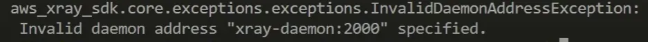

<details><summary>Using BusyBox to Debug Connection Error</summary>
<p> 

Since we have our environment variables properly set, let’s create a `busybox` to debug our connection error.

In the `bin` directory, create a file, `busybox`.

```bash
# create file
touch bin/busybox

# FILE CONTENT 

#! /usr/bin/bash 

docker run --rm \
  --network cruddur-net \
  --publish 4567:4567 \
  -it busybox
```

To ensure you have the right permissions to execute the newly created script, run the following commands:

```bash
# by default, you will get a permission denied when trying to run a script you just created
# run this command to grant it permission - https://www.tutorialspoint.com/unix/unix-file-permission.htm
chmod 555 bin/busybox
  
# execute the script 
./bin/busybox
```

Let’s check the connection information of our `busybox`. Be careful looking; it is always given a funny name.

```bash
docker network inspect cruddur-net
```

Now shell into the container to troubleshoot.

Inside the container, ping `xray` to be sure it’s running. 

```bash
ping xray-daemon

telnet xray-daemon 2000
# If it connected successfully, it means the address, "2000," is correct, and 
# the hostname, "xray-daemon," is resolving. 
```

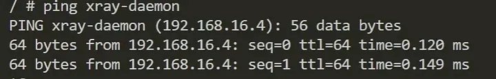

After troubleshooting, go ahead and `exit` the container.

</p>
</details>

Using `busybox`, we realized that our connection works perfectly well. 

So to troubleshoot our production the way we did our `busybox`, we have to temporarily install `ping` and `telnet` in our `prd` environment.

<details><summary>Debugging Production Connection</summary>
<p> 

In the `backend-flask/Dockerfile.prod` file, let’s add these few lines of code to it:

```bash
# ADD after the first line, "FROM"

# [TODO] For debugging, don't leave these in
RUN apt-get update =y
RUN apt-get install iputils-ping -y
# -------------
```

Now we have to rebuild our image. 

```bash
./bin/backend/build
```

To shell into our backend production, let’s add `/bin/bash` at the end of our `-it` flag in our frontend `run` script. 

```bash
./bin/backend/run
```

Inside the container, run these commands, `ping google.com` and `ping xray-daemon`, to ensure a connection is established. 

Hmmm, what could be the problem? 🤔

In our `run` script, let’s explicitly call our backend environment variables like so:

```bash
# try this
docker run --rm \
	--env ...\
	--env ...\
	--env ...\
	--network cruddur-net \
	--publish 4567:4567 \
	-it backend-flask-prod
```

That seems to be working. That means our problem is from our environment variables. 

Finally, we know what the problem is → the env variables generated have quotations around them, whereas the ones we see when we shell into the container do not have any quotations. So now we know the double quotations in our env vars should be removed. 

For a permanent fix, let’s update our `.env.erb` files to remove the single and double quotations around the values. You can now go ahead and delete any other `.env` file that we no longer need. 

After the modifications to the env vars files, let’s go ahead and regenerate our environment variables again by using our `generate-env` respective script files. 

To ensure everything works, do a `docker compose down` if you had your environment up before. Then a `docker compose up` so our updates are reflected. Yeah!!! Everything works just fine now. 🎉

Now we fixed the connection error, go ahead and comment on the command we added earlier to install `ping` in our `backend-flask/Dockerfile.prod` file.

</p>
</details>

Back to debugging our health-check problems. 

Navigate to your `aws/task-definitions/backend-flask.json` file, under the `healthCheck` section for the `backend-flask`; you will realize that our path is pointing to the wrong place. This is because we didn’t adjust the path when we moved our `bin` directory. 

To fix this, let’s create a `bin` folder in our `backend-flask` and then move our health check script to a new path.

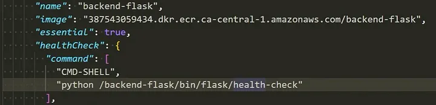

```bash
# create directory
mkdir backend-flask/bin

# move the files
mv bin/flask/health-check backend-flask/bin/health-check
```

Now go ahead and modify that path in your task definitions file. 

```json
// replace with this
"python /backend-flask/bin/health-check"
```

With our updated task definitions file, let’s rebuild the backend image and push.

```bash
# build image
./bin/backend/build

# push image
./bin/backend/push
```

Now, let’s register our tasks again. 

Hmm, we are getting an `AccessDeniedException` when calling the `RegisterTaskDefinition` operation. Investigating this issue revealed that AWS locked us out of our account because we mistakenly committed our code that revealed our `AWS_ACCESS_KEY` and `AWS_SECRET_KEY`. So what AWS did was create a policy called `AWSCompromisedKeyQuarantineV2`, which locked us out of our account. 

To fix this, delete the policy from your account as a root user and rotate your `ACCESS_KEY`

When you change your access key, remember to export it back to your Gitpod using the `export` and `gp env` command. 

After resolving that issue, go ahead and register your backend task again.

```bash
./bin/backend/register
./bin/backend/build
./bin/backend/push
./bin/backend/deploy
```

Go to your AWS console to confirm that your `backend-flask` task deployed successfully. 

Hmm, it shows that our `backend-flask` is returning an `unhealthy` health status. Let’s go and update our `timeout` code from `15` to `5` seconds and see what happens. 

```json
"interval": 30,
        "timeout": 5,
        "retries": 3,
        "startPeriod": 60
```

Due to the update, re-register your task definition 

```bash
./bin/backend/register
./bin/backend/build
./bin/backend/push
./bin/backend/deploy
```

Check your AWS console again to ensure everything is deployed successfully. But if you check the `xray` container, you realize that it has an `unknown` health status. That is because we don’t have a way of adding a health check to it due to the fact that `curl` is not installed in the default container, which is needed to do a health check. 

Talking about `xray`, make sure it is added to the `containerDefinitions` in your frontend task definition. 

```json
"containerDefinitions": [
      {
        "name": "xray",
        "image": "public.ecr.aws/xray/aws-xray-daemon",
        "essential": true,       
        "user": "1337",
        "portMappings": [
          {
            "name": "xray",
            "containerPort": 2000,
            "protocol": "udp"
          }
        ]        
      },
```

Now register the task, push, and deploy. 

```bash
./bin/frontend/register
./bin/frontend/build
./bin/frontend/push
./bin/frontend/deploy
```

Check your AWS console to be sure everything is deployed successfully for the frontend.

</p>
</details>

</p>
</details>

<details><summary>Turn on Container Insights</summary>
<p> 

- Navigate to your cluster in ECS and select it.
  
- Click the **Update cluster**
  
- Expand the **Monitoring** section and turn on `Container Insights`.

We should have that ready to collect data for us. Over time as we work along the project, logs will be generated for us. 

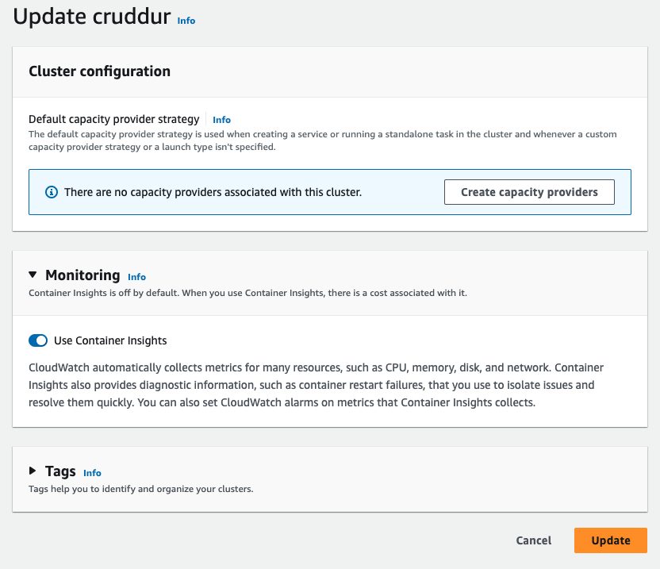

You can go ahead and test your domain name to be sure it works. Make sure you are logged in. Check the `Home` and `Messages` (new message) pages.

</p>
</details>

### Miscellaneous

To not incur charges on your ECS services, edit/update your service to accept `Desired tasks` as `0` instead of `1`. 

So, when stopped, another task doesn’t get started. This will reduce your spending. 

<details><summary>To be able always to send messages in PRD</summary>
<p> 

The users in your RDS production database have to match your local. And their `cognito_user_ids` should always be populated with the right `sub` ID on your AWS Cognito console. 

Also, make sure you have a `DynamoDB` created for production. Navigate to the `DynamoDB` service and confirm. 

If not created, run this command to create it

```bash
./bin/ddb/schema-load prd
```

Go over to your AWS DynamoDB console to confirm it’s created. 

Another thing to check for, make sure your `cognito_user_ids` in the production DB doesn't say `MOCK`. That means you seeded your production data which shouldn't be. It should consist of real data. 

To rectify that mistake, 

- Delete all users in the AWS Cognito console, so you can recreate them through the Cruddur UI
  
- Delete the local/seed data you have in production; it shouldn’t be so
  
    - **Never run seed data for production**
      
- Go to your `Gitpod` and run the following commands

```bash
# connect to prd database
./bin/db/connect prd

# delete the seed data in our prd 
# This command just deletes the data, not the table 
truncate users;

# confirm data is deleted 
select * from users;
```

Now go to your Cruddur UI and sign up those users again. 

</p>
</details>

