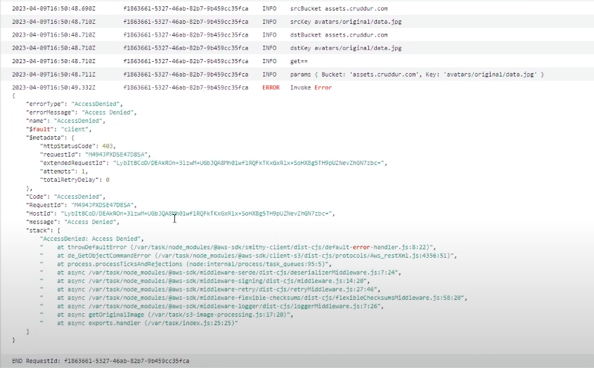
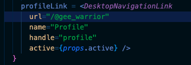
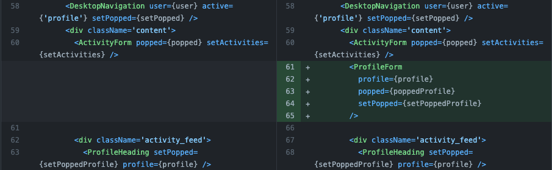
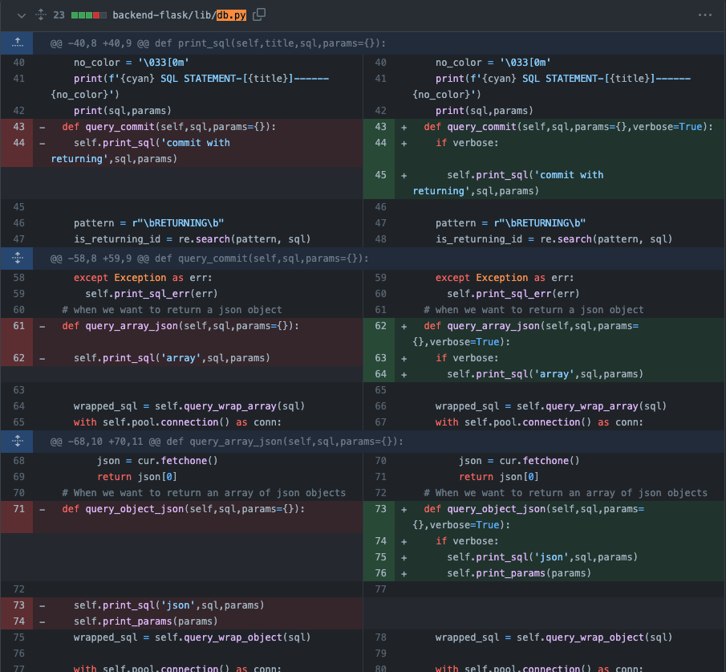
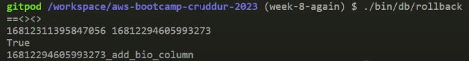

# Week 8 — Serverless Image Processing

## Required Homework/Tasks

All the tasks under this section are done using the `Gitpod` workspace.

### 1. Implement CDK Stack

CDK - Cloud Development Kit. It is also known as an IaC tool. 

[AWS CDK](https://docs.aws.amazon.com/cdk/v2/guide/home.html) is used to define your cloud application resources using familiar programming languages. You can synthesize its code to a CloudFormation template.

CDK works (play) well with pretty much other IaC tools out there. It has the AWS SAM modules, Kubernetes modules, terraform modules, etc. 

<details><summary>Implementation</summary>
<p> 

To have all our CDK pipeline in one folder, let’s go ahead and create a folder in our root project, `thumbing-serverless-cdk`

```bash
# create directory
mkdir thumbing-serverless-cdk
```

Let’s install our CDK library in the new folder for our project. This installation is so we can use the AWS CDK CLI anywhere.

```bash
# "-g" flag means it will be installed globally
# so it will be recognized in your system and be able to interact with CDK apis
npm install aws-cdk -g
```

Don’t forget to add it to your `.gitpod.yml` file, so it’s available to us anytime we open a new workspace. 

```yaml
- name: cdk
  before: |
    npm install aws-cdk -g
    cd thumbing-serverless-cdk
    cp .env.example .env
    npm i
```

After installation, let's initialize a CDK project. This initialization is done to provide us out-of-the-box skeleton for all the files that we are going to need and the folder structure that we want specifically for our language of choice. 

```bash
# initialize a CDK project
# be sure to be in the new folder you created
cdk init app --language typescript
```


You can check out your `package.json` file in the `thumbing-serverless-cdk` folder to be sure all the necessary libraries are installed. 

In the `thumbing-serverless-cdk` directory, you should see a `.ts` file in the `lib/` directory. That is where all the infrastructure as code will live. 

- In this file, let’s define our S3 buckets - this is where our avatar images are going to live for image processing.
  
- In your `thumbing-serverless-cdk-stack.ts` file, add the following lines of code

```tsx
// define our s3 bucket
import * as s3 from 'aws-cdk-lib/aws-s3';

// in the class, add the following 

// create an S3 bucket 
const bucketName: string = process.env.THUMBING_BUCKET_NAME as string;
const bucket = this.createBucket(bucketName);

createBucket(bucketName: string): s3.IBucket {
    const bucket = new s3.Bucket(this, 'ThumbingBucket', {
      bucketName: bucketName,
      removalPolicy: cdk.RemovalPolicy.DESTROY
    });
    return bucket;
  }
```


To create a CloudFormation template from your CDK code, run this command in your terminal. The `synth` command is used to synthesize the AWS CloudFormation stack(s) that represent your infrastructure as code.

```bash
# in your thumbing-serverless-cdk
cdk synth
```

After running that command, it spits out a YAML in the console but generates a `cdk.out` folder where you can also see the JSON format of the template and other stuff.

You need to bootstrap your account before you can deploy AWS CDK apps into an AWS environment. This is done **once** for your AWS account for each region. If you are using 3 regions, you need to do a bootstrap for each of them.

```bash
# for bootstrapping a single region
cdk bootstrap "aws://$AWS_ACCOUNT_ID/$AWS_DEFAULT_REGION"
cdk bootstrap "aws://AWS_ACCOUNT_ID/FIRST_REGION"

# for bootstrapping multiple regions
cdk bootstrap "aws://AWS_ACCOUNT_ID/FIRST_REGION AWS_ACCOUNT_ID/SECOND_REGION"
```

You can check your AWS console if your region was bootstrapped by going to the **CloudFormation** service. 

- You should see a **CDKToolKit** created for you. That toolkit is to let you use CDKs. It simply just creates IAM policies to give permissions to the different AWS resources.

Now let’s deploy our project to our AWS account.

```bash
# deploy my project
cdk deploy 
```

<details><summary>Create the Lambda Function</summary>
<p> 

Let’s create our lambda function that will process our avatar images. [Read more](https://docs.aws.amazon.com/cdk/api/v2/docs/aws-cdk-lib.aws_lambda.Function.html) about CDK Lambda. 

In your `thumbing-serverless-cdk-stack.ts` file, add the following lines of code

```tsx
// define our lambda
import * as lambda from 'aws-cdk-lib/aws-lambda';

// in the class section, add the following

// create a lambda function
const functionPath: string = process.env.THUMBING_FUNCTION_PATH as string;
const folderInput: string = process.env.THUMBING_S3_FOLDER_INPUT as string;
const folderOutput: string = process.env.THUMBING_S3_FOLDER_OUTPUT as string;

const lambda = this.createLambda(functionPath, bucketName, folderInput, folderOutput);

createLambda(functionPath: string, bucketName: string, folderInput: string, folderOutput: string): lambda.IFunction {
    const lambdaFunction = new lambda.Function(this, 'ThumbLambda', {
      runtime: lambda.Runtime.NODEJS_18_X,
      handler: 'index.handler',
      code: lambda.Code.fromAsset(functionPath),
      environment: {
        DEST_BUCKET_NAME: bucketName,
        FOLDER_INPUT: folderInput,
        FOLDER_OUTPUT: folderOutput,
        PROCESS_WIDTH: '512',
        PROCESS_HEIGHT: '512'
      }
    });
    return lambdaFunction;
  }
```


Let’s define our environment variables. In your `thumbing-serverless-cdk` directory, create a file, `.env`, for those variables. 

```bash
# create ".env" file
touch .env

# FILE CONTENT
# remember bucket name has to be unique 
THUMBING_BUCKET_NAME="MYDOMAIN-cruddur-thumbs"
THUMBING_FUNCTION_PATH="/workspace/aws-bootcamp-cruddur-2023/aws/lambdas"
THUMBING_S3_FOLDER_INPUT="avatar/original"
THUMBING_S3_FOLDER_OUTPUT="avatar/processed"
```

Now let’s load our environment variables into our `thumbing-serverless-cdk-stack.ts` file

```tsx
// load env variables
import * as dotenv from 'dotenv';
 
dotenv.config();
```

Make sure the `dotenv` library is installed in your `package.json` file. To install it if not available, use this command:

```bash
# in your thumbing...ts folder, run this command
npm i dotenv
```


Don’t forget to set your environment variables in your terminal and gitpod.

```bash

export THUMBING_BUCKET_NAME="MYDOMAIN-cruddur-thumbs"
gp env THUMBING_BUCKET_NAME="MYDOMAIN-cruddur-thumbs"

export THUMBING_FUNCTION_PATH="/workspace/aws-bootcamp-cruddur-2023/aws/lambdas"
gp env THUMBING_FUNCTION_PATH="/workspace/aws-bootcamp-cruddur-2023/aws/lambdas"

export THUMBING_S3_FOLDER_INPUT="avatar/original"
gp env THUMBING_S3_FOLDER_INPUT="avatar/original"

export THUMBING_S3_FOLDER_OUTPUT="avatar/processed"
gp env THUMBING_S3_FOLDER_OUTPUT="avatar/processed"
```

Let’s go ahead and `synth` to make sure we are all good before we go ahead. Make sure our S3 and lambda function is created in the generated template. 

```bash
cdk synth
```

</p>
</details>

</p>
</details>


### 2. Serverless Image Processing CDK

To list the stacks we have, use this command:

```bash
# list stacks
cdk ls
```

<details><summary>Implementation</summary>
<p> 

Let’s load our environment variables

```tsx
const dotenv = require('dotenv');
dotenv.config();

const bucketName: string = process.env.THUMBING_BUCKET_NAME as string;
const folderInput: string = process.env.THUMBING_S3_FOLDER_INPUT as string;
const folderOutput: string = process.env.THUMBING_S3_FOLDER_OUTPUT as string;
const webhookUrl: string = process.env.THUMBING_WEBHOOK_URL as string;
const topicName: string = process.env.THUMBING_TOPIC_NAME as string;
const functionPath: string = process.env.THUMBING_FUNCTION_PATH as string;
console.log('bucketName',bucketName)
console.log('folderInput',folderInput)
console.log('folderOutput',folderOutput)
console.log('webhookUrl',webhookUrl)
console.log('topicName',topicName)
console.log('functionPath',functionPath)
```

Let’s rename our environment variable file because our `.gitignore` file ignores the file

```bash
# rename file
mv .env .env.example
```

In your `aws/lambdas` directory, create a folder `process-images`

```bash
mkdir aws/lambdas/process-images 
```

Then, make sure your `.env.example` file has these variables set

```bash
THUMBING_BUCKET_NAME="assets.MYDOMAIN.com"
THUMBING_S3_FOLDER_INPUT="/avatar/original"
THUMBING_S3_FOLDER_OUTPUT="/avatar/processed"
THUMBING_WEBHOOK_URL="api.MYDOMAIN.com/webhooks/avatar"
THUMBING_TOPIC_NAME="cruddur-assets"
THUMBING_FUNCTION_PATH="/workspace/aws-bootcamp-cruddur-2023/aws/lambdas/process-images"
```

Don’t forget also to set in your terminal

```bash
export THUMBING_BUCKET_NAME="assets.MYDOMAIN.com"
gp env THUMBING_BUCKET_NAME="assets.MYDOMAIN.com"

export THUMBING_S3_FOLDER_INPUT="/avatar/original"
gp env THUMBING_S3_FOLDER_INPUT="/avatar/original"

export THUMBING_S3_FOLDER_OUTPUT="/avatar/processed"
gp env THUMBING_S3_FOLDER_OUTPUT="/avatar/processed"

export THUMBING_WEBHOOK_URL="api.MYDOMAIN.com/webhooks/avatar"
gp env THUMBING_WEBHOOK_URL="api.MYDOMAIN.com/webhooks/avatar"

export THUMBING_TOPIC_NAME="cruddur-assets"
gp env THUMBING_TOPIC_NAME="cruddur-assets"

export THUMBING_FUNCTION_PATH="/workspace/aws-bootcamp-cruddur-2023/aws/lambdas/process-images"
gp env THUMBING_FUNCTION_PATH="/workspace/aws-bootcamp-cruddur-2023/aws/lambdas/process-images"
```

In your `aws/lambdas/process-images` directory, create a file, `index.js` with the following contents:

```jsx
// create file
touch aws/lambdas/process-images/index.js

// FILE CONTENT
const process = require('process');
const {getClient, getOriginalImage, processImage, uploadProcessedImage} = require('./s3-image-processing.js')
const path = require('path');

const bucketName = process.env.DEST_BUCKET_NAME
const folderInput = process.env.FOLDER_INPUT
const folderOutput = process.env.FOLDER_OUTPUT
const width = parseInt(process.env.PROCESS_WIDTH)
const height = parseInt(process.env.PROCESS_HEIGHT)

client = getClient();

exports.handler = async (event) => {
  const srcBucket = event.Records[0].s3.bucket.name;
  const srcKey = decodeURIComponent(event.Records[0].s3.object.key.replace(/\+/g, ' '));
  console.log('srcBucket',srcBucket)
  console.log('srcKey',srcKey)

  const dstBucket = bucketName;

  filename = path.parse(srcKey).name
  const dstKey = `${folderOutput}/${filename}.jpg`
  console.log('dstBucket',dstBucket)
  console.log('dstKey',dstKey)

  const originalImage = await getOriginalImage(client,srcBucket,srcKey)
  const processedImage = await processImage(originalImage,width,height)
  await uploadProcessedImage(client,dstBucket,dstKey,processedImage)
};
```

To easily test our lambda function code, let’s create a `test.js` file

```jsx
// create file
touch aws/lambdas/process-images/test.js

// FILE CONTENT
const {getClient, getOriginalImage, processImage, uploadProcessedImage} = require('./s3-image-processing.js')

async function main(){
  client = getClient()
  // change the bucket names to YOURS
  const srcBucket = 'THUMBIN BUCKET NAME'
  const srcKey = 'avatar/original/data.jpg'
  const dstBucket = 'THUMBIN BUCKET NAME'
  const dstKey = 'avatar/processed/data.png'
  const width = 256
  const height = 256

  const originalImage = await getOriginalImage(client,srcBucket,srcKey)
  console.log(originalImage)
  const processedImage = await processImage(originalImage,width,height)
  await uploadProcessedImage(client,dstBucket,dstKey,processedImage)
}

main()
```

Now let’s create our image-processing file, `s3-image-processing.js`:

```jsx
// create file
touch aws/lambdas/process-images/s3-image-processing.js

// FILE CONTENT
const sharp = require('sharp');
const { S3Client, PutObjectCommand, GetObjectCommand } = require("@aws-sdk/client-s3");

function getClient(){
  const client = new S3Client();
  return client;
}

async function getOriginalImage(client,srcBucket,srcKey){
  console.log('get==')
  const params = {
    Bucket: srcBucket,
    Key: srcKey
  };
  console.log('params',params)
  const command = new GetObjectCommand(params);
  const response = await client.send(command);

  const chunks = [];
  for await (const chunk of response.Body) {
    chunks.push(chunk);
  }
  const buffer = Buffer.concat(chunks);
  return buffer;
}

async function processImage(image,width,height){
  const processedImage = await sharp(image)
    .resize(width, height)
    .jpeg()
    .toBuffer();
  return processedImage;
}

async function uploadProcessedImage(client,dstBucket,dstKey,image){
  console.log('upload==')
  const params = {
    Bucket: dstBucket,
    Key: dstKey,
    Body: image,
    ContentType: 'image/jpeg'
  };
  console.log('params',params)
  const command = new PutObjectCommand(params);
  const response = await client.send(command);
  console.log('repsonse',response);
  return response;
}

module.exports = {
  getClient: getClient,
  getOriginalImage: getOriginalImage,
  processImage: processImage,
  uploadProcessedImage: uploadProcessedImage
}
```

Let’s create a file, `example.json`. ChatGPT made this file

```json
// create file
touch aws/lambdas/process-images/example.json

// FILE CONTENT
{
  "Records": [
    {
      "eventVersion": "2.0",
      "eventSource": "aws:s3",
      "awsRegion": "ca-central-1", // your own REGION
      "eventTime": "1970-01-01T00:00:00.000Z",
      "eventName": "ObjectCreated:Put",
      "userIdentity": {
        "principalId": "EXAMPLE"
      },
      "requestParameters": {
        "sourceIPAddress": "127.0.0.1"
      },
      "responseElements": {
        "x-amz-request-id": "EXAMPLE123456789",
        "x-amz-id-2": "EXAMPLE123/5678abcdefghijklambdaisawesome/mnopqrstuvwxyzABCDEFGH"
      },
      "s3": {
        "s3SchemaVersion": "1.0",
        "configurationId": "testConfigRule",
        "bucket": {
          "name": "assets.cruddur.com", // your own domain
          "ownerIdentity": {
            "principalId": "EXAMPLE"
          },
          "arn": "arn:aws:s3:::assets.cruddur.com" // you own domain
        },
        "object": {
          "key": "avatars/original/data.jpg",
          "size": 1024,
          "eTag": "0123456789abcdef0123456789abcdef",
          "sequencer": "0A1B2C3D4E5F678901"
        }
      }
    }
  ]
}
```

Now let’s create our `package.json` file. In your terminal, run the commands:

```bash
# create a "package.json" for our folder 
# make sure to be in the "/process-images/" directory
npm init -y

# now install these packages [library] 
npm i sharp
npm i @aws-sdk/client-s3
```

You can check your `package.json` file to confirm both libraries are installed.

Now we can go ahead to deploy.

```bash
cdk synth
cdk deploy 
```

Let’s create a script to install our `sharp` library properly. 

In your `bin/` directory, create a folder `avatar` with file `build`

```bash
# create folder and then file
mkdir bin/avatar
touch bin/avatar/build

# FILE CONTENT

#! /usr/bin/bash

ABS_PATH=$(readlink -f "$0")
SERVERLESS_PATH=$(dirname $ABS_PATH)
BIN_PATH=$(dirname $SERVERLESS_PATH)
PROJECT_PATH=$(dirname $BIN_PATH)
SERVERLESS_PROJECT_PATH="$PROJECT_PATH/thumbing-serverless-cdk"

cd $SERVERLESS_PROJECT_PATH

npm install
rm -rf node_modules/sharp
SHARP_IGNORE_GLOBAL_LIBVIPS=1 npm install --arch=x64 --platform=linux --libc=glibc sharp
```

Execute the script so we have those available to us in our workspace. 

To ensure you have the right permissions to execute the newly created script, run the following commands:

```bash
# by default, you will get a permission denied when trying to run a script you just created
# run this command to grant it permission - https://www.tutorialspoint.com/unix/unix-file-permission.htm
chmod 555 bin/avatar/build
  
# execute the script 
./bin/avatar/build
```

<details><summary>Hook up S3 to Lambda</summary>
<p> 

Let’s connect our S3 to the Lambda function we created. We will do that by creating an S3 event notification to Lambda. 

In your `thumbing-serverless-cdk-stack.ts` file, add the following lines of code. 

```tsx
// import the s3n library
import * as s3n from 'aws-cdk-lib/aws-s3-notifications';

// add above with others
this.createS3NotifyToLambda(folderInput,lambda,bucket)

// add below 
createS3NotifyToLambda(prefix: string, lambda: lambda.IFunction, bucket: s3.IBucket): void {
    const destination = new s3n.LambdaDestination(lambda);
    bucket.addEventNotification(
      s3.EventType.OBJECT_CREATED_PUT,
      destination,
      {prefix: prefix} // folder to contain the original images
    )
  }
```

With the imported `s3n` library, it will create the `LambdaDestination` for our lambda destination. We're passing in the Lambda, the S3 bucket, and the prefix. 

Make sure to be in the `thumbing-serverless-cdk` folder when running the commands below.

```bash
cdk synth
cdk deploy
```

You can copy the content of the template generated by the above command, `cdk synth`, to see what is actually being created. 

Head over to the CloudFormation console after deployment to verify if that Lambda function has been created. 

- You should see this stack, `BucketNotificationsHandler` added
  
- Click into it and go to the lambda created to confirm the bucket name matches what you have in the configuration for the environment variables.
  
    - If the name doesn’t match, just do a `cdk destroy` to destroy your entire stack. Be careful; there are best practices for this.
      
- In the lambda you created, you should see a trigger to our S3 bucket
  
- Before redeploying the stack using `cdk deploy`, make sure your environment variables are set to the correct values in your terminal. If not, `unset` and set with the correct ones.
    


Now let’s import our existing bucket into the stack. You can go ahead and tear down the stack and add the following function in your `.ts` file

```tsx
// add after your "createBucket" function
importBucket(bucketName: string): s3.IBucket {
    const bucket = s3.Bucket.fromBucketName(this,"AssetsBucket",bucketName);
    return bucket;
  }
```

Let’s update our existing code referencing `ThumbingBucket` to be called `AssetsBucket`. 

In the `createBucket` function, change `ThumbingBucket` to `AssetsBucket`.

```tsx
// before the "createBucket" function
// comment out 
//const bucket = this.createBucket(bucketName);

// then add this
const bucket = this.importBucket(bucketName);

// in the "createBucket" function
const bucket = new s3.Bucket(this, 'AssetsBucket', {
```


**This should be automatically created for you if your last CDK deployment was successful.** 

Now we create our bucket manually through the console. 

In your AWS console, navigate to your S3 service

- Click on **Create bucket**
  
    - Bucket name: `assets.mydomain.com`
      
    - Region: `us-west-2`
      
- Now **create**

**You still have to manually create it so it persists after destroying your stack.** 

Now let’s redeploy our stack. Go to your CloudFormation and S3 console to confirm. 

- If we destroy our stack, will our bucket still persist? 🤔
  
- To be sure, do a `cdk destroy` and a `cdk deploy`
  
- Looks like it persisted; that’s good

Inside your `assets.mydomain.com`, create these two folders 

- `original` - it should look like this after created `original/`
  
- `processed` - it should look like this after created `processed/`

</p>
</details>

<details><summary>Uploading to S3</summary>
<p> 

Go ahead and find any image of your choice online. When you do, make sure to change the name to `data.jpg` because that’s what we have hardcoded to our Lambda. Also, make sure the image's dimensions are large enough to be processed. 

Once done, go ahead and drop that image into the `original/` folder in your S3 bucket manually. But we will be using some CLI commands to do the uploading.  

- This action should trigger a Lambda function to process the image

In your `bin/avatar` folder, create another folder `files` for storing our test images. 

```bash
# create folder
mkdir bin/avatar/files
```

Now copy the image you downloaded from the internet and renamed to `data.jpg` into this folder. 

In your `bin/avatar` folder, create a file, `upload` 

```bash
# create file
touch bin/avatar/upload

# FILE CONTENT

#! /usr/bin/bash

ABS_PATH=$(readlink -f "$0")
SERVERLESS_PATH=$(dirname $ABS_PATH)
DATA_FILE_PATH="$SERVERLESS_PATH/files/data.jpg"

aws s3 cp "$DATA_FILE_PATH" "s3://assets.$DOMAIN_NAME/avatars/original"
```

In your terminal, let’s import our domain name as an environment variable. 

```bash
export DOMAIN_NAME="mydomain.com"
gp env DOMAIN_NAME="mydomain.com"
```

To ensure you have the right permissions to execute the newly created script, run the following commands:

```bash
# by default, you will get a permission denied when trying to run a script you just created
# run this command to grant it permission - https://www.tutorialspoint.com/unix/unix-file-permission.htm
chmod 555 bin/avatar/upload
  
# execute the script 
./bin/avatar/upload
```

Thinking back now, our `original/` and `processed/`folders are top levels in our assets folder, and we don’t want that because the folder is going to contain several uploaded avatars. 

Talking about avatars, let’s do some tiny changes to our environment variables. Change these variables in the `.env.example` and `.env` files to this instead.

```bash
THUMBING_S3_FOLDER_INPUT="avatars/original"
THUMBING_S3_FOLDER_OUTPUT="avatars/processed"
```

Don’t forget to correct those in your terminal if you set it before. 

```bash
export THUMBING_S3_FOLDER_INPUT="avatars/original"
gp env THUMBING_S3_FOLDER_INPUT="avatars/original"

export THUMBING_S3_FOLDER_OUTPUT="avatars/processed"
gp env THUMBING_S3_FOLDER_OUTPUT="avatars/processed"
```

After the changes, go ahead and redeploy.

</p>
</details>

<details><summary>Deleting Images from S3</summary>
<p> 

Let’s create a script to simplify that for us. 

In your `bin/avatar` directory, create a file, `clear` 

```bash
# create file
touch bin/avatar/clear

# FILE CONTENT

#! /usr/bin/bash

ABS_PATH=$(readlink -f "$0")
SERVERLESS_PATH=$(dirname $ABS_PATH)
DATA_FILE_PATH="$SERVERLESS_PATH/files/data.jpg"

aws s3 rm "s3://assets.$DOMAIN_NAME/avatars/original/data.jpg"
aws s3 rm "s3://assets.$DOMAIN_NAME/avatars/processed/data.png"
```

To ensure you have the right permissions to execute the newly created script, run the following commands:

```bash
# by default, you will get a permission denied when trying to run a script you just created
# run this command to grant it permission - https://www.tutorialspoint.com/unix/unix-file-permission.htm
chmod 555 bin/avatar/clear
  
# execute the script 
./bin/avatar/clear
```

</p>
</details>

<details><summary>Triggering our Lambda</summary>
<p> 

Now let’s trigger our lambda by doing an upload. We do this using our `upload` script. 

- First, confirm there are no files in your S3 bucket.

After upload, confirm it was truly uploaded. Also, check out its **Properties** tab and go to the **Events notifications** section to confirm if it is, in fact,  doing a `PUT` request, not a `POST`.


Also, navigate to your lambda function and go to the **Configuration** tab to confirm that every variable is set correctly. It will save you a lot of time troubleshooting. 


You can also check out the logs in your CloudWatch since we didn’t enable CloudTrail because of spending. You might not see any lambda logs because we forgot to add the name of our file to our `upload` script.

```bash
# change from this 
aws s3 cp "$DATA_FILE_PATH" "s3://assets.$DOMAIN_NAME/avatars/original"

# to this 
aws s3 cp "$DATA_FILE_PATH" "s3://assets.$DOMAIN_NAME/avatars/original/data.jpg"
```

Now, let’s delete the file we had in our S3 bucket and reupload it.

```bash
# delete 
./bin/avatar/clear

# upload
./bin/avatar/upload
```

Confirm this action on your S3 console. We should see a `processed/` folder if our lambda function was triggered. 

- Navigate to your lambda function and go to **Monitor** tab to view the CloudWatch logs
  
- You might not get any data.
  
- Let’s test out our lambda function to be sure it works.
    

    
- Navigate to the **Test** tab on your lambda
  
    - Select **Create new event**
      
    - Leave **Event sharing settings** as is
      
    - Under **Template**, select S3 Put action
      
    - You should get that it failed; makes sense.


<details><summary>Lambda NOT Triggering</summary>
<p> 

Our lambda is probably not working because we didn’t give it any S3 permissions.

Let’s navigate to `thumbing-serverless-cdk-stack.ts` and create a policy function to give it access to our bucket.

```tsx
// add in the "import' section
import * as iam from 'aws-cdk-lib/aws-iam';

// add above 
const s3ReadWritePolicy = this.createPolicyBucketAccess(bucket.bucketArn)

// add the end of file
createPolicyBucketAccess(bucketArn: string){
    const s3ReadWritePolicy = new iam.PolicyStatement({
      actions: [
        's3:GetObject',
        's3:PutObject',
      ],
      resources: [
        `${bucketArn}/*`,
      ]
    });
    return s3ReadWritePolicy;
  }
```

Now let’s attach the created policy to our lambda. 

```tsx
// add after the "ReadWrite" policy you just made 
const s3ReadWritePolicy = this.createPolicyBucketAccess(bucket.bucketArn)
lambda.addToRolePolicy(s3ReadWritePolicy);
```

Go ahead and redeploy. 

```bash
cdk deploy
```

After the deployment, check your lambda function under the **Permissions** tab to be sure there are S3 permissions to your bucket.


Let’s try to trigger our lambda function again. Go ahead and delete the image we previously uploaded and upload it again

```bash
./bin/avatar/clear
./bin/avatar/upload
```

Afterward, go to the **Monitor** tab in your lambda and click on the **CloudWatch Logs**. Now you should see some log streams.

- Let’s confirm that our image was processed
  
- We seem to be getting an error back



### Troubleshooting

Let’s check our `aws/lambdas/process-images/index.js` file to be sure we have the right variables set and assigned. 

- Everything seems properly set

Let’s head over to our Lambda function under the **Configuration** tab, scroll down to the `Environment variables` section and confirm everything is properly set. 


Also, check the **Properties** of your S3 bucket. 

- Everything still looks good.

Further troubleshooting, we found out that the `srcKey` endpoint passed looks different from our `folderInput` and `folderOutput`.

Do this ONLY if your `folderInput` and `folderOutput` is different from the above screenshot. 


Now let’s navigate into our `.env.example` and `.env` files and change our values to this. 

```bash
# remove the leading "/"
THUMBING_S3_FOLDER_INPUT="avatars/original"
THUMBING_S3_FOLDER_OUTPUT="avatars/processed"
```

Don’t forget to do the same to your terminal

```bash
export THUMBING_S3_FOLDER_INPUT="avatars/original"
gp env THUMBING_S3_FOLDER_INPUT="avatars/original"

export THUMBING_S3_FOLDER_OUTPUT="avatars/processed"
gp env THUMBING_S3_FOLDER_OUTPUT="avatars/processed"
```

After changes, redeploy your stack. When the deployment is done, go ahead and re-upload the file to trigger our lambda. 

Checking our CloudWatch logs, we now see that our `dstKey` value has changed to the right thing, which is good. 


But we are still getting some `TypeError` messages saying that `client.send is not a function`.


### Further Debugging

We navigate to our `aws/lambdas/process-images/s3-image-processing.js` file, and we find that, indeed such code exists within our codebase.


According to our CloudWatch log, we are missing the `client`. So let’s navigate to our `aws/lambdas/process-images/index.js` file to figure out the problem. 

- Now in our `index.js` file, we find out that we didn’t pass the `client` to our `uploadProcessedimage`

```jsx
// the last line of code 
await uploadProcessedImage(client,dstBucket,dstKey,processedImage)
```

Now go ahead and redeploy the stack. Fingers crossed, everything should be good. After deployment, delete the old image we uploaded and upload it again to trigger our lambda. 

```bash
# deploy
cdk deploy

# delete image
./bin/avatar/clear

# upload image 
./bin/avatar/upload
```

Check your S3 console to confirm your `processed` folder is now created, which means your lambda function triggered properly. Also, check your CloudWatch logs to be double-sure.


</p>
</details>


There’s a tiny bug in our code because our image on AWS console says `jpg` but we coded it to be a `png` format. 


Let’s download our image from S3 and see if we get any type of info to explain why that is happening. 

- Nothing out of the ordinary except that the file is downloading as a `png` even tho it has a `jpg` extension.

Let’s navigate to our `aws/lambdas/process-images/index.js` file and remove the hard-coded file extension we added. 

```jsx
// add at the top 
const path = require('path');

// this fixes our file extension misconfiguration
filename = path.parse(srcKey).name
const dstKey = `${folderOutput}/${filename}.jpg`
```

Change the file extension for both files in the `clear` script to be `.jpg`.

Do the same in your `s3-image-processing.js` file, 

- change the **ContentType** for the `uploadProcessedImage` function from `image/png` to `image.jpeg`.
    
    
    
- also, update the `.png()` method to be `.jpeg()` method in the `processImage` function
    
    
    
After the changes, go ahead and redeploy. Afterward, manually delete the image from the last time and re-upload it. 

- Confirm by checking the file extension of your `processed` file which should be `jpg`

</p>
</details>

<details><summary>Adding SNS Notifications</summary>
<p> 

Now we will create an SNS topic, subscription, and an S3 event notification sent to our SNS topic. 

In your `thumbing-serverless-cdk-stack.ts` file, let’s create an SNS topic 

```tsx
// our import statement for SNS topic 
import * as sns from 'aws-cdk-lib/aws-sns';
// for subscriptions 
import * as subscriptions from 'aws-cdk-lib/aws-sns-subscriptions';

// create topic and subscription
const snsTopic = this.createSnsTopic(topicName)
this.createSnsSubscription(snsTopic,webhookUrl)

// create SNS policy
const snsPublishPolicy = this.createPolicySnSPublish(snsTopic.topicArn)

// add our s3 event notifications
this.createS3NotifyToLambda(folderInput,lambda,bucket)
this.createS3NotifyToSns(folderOutput,snsTopic,bucket)

// attach policy to lambda
lambda.addToRolePolicy(snsPublishPolicy);

// add at the last code line
createSnsTopic(topicName: string): sns.ITopic{
    const logicalName = "ThumbingTopic";
    const snsTopic = new sns.Topic(this, logicalName, {
      topicName: topicName
    });
    return snsTopic;
  }

  createSnsSubscription(snsTopic: sns.ITopic, webhookUrl: string): sns.Subscription {
    const snsSubscription = snsTopic.addSubscription(
      new subscriptions.UrlSubscription(webhookUrl)
    )
    return snsSubscription;
  }

createS3NotifyToSns(prefix: string, snsTopic: sns.ITopic, bucket: s3.IBucket): void {
    const destination = new s3n.SnsDestination(snsTopic)
    bucket.addEventNotification(
      s3.EventType.OBJECT_CREATED_PUT, 
      destination,
      {prefix: prefix}
    );
  }

/*
createPolicySnSPublish(topicArn: string){
  const snsPublishPolicy = new iam.PolicyStatement({
    actions: [
      'sns:Publish',
    ],
    resources: [
      topicArn
    ]
  });
  return snsPublishPolicy;
} 
*/
```

After the changes, go ahead and redeploy those changes to your stack. 

If you get a similar error while deploying, go ahead and check your environment variable files { `.env.example` and `.env` } and make sure `https://` is appended to your `..WEBHOOK_URL`. Also, make the changes in your environment variables in your terminal. 


```bash
export THUMBING_WEBHOOK_URL="https://api.mydomain.com/webhooks/avatar"
gp env THUMBING_WEBHOOK_URL="https://api.mydomain.com/webhooks/avatar"
```

Now redeploy again. 

Go to your AWS console to confirm. 

- Check your S3 event notifications
    
  
    
- Check your SNS topic is created

  

</p>
</details>

</p>
</details>

### 3. Serve Avatars via CloudFront

Now we are going to be working to serve our images over `CloudFront`. We don’t want to download our images every time and serve them to the application. Instead, we should put it in a CDN to serve it. 

<details><summary>CloudFront Distribution</summary>
<p> 

Navigate to your **CloudFront** service in your AWS console

- Click **Create a CloudFront distribution**
  
- Origin domain: select your assets bucket

- Original path: nothing goes there in our case
  
- Name: leave as is
  
- Origin access: **Origin access control settings**

    - Now go ahead and click **Create control setting** since we don’t have any created
      
    - Under the **Create control setting** page,
      
        - Name: leave as is
          
        - Description: your choice
          
        - Signing behavior: **Sign requests**
          
        - Origin type: **S3**
          
    - Go ahead and create
      
- Enable Origin Shield: **No**
  
- Under the **default cache behavior**, in the **Viewer** section, select the `Redirect HTTP to HTTPS` option and leave everything as is.
  
- Under the **Cache key and origin requests**, select **Cache policy and origin request policy**
  
    - Cache policy: `CachingOptimized`
      
    - Origin request policy: `CORS-CustomOrigin`
      
- Response headers policy - `SimpleCORS`
  
- Leave everything else as is and move to the **Web Application Firewall (WAF)** section
  
    - Select **Do not enable security protections**
      
- Continue to the **Settings** section
  
    - Add an **Alternate domain name**: `assets.mydomain.com`
      
    - Custom SSL certificate: select the certificate we created earlier week 
      
        - You will probably not see that because CloudFront only uses certificates created in the `us-east-1`. Go ahead and create one to attach to this distribution
          
        - Don’t create records for them in Route53 because they exist already. Just creating the certificate is fine.
          
- Leave everything else and add a description if you want.
  
    - Description: **Serve Assets for Cruddur**
      
- Now go ahead and **Create distribution**

**Note**: It takes a while to create, 10 - 15 mins. 

To test out our configuration after the distribution is ready, copy the **distribution domain name** and append `/avatars/processed/data.jpg` to the URL. 

- You can also try `assets.mydomain.com/avatars/processed/data.jpg`
  
- You might get an error, and that’s fine

Thinking about the error, let’s try debugging it.

### Troubleshooting

We are probably getting that error because our Route53 is not pointed to our distribution. 

So let’s navigate to our Route53 service. 

- Click into your **hosted zone**
  
- Click on **create record**
  
    - Record name: `assets`
    
    - Record type: `A`
      
    - Toggle on the `Alias` button and select CloudFront distribution
      
- Go ahead and **create record**

Now reload this URL - `assets.mydomain.com/avatars/processed/data.jpg`. You should probably still get an error.

Let’s navigate to our S3 and figure out why. 

- It is shown that we don’t have any assets because we deleted it prior and forgot to upload it back. Makes sense.
  
- Now let’s upload using our `upload` script
  
- After uploading, go back to the URL and refresh
  
- It still doesn’t work
    
    
    
Go back to your CloudFront distribution and have a look. Now we see that it's a bucket permissions problem. We didn’t open up our bucket to allow CloudFront. 

- Click on the distribution you just created
  
- Navigate to the **Origins** tab, select your origin name
  
- Go ahead and **Edit**
  
- Scroll down to the **Origin access** part, click on **Copy policy** to copy that bucket policy
  
    - Head over to S3 and select your `assets.mydomain.com` bucket
      
    - Go into the **Permissions** tab, scroll down to the **Bucket policy** section, and paste the policy you copied from Cloudfront.
      
    - **Save** and refresh URL
    
        - `assets.mydomain.com/avatars/processed/data.jpg`
          
        - `assets.mydomain.com/avatars/original/data.jpg`
          
    - It should be working now.
        
        
        
But we shouldn’t let people be able to access the original image, only the processed one. Let’s limit that access.

Right now, people are able to access the `original` image; we need to limit that access. They should only be able to access the `processed` ones. 

***2 Choices of Approach:***

- We could explicitly write policy permissions for each folder OR
  
- create separate buckets for the `original` images and one for the `processed` ones.

The **second** choice provides us with more security. It limits whatever people upload; that way, they don’t upload malicious things that go on to be processed and possibly cause some damage. 

**So we should have a bucket for uploads and another for assets that are being served to the public.**

</p>
</details>

<details><summary>Organizing our buckets</summary>
<p> 

Here we will have a bucket for uploads and another for assets that are being served to the public, which are the processed ones. 

In your `thumbing-serverless-cdk-stack.ts` file, make the following update: 

```tsx
// edit these ones
const uploadsBucketName: string = process.env.UPLOADS_BUCKET_NAME as string;
const assetsBucketName: string = process.env.ASSETS_BUCKET_NAME as string;

// add these lines 
const uploadsBucket = this.createBucket(uploadsBucketName);
const assetsBucket = this.importBucket(assetsBucketName);

console.log('uploadsBucketName',)
console.log('assetsBucketName',assetsBucketName)
console.log('folderInput',folderInput)
console.log('folderOutput',folderOutput)
console.log('webhookUrl',webhookUrl)
console.log('topicName',topicName)
console.log('functionPath',functionPath)

// edit these
// create a lambda
const lambda = this.createLambda(
  functionPath, 
  uploadsBucketName, 
  assetsBucketName, 
  folderInput, 
  folderOutput
);

// add our s3 event notifications
this.createS3NotifyToLambda(folderInput,lambda,uploadsBucket)
this.createS3NotifyToSns(folderOutput,snsTopic,assetsBucket)

// create policies
const s3UploadsReadWritePolicy = this.createPolicyBucketAccess(uploadsBucket.bucketArn)
const s3AssetsReadWritePolicy = this.createPolicyBucketAccess(assetsBucket.bucketArn)
//const snsPublishPolicy = this.createPolicySnSPublish(snsTopic.topicArn)

// attach policies for permissions
lambda.addToRolePolicy(s3UploadsReadWritePolicy);
lambda.addToRolePolicy(s3AssetsReadWritePolicy);
//lambda.addToRolePolicy(snsPublishPolicy);

createBucket(bucketName: string): s3.IBucket {
    const bucket = new s3.Bucket(this, 'UploadsBucket', {
      bucketName: bucketName,
      removalPolicy: cdk.RemovalPolicy.DESTROY
    });
    return bucket;
  }

importBucket(bucketName: string): s3.IBucket {
  const bucket = s3.Bucket.fromBucketName(this,"AssetsBucket",bucketName);
  return bucket;
}

createLambda(functionPath: string, uploadsBucketName: string, assetsBucketName: string, folderInput: string, folderOutput: string): lambda.IFunction {
  const lambdaFunction = new lambda.Function(this, 'ThumbLambda', {
    runtime: lambda.Runtime.NODEJS_18_X,
    handler: 'index.handler',
    code: lambda.Code.fromAsset(functionPath),
    environment: {
      DEST_BUCKET_NAME: assetsBucketName,
      FOLDER_INPUT: folderInput,
      FOLDER_OUTPUT: folderOutput,
      PROCESS_WIDTH: '512',
      PROCESS_HEIGHT: '512'
    }
  });
  return lambdaFunction;
}
```

Also, make those changes in your `.env` and `.env.example` file

```tsx
UPLOADS_BUCKET_NAME="[mydomain]-uploaded-avatars"
ASSETS_BUCKET_NAME="assets.[mydomain].com"
```

Don’t forget to do the same on your terminal. 

```bash
export UPLOADS_BUCKET_NAME="simplynaturell-cruddur-uploaded-avatars"
gp env UPLOADS_BUCKET_NAME="simplynaturell-cruddur-uploaded-avatars"

export ASSETS_BUCKET_NAME="assets.simplynaturell.com"
gp env ASSETS_BUCKET_NAME="assets.simplynaturell.com"
```

After the above changes, go ahead and do a `cdk deploy`

In order to be more specific in what our buckets are for, we go ahead and change our `bin/serverless` directory to be called `bin/avatar`. With that update, you will need to update your scripts that mention that directory. 

For the `upload` script;

```tsx
#! /usr/bin/bash

ABS_PATH=$(readlink -f "$0")
SERVERLESS_PATH=$(dirname $ABS_PATH)
DATA_FILE_PATH="$SERVERLESS_PATH/files/data.jpg"

aws s3 cp "$DATA_FILE_PATH" "s3://[mydomain]-uploaded-avatars/data.jpg"
```

For the `clear` script;

```tsx
#! /usr/bin/bash

ABS_PATH=$(readlink -f "$0")
SERVERLESS_PATH=$(dirname $ABS_PATH)
DATA_FILE_PATH="$SERVERLESS_PATH/files/data.jpg"

aws s3 rm "s3://[mydomain]-uploaded-avatars/avatars/original/data.jpg"
aws s3 rm "s3://assets.$DOMAIN_NAME/avatars/processed/data.jpg"
```

After deployment, go to your AWS console and navigate to the S3 service. Make sure that the `assets` bucket has no file in it. Go ahead and delete the `original` and `processed` folders; no longer needed. After deletion, let’s upload again using our `upload` script to trigger our lambda function. 

- If your lambda function is indeed triggered, our `original` file should be in your `[mydomain]-uploaded-avatars` bucket and `processed` in the `assets` bucket.
    
    
    
    
    
<details><summary>Change the Folder Structure of Our Buckets</summary>
<p> 

Let’s change the folder structure of our buckets.

In your `.env` and `.env.example` files, make the following changes

```bash
THUMBING_S3_FOLDER_INPUT=""
THUMBING_S3_FOLDER_OUTPUT="avatars"
```

Don’t forget to do the same on your terminal:

```bash
unset THUMBING_S3_FOLDER_INPUT=""

export THUMBING_S3_FOLDER_OUTPUT="avatars"
gp env THUMBING_S3_FOLDER_OUTPUT="avatars"
```

Before deploying the changes, delete the contents of our S3 buckets through the AWS console. 

Now go ahead and do a `cdk deploy` to deploy our environment variables changes. 

- If you encounter an error about the `prefix` not being specified as so


- Go into your `thumbing-serverless-cdk-stack.ts` file, and under the `createS3NotifyToLambda` function, comment out the `prefix` declaration as so

```tsx
createS3NotifyToLambda(prefix: string, lambda: lambda.IFunction, bucket: s3.IBucket): void {
    const destination = new s3n.LambdaDestination(lambda);
    bucket.addEventNotification(
      s3.EventType.OBJECT_CREATED_PUT,
      destination//,
      //{prefix: prefix} // folder to contain the original images
    )
  }
```

Again, run a `cdk deploy`, and now you should encounter no errors. 

Due to removing the `prefix` declaration we had in our code, let’s amend our `upload` script. 

```tsx
#! /usr/bin/bash

ABS_PATH=$(readlink -f "$0")
SERVERLESS_PATH=$(dirname $ABS_PATH)
DATA_FILE_PATH="$SERVERLESS_PATH/files/data.jpg"

aws s3 cp "$DATA_FILE_PATH" "s3://[mydomain]-uploaded-avatars/data.jpg"
```

Before we trigger our image processing [lambda function], let’s delete every old image in our buckets so we can upload it again to trigger that action. 

- Go ahead and upload the image again using your `upload` script

- Confirm in your AWS S3 console that the image was uploaded and processed as it should.

</p>
</details>

</p>
</details>


### 4. Implement Users Profile Page 

For this implementation, we will run our application in a local environment; no need for production yet. 

<details><summary>Set Up New Workspace</summary>
<p> 

If you just started a new `Gitpod` workspace, make sure your environment variables are generated in your root project. If not, run these commands:

```bash
./bin/frontend/generate-env
./bin/backend/generate-env
```

Check the generated environment variable files and confirm that in the `backend-flask.env` one, `CONNECTION_URL` is set to the local environment, and in the `frontend-react-js.env` one, `REACT_APP_BACKEND_URL` is set to your local `gitpod` backend. 

Make sure you also have your local DynamoDB endpoint, `AWS_ENDPOINT_URL` set. 

If all is good to go, go ahead and run the following commands:

```bash
# login to ECR 
./bin/ecr/login

# start up local environment
docker compose up
```

Now let’s provide some data for our application frontend. Do that by running the following scripts

```bash
./bin/db/setup
# if table already exists
./bin/ddb/drop cruddur-messages

# if table doesn't exist, continue
./bin/ddb/schema-load
./bin/ddb/seed
```

Open up your local frontend in the browser to see if there’s data - give it some time. 

- Go ahead and sign in
  
- While logged in, navigate to the `Profile` page and see what we can do there. For sure, we want to return some user activity on this page

</p>
</details>

<details><summary>Return User Activity</summary>
<p> 

Now let’s create an SQL script. 

In `backend-flask/db/sql/users` directory, make a file, `show.sql` with the following content:

```sql
# create file
touch backend-flask/db/sql/users/show.sql

# FILE CONTENT
SELECT
  users.uuid,
  users.handle,
  users.display_name,
  (SELECT COALESCE(array_to_json(array_agg(row_to_json(array_row))),'[]'::json) FROM (
    SELECT
      activities.uuid,
      users.display_name,
      users.handle,
      activities.message,
      activities.created_at,
      activities.expires_at
    FROM public.activities  
    WHERE 
      activities.user_uuid = users.uuid
    ORDER BY activities.created_at DESC
    LIMIT 40    
  ) array_row) as activities
FROM public.users
WHERE
  users.handle = %(handle)s
```

With our above query, we can go ahead and remove some of the mock data we have in our code. Let’s go ahead and do the following:

In your `backend-flask/services/user_activities.py` file, let’s make these changes 

```python
from lib.db import db
#from aws_xray_sdk.core import xray_recorder
class UserActivities:
  def run(user_handle):
    #try:
    model = {
      'errors': None,
      'data': None
    }
    if user_handle == None or len(user_handle) < 1:
      model['errors'] = ['blank_user_handle']
    else:
      print("else:")
      sql = db.template('users','show')
      results = db.query_object_json(sql,{'handle': user_handle})
      model['data'] = results
      #subsegment = xray_recorder.begin_subsegment('mock-data')
      ## xray ---
      #dict = {
      #  "now": now.isoformat(),
      #  "results-size": len(model['data'])
      #}
      #subsegment.put_metadata('key', dict, 'namespace')
      #xray_recorder.end_subsegment()
    #finally:  
    ##  # Close the segment
    #  xray_recorder.end_subsegment()
    return model
```

Now check back on your frontend in the browser to confirm it’s still loading up properly. 

If you get an error like this 


and when you do `Inspect` on the page, you get an array of activities like this; you are on the right track.  


If you are encountering this error:


That is because your URL is hardcoded with `andrewbrown` instead of your handle. Change it manually to yours. 

To permanently make the change, navigate to your `DesktopNavigation.js` file, and in the `profileLink` section, change the URL to your own `handle`. 



Move over to your `frontend-react-js/src/pages/UserFeedPage.js` file and update `setActivities`

```jsx
const loadData = async () => {
    try {
      const backend_url = `${process.env.REACT_APP_BACKEND_URL}/api/activities/${title}`
      const res = await fetch(backend_url, {
        method: "GET"
      });
      let resJson = await res.json();
      if (res.status === 200) {
        **setActivities(resJson.activities)**
      } else {
        console.log(res)
      }
    } catch (err) {
      console.log(err);
    }
  };
```

We’ve now updated our `setActivities`, let’s also set the profile

```jsx
// at the top "export default.." section
const [profile, setProfile] = React.useState([]);

// where you added "setActivities(resJson.activities)"
if (res.status === 200) {
  setActivities(resJson.profile)
  setActivities(resJson.activities)
```

Due to this update, our data structure needs to reflect it. Let’s go ahead and make some changes to our `show.sql` template 

```sql
SELECT
  (SELECT COALESCE(row_to_json(object_row),'{}'::json) FROM (
    SELECT
      users.uuid,
      users.handle,
      users.display_name
  ) object_row) as profile,
```

Now refresh your browser, and you should see some data returned. With the returned data, we can now populate our `Profile`'s page.


<details><summary>Edit Button Component</summary>
<p> 

Let’s create a new component, `EditProfileButton.js`. 

In `frontend-react-js/src/components` directory, create a file, `EditProfileButton.js`

```jsx
// create file
touch frontend-react-js/src/components/EditProfileButton.js

// FILE CONTENT

import './EditProfileButton.css';

export default function EditProfileButton(props) {
  const pop_profile_form = (event) => {
    event.preventDefault();
    props.setPopped(true);
    return false;
  }

  return (
    <button onClick={pop_profile_form} className='profile-edit-button' href="#">Edit Profile</button>
  );
}
```

Also, create a CSS file for the newly created component. 

```css
// create file
touch frontend-react-js/src/components/EditProfileButton.css

// FILE CONTENT

.profile-edit-button {
  border: solid 1px rgba(255,255,255,0.5);
  padding: 12px 20px;
  font-size: 18px;
  background: none;
  border-radius: 999px;
  color: rgba(255,255,255,0.8);
  cursor: pointer;
}

.profile-edit-button:hover {
  background: rgba(255,255,255,0.3)
}
```

Go ahead and also edit the `CrudButton.js` file to include 

```jsx
  const pop_activities_form = (event) => {
    event.preventDefault();
    props.setPopped(true);
    return false;
  }
```

Now let’s import our `EditProfileButton` component into our `UserFeed.js`

```jsx
import EditProfileButton from '../components/EditProfileButton';
```

In `UserFeedPage.js` file, let’s do some code refactoring

```jsx
<article>
      <DesktopNavigation user={user} active={'profile'} setPopped={setPopped} />
      <div className='content'>
        <ActivityForm popped={popped} setActivities={setActivities} />
      
        <div className='activity_feed'>
          <div className='activity_feed_heading'>
            <div className='title'>{title}</div>
          </div>
          <ActivityFeed activities={activities} />
        </div>
      </div>
      <DesktopSidebar user={user} />
    </article>
```

Let’s do similar to other pages that are using the activity feed - `NotificationsPage.js` and `HomeFeedPage.js`

```jsx
// HomeFeedPage.js
return (
    <article>
      <DesktopNavigation user={user} active={'home'} setPopped={setPopped} />
      <div className='content'>
        <ActivityForm  
          popped={popped}
          setPopped={setPopped} 
          setActivities={setActivities} 
        />
        <ReplyForm 
          activity={replyActivity} 
          popped={poppedReply} 
          setPopped={setPoppedReply} 
          setActivities={setActivities} 
          activities={activities} 
        />
        <div className='activity_feed'>
          <div className='activity_feed_heading'>
            <div className='title'>Home</div>
          </div>
          <ActivityFeed 
            setReplyActivity={setReplyActivity} 
            setPopped={setPoppedReply} 
            activities={activities} 
          />
        </div>
      </div>
      <DesktopSidebar user={user} />
    </article>
  );

// NotificationsPage.js
return (
    <article>
      <DesktopNavigation user={user} active={'notifications'} setPopped={setPopped} />
      <div className='content'>
        <ActivityForm  
          popped={popped}
          setPopped={setPopped} 
          setActivities={setActivities} 
        />
        <ReplyForm 
          activity={replyActivity} 
          popped={poppedReply} 
          setPopped={setPoppedReply} 
          setActivities={setActivities} 
          activities={activities} 
        />
        <div className='activity_feed'>
          <div className='activity_feed_heading'>
            <div className='title'>Notifications</div>
          </div>
          <ActivityFeed 
            setReplyActivity={setReplyActivity} 
            setPopped={setPoppedReply} 
            activities={activities} 
          />
        </div>
      </div>
      <DesktopSidebar user={user} />
    </article>
  );
```

After these updates, go ahead and refresh your frontend browser to be sure everything still works. Also, sign in to be sure you have returned data on your `Notifications` page and `Profile` page. 

- But if you notice, the `Profile` page doesn’t show if we are logged in or not, which is part of the conditionals we added.

Remove and add these code segments to your `UserFeedPage.js` file 

```jsx
// DELETE THIS 
const checkAuth = async () => {
    console.log('checkAuth')
    // [TODO] Authenication
    if (Cookies.get('user.logged_in')) {
      setUser({
        display_name: Cookies.get('user.name'),
        handle: Cookies.get('user.username')
      })
    }
  };

// REPLACE THIS
import Cookies from 'js-cookie'
// WITH THIS 
import {checkAuth, getAccessToken} from 'lib/CheckAuth';

// ADD THIS in the "loadData" section
await getAccessToken()
const access_token = localStorage.getItem("access_token")
const res = await fetch(backend_url, {
  headers: {
    Authorization: `Bearer ${access_token}`
  },
  method: "GET"
});

// REPLACE THIS
checkAuth();
// WITH THIS 
checkAuth(setUser);
```

Now refresh your browser to be sure our authentication works. 

**BEFORE**


**AFTER**


</p>
</details>

<details><summary> Working on the HomePage</summary>
<p> 

Go back to the `UserFeedPage.js` file to add some authentication configurations

```jsx
// delete this
const title = `@${params.handle}`;

// update this section with this 
<article>
      <DesktopNavigation user={user} active={'profile'} setPopped={setPopped} />
      <div className='content'>
        <ActivityForm popped={popped} setActivities={setActivities} />
      
        <div className='activity_feed'>
          <div className='activity_feed_heading'>
            <div className='title'>{profile.display_name}</div>
            <div className='cruds_count'>{profile.cruds_count} Cruds</div>
          </div>
          <ActivityFeed activities={activities} />
        </div>
      </div>
      <DesktopSidebar user={user} />
    </article>
```

Now let’s update our SQL `show` script to add the data field, `cruds_count`

In `backend-flask/db/sql/users/show.sql` file, make the following updates 

```sql
SELECT
  (SELECT COALESCE(row_to_json(object_row),'{}'::json) FROM (
    SELECT
      users.uuid,
      users.cognito_user_id as cognito_user_uuid,
      users.handle,
      users.display_name,
      users.bio,
      (
      SELECT 
       count(true)
      FROM public.activities
      WHERE
        activities.user_uuid = users.uuid
       ) as cruds_count
  ) object_row) as profile,
```

Now refresh your frontend app to be sure everything still works. 

If no data is returned, do an `Inspect`. If your error says, `ReferenceError: title is not defined`. It is probably because of the `const title` we removed that was defining it. We probably forgot to remove it somewhere. 


When you click the link, you will be directed to this line of code which is correct because we forgot to remove it after we deleted our definition, `const title ...`


In your `UserFeedPage.js`, update this line of code 

```jsx
const backend_url = `${process.env.REACT_APP_BACKEND_URL}/api/activities/@${params.handle}`
```

Now refresh your frontend app to be sure everything still works. 

Our `Profile` page doesn’t seem to be showing our `display_name` and `title`, but we are getting an HTTP request status of `200`. 

Checking back our `UserFeedPage.js` file, we discover that we called `setActiivties` twice instead of

```jsx
if (res.status === 200) {
        setProfile(resJson.profile)
        setActivities(resJson.activities)
```

Now refresh again. You should see your display name and crud count at the top left of your page. 


</p>
</details>

<details><summary>Breaking the Profile Heading Into Components</summary>
<p> 

In `frontend-react-js/src/components/` directory, create a file, `ProfileHeading.js`

```jsx
// create file
touch frontend-react-js/src/components/ProfileHeading.js

// FILE CONTENT
import './ProfileHeading.css';
import EditProfileButton from '../components/EditProfileButton';

export default function ProfileHeading(props) {
  return (
  <div className='activity_feed_heading profile_heading'>
    <div className='title'>{props.profile.display_name}</div>
    <div className="cruds_count">{props.profile.cruds_count} Cruds</div>
    
    <div className="avatar">
      </img>
    </div>
      
    <div className="display_name">{props.display_name}</div>
    <div className="handle">@{props.handle}</div>
      
    <EditProfileButton setPopped={props.setPopped} />
  </div> 
  );
}
```

Also, make the CSS of the `ProfileHeading`

```bash
# create file
touch frontend-react-js/src/components/ProfileHeading.css
```

In `UserFeedPage.js` file, add the following

```jsx
// Replace the "import EditProfileButton..." with this
import ProfileHeading from '../components/ProfileHeading';
//import ProfileForm from '../components/ProfileForm';

const [poppedProfile, setPoppedProfile] = React.useState([]);

// in the 'activity_feed' class
return (
    <article>
      <DesktopNavigation user={user} active={'profile'} setPopped={setPopped} />
      <div className='content'>
        <ActivityForm popped={popped} setActivities={setActivities} />
       
        <div className='activity_feed'>
          <ProfileHeading setPopped={setPoppedProfile} profile={profile} />
          <div className='activity_feed_heading'>
            <div className='title'>{profile.display_name}</div>
            <div className='cruds_count'>{profile.cruds_count} Cruds</div>
          </div>
          <ActivityFeed activities={activities} />
        </div>
      </div>
      <DesktopSidebar user={user} />
    </article>
  );
```

After these code changes, go ahead and refresh your frontend app. You should be getting something like this 


I cropped my avatar and reuploaded it, but it didn’t work because of CloudFront caching. So I went to the AWS console to invalidate the path. 

To do that:

- Navigate to **CloudFront**
  
- Select your distribution and go to the **Invalidations** tab
  
- Click on **Create validation** to invalidate the cache
  
- Enter the path you want to invalidate

    - I entered `/avatars/data.jpg`
      
- Go ahead and **create**

That worked!!!

<details><summary>Add a Background/Banner to Profile Page</summary>
<p> 

Content of `ProfileHeading.css`

```css
.profile_heading {
  padding-bottom: 0px;
}
.profile_heading .avatar {
  position: absolute;
  bottom:-74px;
  left: 16px;
}
.profile_heading .avatar img {
  width: 148px;
  height: 148px;
  border-radius: 999px;
  border: solid 8px var(--fg);
}

.profile_heading .banner {
  position: relative;
  height: 200px;
}

.profile_heading .info {
  display: flex;
  flex-direction: row;
  align-items: start;
  padding: 16px;
}

.profile_heading .info .id {
  padding-top: 70px;
  flex-grow: 1;
}

.profile_heading .info .id .display_name {
  font-size: 24px;
  font-weight: bold;
  color: rgb(255,255,255);
}
.profile_heading .info .id .handle {
  font-size: 16px;
  color: rgba(255,255,255,0.7);
}
```

Now, download a banner/background of your choice to match your avatar. 

Create a folder, `/imgs/` in the `frontend-react-js/src/components` directory. Make sure your file is a `jpg`. 

- After downloading the file [big size], save it with a `.jpg` file extension
  
    - You can save it as `banner.jpg`
    
- Then drag it into the `imgs` folder you created

Update your `ProfileHeading.js` file with the following:

```bash
import './ProfileHeading.css';
import EditProfileButton from '../components/EditProfileButton';

export default function ProfileHeading(props) {
  const backgroundImage = 'url("https://assets.MYDOMAIN.com/banners/banner.jpg")';
  const styles = {
    backgroundImage: backgroundImage,
    backgroundSize: 'cover',
    backgroundPosition: 'center',
  };
  return (
  <div className='activity_feed_heading profile_heading'>
    <div className='title'>{props.profile.display_name}</div>
    <div className="cruds_count">{props.profile.cruds_count} Cruds</div>
    <div class="banner" style={styles} >
      <div className="avatar">
        </img>
      </div>
    </div>
    <div class="info">
      <div class='id'>
        <div className="display_name">{props.profile.display_name}</div>
        <div className="handle">@{props.profile.handle}</div>
      </div>
      <EditProfileButton setPopped={props.setPopped} />
    </div>

  </div>
  );
}
```

For our `backgroundImage` URL, we want to serve it through our CloudFront distribution. 

- Let’s go to the AWS console and create a `banners` folder in our `assets.MYDOMAIN.com` bucket.
  
- Inside the `banner` folder, drag and drop your background image

After that update, refresh your frontend app. Make sure the banner isn’t loading from your local environment (delete the one you uploaded to the `imgs` folder, you can always add it back if you want) but through our CloudFront distribution, which is from our S3 bucket. 

Now your `Profile` page should look like this, assuming the styling isn’t done yet. 


A bit after styling


</p>
</details>

</p>
</details>

</p>
</details>


### 5. Implement Users Profile Form

Let’s fix the issue in our application where new code isn’t immediately pushed to our console logs. 

<details><summary>Miscellaneous Fixes</summary>
<p> 

Navigate to your `backend-flask/Dockerfile` to make the following changes:

```bash
ENV PYTHONUNBUFFERED=1
```

“Setting this variable, `PYTHONUNBUFFERED`, to `1` disables output buffering for Python, which ensures that output is immediately written to the console. This can be useful for logging and debugging purposes.” ~ Josh from the bootcamp.

- Don’t forget to remove the `-u` flag in the `CMD` section

```docker
CMD [ "python3", "-m" , "flask", "run", "--host=0.0.0.0", "--port=4567", "--debug"]
```

Now let’s log into our ECR to be able to pull images and launch our application. 

```bash
./bin/ecr/login
```

To avoid having to run this command every time we launch a new workspace, let’s add it to our `gitpod.yml` file. 

```yaml
# In the "aws-cli" task, add as the last command
- name: aws-cli
    env:
      AWS_CLI_AUTO_PROMPT: on-partial
    before: |
      cd /workspace
      curl "https://awscli.amazonaws.com/awscli-exe-linux-x86_64.zip" -o "awscliv2.zip"
      unzip awscliv2.zip
      sudo ./aws/install
      cd $THEIA_WORKSPACE_ROOT
      bash bin/ecr/login
```

If your environment variables are not being generated when a new workspace starts, remove the `source` from the path to run the `generate-env` script.

- BUT, the reason could be that you are using `source` for a `ruby` script.

```yaml
- name: flask 
    command: |
      "$THEIA_WORKSPACE_ROOT/bin/backend/generate-env"
```

If the above solutions are not able to log you into your ECR and generate your environment variable files, consider updating your `bin/bootstrap` script with the following code:

```bash
#! /usr/bin/bash

set -e # stop if it fails at any point

CYAN='\033[1;36m'
NO_COLOR='\033[0m'
LABEL="bootstrap"
printf "${CYAN}====== ${LABEL}${NO_COLOR}\n"

ABS_PATH=$(readlink -f "$0")
BIN_DIR=$(dirname $ABS_PATH)

source "$BIN_DIR/ecr/login"
source "$BIN_DIR/backend/generate-env"
source "$BIN_DIR/frontend/generate-env"
```

Go ahead and start your local application now using the command:

```bash
docker compose up
```

The intention of creating a `bootstrap` script was to create our database and load it with our mock data. But we will just do it in another script, `bin/prepare`

```bash
# create file
touch bin/prepare 

# FILE CONTENT

#! /usr/bin/bash
set -e # stop if it fails at any point

CYAN='\033[1;36m'
NO_COLOR='\033[0m'
LABEL="prepare"
printf "${CYAN}====== ${LABEL}${NO_COLOR}\n"

ABS_PATH=$(readlink -f "$0")
BIN_PATH=$(dirname $ABS_PATH)
DB_PATH="$BIN_PATH/db"
DDB_PATH="$BIN_PATH/ddb"

source "$DB_PATH/create"
source "$DB_PATH/schema-load"
source "$DB_PATH/seed"
python "$DB_PATH/update_cognito_user_ids"
python "$DDB_PATH/schema-load"
python "$DDB_PATH/seed"
```

To ensure you have the right permissions to execute the newly created script, run the following commands:

```bash
# by default, you will get a permission denied when trying to run a script you just created
# run this command to grant it permission - https://www.tutorialspoint.com/unix/unix-file-permission.htm
chmod 555 bin/prepare
  
# execute the script 
./bin/prepare
```

But running this script gives us an error because it is up a directory. For now, we will go on and manually run those scripts. 

- Open up your frontend in your browser to make sure data is being returned.

- Log in and go view your `Profile` page

Right now, when you click the `Edit Profile` on the page, nothing happens. We will go ahead and implement some code for that. 

Let’s create a file `frontend-react-js/jsconfig.json`

```bash
# create file
touch frontend-react-js/jsconfig.json

# FILE CONTENT

{
    "compilerOptions": {
      "baseUrl": "src"
    },
    "include": ["src"]
  }
```

The `compilerOptions` object contains options that affect how code is compiled into JavaScript. In this case, the option specified is `baseUrl`, which sets the base directory for resolving non-relative module names. Specifically, it sets the base URL for resolving module specifiers in import statements to the `src` directory.

Basically, anything in the `src` directory, you can now reference it in the root level.  

**BEFORE**


**AFTER**


The `../` is removed from the paths. This works only for javascript. 

With this component added, we can move our files around in our directories as the pathing is now absolute to our `import` - a powerful tool. 

Test out the configuration by doing a `docker compose down` & then `up`.

</p>
</details>

<details><summary>Working on Profile Form</summary>
<p> 

Let’s create a new component, `frontend-react-js/src/components/ProfileForm.js`

```jsx
// create file
touch frontend-react-js/src/components/ProfileForm.js

// FILE CONTENT 

import './ProfileForm.css';
import React from "react";
import process from 'process';
import {getAccessToken} from 'lib/CheckAuth';

export default function ProfileForm(props) {
  const [bio, setBio] = React.useState(0);
  const [displayName, setDisplayName] = React.useState(0);

  React.useEffect(()=>{
    console.log('useEffects',props)
    setBio(props.profile.bio);
    setDisplayName(props.profile.display_name);
  }, [props.profile])

  const onsubmit = async (event) => {
    event.preventDefault();
    try {
      const backend_url = `${process.env.REACT_APP_BACKEND_URL}/api/profile/update`
      await getAccessToken()
      const access_token = localStorage.getItem("access_token")
      const res = await fetch(backend_url, {
        method: "POST",
        headers: {
          'Authorization': `Bearer ${access_token}`,
          'Accept': 'application/json',
          'Content-Type': 'application/json'
        },
        body: JSON.stringify({
          bio: bio,
          display_name: displayName
        }),
      });
      let data = await res.json();
      if (res.status === 200) {
        setBio(null)
        setDisplayName(null)
        props.setPopped(false)
      } else {
        console.log(res)
      }
    } catch (err) {
      console.log(err);
    }
  }

  const bio_onchange = (event) => {
    setBio(event.target.value);
  }

  const display_name_onchange = (event) => {
    setDisplayName(event.target.value);
  }

  const close = (event)=> {
    console.log('close',event.target)
    if (event.target.classList.contains("profile_popup")) {
      props.setPopped(false)
    }
  }

  if (props.popped === true) {
    return (
      <div className="popup_form_wrap profile_popup" onClick={close}>
        <form 
          className='profile_form popup_form'
          onSubmit={onsubmit}
        >
          <div class="popup_heading">
            <div class="popup_title">Edit Profile</div>
            <div className='submit'>
              <button type='submit'>Save</button>
            </div>
          </div>
          <div className="popup_content">
            <div className="field display_name">
              <label>Display Name</label>
              <input
                type="text"
                placeholder="Display Name"
                value={displayName}
                onChange={display_name_onchange} 
              />
            </div>
            <div className="field bio">
              <label>Bio</label>
              <textarea
                placeholder="Bio"
                value={bio}
                onChange={bio_onchange} 
              />
            </div>
          </div>
        </form>
      </div>
    );
  }
}
```

Also, let’s create the CSS file of the form, `ProfileForm.css`

```css
// create file
touch frontend-react-js/src/components/ProfileForm.css

// FILE CONTENT 

form.profile_form input[type='text'],
form.profile_form textarea {
  font-family: Arial, Helvetica, sans-serif;
  font-size: 16px;
  border-radius: 4px;
  border: none;
  outline: none;
  display: block;
  outline: none;
  resize: none;
  width: 100%;
  padding: 16px;
  border: solid 1px var(--field-border);
  background: var(--field-bg);
  color: #fff;
}

.profile_popup .popup_content {
  padding: 16px;
}

form.profile_form .field.display_name {
  margin-bottom: 24px;
}

form.profile_form label {
  color: rgba(255,255,255,0.8);
  padding-bottom: 4px;
  display: block;
}

form.profile_form textarea {
  height: 140px;
}

form.profile_form input[type='text']:hover,
form.profile_form textarea:focus {
  border: solid 1px var(--field-border-focus)
}

.profile_popup button[type='submit'] {
  font-weight: 800;
  outline: none;
  border: none;
  border-radius: 4px;
  padding: 10px 20px;
  font-size: 16px;
  background: rgba(149,0,255,1);
  color: #fff;
}
```

Now let’s update our `UserFeedPage.js` file to import our `ProfileForm` 




```jsx
// add this import statement
import {checkAuth, getAccessToken} from 'lib/CheckAuth';

// add these
<ProfileForm 
          profile={profile}
          popped={poppedProfile} 
          setPopped={setPoppedProfile} 
        />
```

Now refresh your frontend app and click on `Edit Profile` to be sure it’s working.


It’s looking better, but we have to refactor some code to make it look better. 

In `frontend-react-js/src/components/ReplyForm.css` file, let’s make the following updates


Let’s create a new component, `Popup.css`

```css
.popup_form_wrap {
  z-index: 100;
  position: fixed;
  height: 100%;
  width: 100%;
  top: 0;
  left: 0;
  display: flex;
  flex-direction: column;
  justify-content: flex-start;
  align-items: center;
  padding-top: 48px;
  background: rgba(255,255,255,0.1)
}

.popup_form {
  background: #000;
  box-shadow: 0px 0px 6px rgba(190, 9, 190, 0.6);
  border-radius: 16px;
  width: 600px;
}

.popup_form .popup_heading {
  display: flex;
  flex-direction: row;
  border-bottom: solid 1px rgba(255,255,255,0.4);
  padding: 16px;
}

.popup_form .popup_heading .popup_title{
  flex-grow: 1;
  color: rgb(255,255,255);
  font-size: 18px;

}
```

Refresh your frontend app again to be sure your updates are reflected. Click on the `Edit Profile` button. 


It’s looking this way because we haven’t imported our popup component into our `app.js` 

```jsx
import './components/Popup.css';
```

Go ahead and refresh your web app. Now it should look like this


Now it is working the intended way. 

If you click on the outside of that `Edit Profile` page, the popup goes away. 

- That is because our code's `close` function serves as an event listener, which is called when the user clicks on the `div` element with `className` of `popup_form_wrap profile_popup`. The function checks if the clicked element has a `classList` that contains  `profile_popup`; if so, it calls `props.setPopped(false)` to update the popped state to false and close the popup.
- You can also see that the `popup` div is constantly being called in `Inspect`
    
    

To remove this functionality, let’s remove this line of code from our `ProfileForm.js` file

```jsx
// delete from the "const close" function
console.log('close',event.target)
```

<details><summary>Endpoint to Update Profile</summary>
<p> 

Navigate to your `backend-flask/app.py` file to make the following updates 

```python
# add our profile update import statement
from services.update_profile import *

# add before the "/api/messages" route/endpoint
@app.route("/api/profile/update", methods=['POST','OPTIONS'])
@cross_origin()
def data_update_profile():
  bio          = request.json.get('bio',None)
  display_name = request.json.get('display_name',None)
  access_token = extract_access_token(request.headers)
  try:
    claims = cognito_jwt_token.verify(access_token)
    cognito_user_id = claims['sub']
    UpdateProfile.run(
      cognito_user_id=cognito_user_id,
      bio=bio,
      display_name=display_name
    )
    if model['errors'] is not None:
      return model['errors'], 422
    else:
      return model['data'], 200
  except TokenVerifyError as e:
    # unauthenicatied request
    app.logger.debug(e)
    return {}, 401
```

Let’s create our profile update service, `update_profile.py`

```python
# create file
touch backend-flask/services/update_profile.py

# FILE CONTENT
from lib.db import db

class UpdateProfile:
  def run(cognito_user_id,bio,display_name):
    model = {
      'errors': None,
      'data': None
    }

    if display_name == None or len(display_name) < 1:
      model['errors'] = ['display_name_blank']

    if model['errors']:
      model['data'] = {
        'bio': bio,
        'display_name': display_name
      }
    else:
      handle = UpdateProfile.update_profile(bio,display_name,cognito_user_id)
      data = UpdateProfile.query_users_short(handle)
      model['data'] = data
    return model

  def update_profile(bio,display_name,cognito_user_id):
    if bio == None:    
      bio = ''

    sql = db.template('users','update')
    handle = db.query_commit(sql,{
      'cognito_user_id': cognito_user_id,
      'bio': bio,
      'display_name': display_name
    })
  def query_users_short(handle):
    sql = db.template('users','short')
    data = db.query_select_object(sql,{
      'handle': handle
    })
    return data
```

> The `query_users_short` method takes a handle parameter and executes an SQL query to retrieve the user data associated with the specified handle. The method then returns the user data as a dictionary. ~ Josh
> 

Let’s create the query that’s going to update our user’s profile. 

In `backend-flask/db/sql/users` create a SQL script, `update.sql`

```sql
UPDATE public.users 
SET 
  bio = %(bio)s,
  display_name= %(display_name)s
WHERE 
  users.cognito_user_id = %(cognito_user_id)s
RETURNING handle;
```

> Currently, there’s no `bio` field added to our database. This code will fail if run. We need to add it to our database. We could've just added a query to insert it, but at some point, we were needing migrations functionality added, so let's talk about SQL migrations.

</p>
</details>

</p>
</details>


### 6. Implement Backend Migrations

Let’s set up our own database migration script. 

<details><summary>SQL Migrations Implementation</summary>
<p> 

In the `bin/` directory, create a folder, `generate`, and inside the folder, create a file, `migration`

```python
# create folder & file
mkdir bin/generate
touch bin/generate/migration

# FILE CONTENT 

#!/usr/bin/env python3

import time
import os
import sys

if len(sys.argv) == 2:
  name = sys.argv[1]
else:
  print("pass a filename: eg. ./bin/generate/migration add_bio_column")
  exit(0)

timestamp = str(time.time()).replace(".","")

filename = f"{timestamp}_{name}.py"

# covert undername name to title case eg. add_bio_column -> AddBioColumn
klass = name.replace('_', ' ').title().replace(' ','')

file_content = f"""
from lib.db import db

class {klass}Migration:
  def migrate_sql():
    data = \"\"\"
    \"\"\"
    return data
  def rollback_sql():
    data = \"\"\"
    \"\"\"
    return data

  def migrate():
    db.query_commit({klass}Migration.migrate_sql(),{{
    }})

  def rollback():
    db.query_commit({klass}Migration.rollback_sql(),{{
    }})

migration = AddBioColumnMigration
"""

#remove leading and trailing new lines
file_content = file_content.lstrip('\n').rstrip('\n')

current_path = os.path.dirname(os.path.abspath(__file__))
file_path = os.path.abspath(os.path.join(current_path, '..', '..','backend-flask','db','migrations',filename))
print(file_path)

with open(file_path, 'w') as f:
  f.write(file_content)
```

To ensure you have the right permissions to execute the newly created script, run the following commands:

```bash
# by default, you will get a permission denied when trying to run a script you just created
# run this command to grant it permission - https://www.tutorialspoint.com/unix/unix-file-permission.htm
chmod 555 bin/generate/migration
```

Now let’s create our `migrations` directory. Inside the folder, let’s create a `.keep` file. This is created to keep that folder, especially when it is empty. 

```bash
mkdir backend-flask/db/migrations
touch backend-flask/db/migrations/.keep
```

Let’s test out our script 

```bash
# execute the script 
./bin/generate/migration add_bio_column
```

**OUTPUT**


Now check your `migrations` directory to be sure our migration Python file was generated. 

- If you see the file, view its content
    
    
    
- When you view the contents of the file, it should look something like this.
    
    
    

Now we have our generated file, let’s go ahead and add our `bio` to our DB (adding & rolling back) by adding these SQL commands to the `migrate_sql` and `rollback_sql` functions as so. 

```python
class AddBioColumnMigration:
  def migrate_sql():
    data = """
    **ALTER TABLE public.users ADD COLUMN bio text;**
    """
    return data
  def rollback_sql():
    data = """
    **ALTER TABLE public.users DROP COLUMN bio;**
    """
    return data
```

After those updates, we need a way to trigger our migration files.

- First, let’s create 2 new scripts, `migrate`, and `rollback` in our `bin/db/` directory.

```python
# create files 
touch bin/db/migrate
touch bin/db/rollback

# FILE CONTENT - migrate 

#!/usr/bin/env python3

import os
import sys
import glob
import re
import time
import importlib

current_path = os.path.dirname(os.path.abspath(__file__))
parent_path = os.path.abspath(os.path.join(current_path, '..', '..','backend-flask'))
sys.path.append(parent_path)
from lib.db import db

def get_last_successful_run():
  sql = """
    SELECT last_successful_run
    FROM public.schema_information
    LIMIT 1
  """
  return int(db.query_value(sql,{},verbose=False))

def set_last_successful_run(value):
  sql = """
  UPDATE schema_information
  SET last_successful_run = %(last_successful_run)s
  WHERE id = 1
  """
  db.query_commit(sql,{'last_successful_run': value},verbose=False)
  return value

last_successful_run = get_last_successful_run()

migrations_path = os.path.abspath(os.path.join(current_path, '..', '..','backend-flask','db','migrations'))
sys.path.append(migrations_path)
migration_files = glob.glob(f"{migrations_path}/*")

for migration_file in migration_files:
  filename = os.path.basename(migration_file)
  module_name = os.path.splitext(filename)[0]
  match = re.match(r'^\d+', filename)
  if match:
    file_time = int(match.group())
    if last_successful_run <= file_time:
      mod = importlib.import_module(module_name)
      print('=== running migration: ',module_name)
      mod.migration.migrate()
      timestamp = str(time.time()).replace(".","")
      last_successful_run = set_last_successful_run(timestamp)

# FILE CONTENT - rollback

#!/usr/bin/env python3

import os
import sys
import glob
import re
import time
import importlib

current_path = os.path.dirname(os.path.abspath(__file__))
parent_path = os.path.abspath(os.path.join(current_path, '..', '..','backend-flask'))
sys.path.append(parent_path)
from lib.db import db

def get_last_successful_run():
  sql = """
    SELECT last_successful_run
    FROM public.schema_information
    LIMIT 1
  """
  return int(db.query_value(sql,{},verbose=False))

def set_last_successful_run(value):
  sql = """
  UPDATE schema_information
  SET last_successful_run = %(last_successful_run)s
  WHERE id = 1
  """
  db.query_commit(sql,{'last_successful_run': value})
  return value

last_successful_run = get_last_successful_run()

migrations_path = os.path.abspath(os.path.join(current_path, '..', '..','backend-flask','db','migrations'))
sys.path.append(migrations_path)
migration_files = glob.glob(f"{migrations_path}/*")

last_migration_file = None
for migration_file in migration_files:
  if last_migration_file == None:
    filename = os.path.basename(migration_file)
    module_name = os.path.splitext(filename)[0]
    match = re.match(r'^\d+', filename)
    if match:
      file_time = int(match.group())
      print("==<><>")
      print(last_successful_run, file_time)
      print(last_successful_run > file_time)
      if last_successful_run > file_time:
        last_migration_file = module_name
        mod = importlib.import_module(module_name)
        print('=== rolling back: ',module_name)
        mod.migration.rollback()
        set_last_successful_run(file_time)

```

- Second, make the scripts executable
    - To ensure you have the right permissions to execute the newly created scripts, run the following commands:
    
    ```bash
    # by default, you will get a permission denied when trying to run a script you just created
    # run this command to grant it permission - https://www.tutorialspoint.com/unix/unix-file-permission.htm
    chmod 555 bin/db/migrate
    chmod 555 bin/db/rollback
    
    # execute the script 
    ./bin/db/migrate
    ./bin/db/rollback
    ```
    
To have these scripts execute successfully, let’s add the `schema_information` table to our `../db/schema.sql` file. Here’s the query to create this table

```sql
CREATE TABLE IF NOT EXISTS public.schema_information (
  last_successful_run text
);
```

This query is different from the other tables we’ve been creating and dropping. This table needs to be created if it doesn’t exist and cannot be dropped if it exists because the table holds very useful information for our migrations. 

Since we are in the middle of implementation, the above table is going to be expected to exist already, but since we just added it to our file and won’t be running the script, we will just manually add it. 

- Connect to your DB and run the above `CREATE` command inside your database

```sql
# connect to DB
./bin/db/connect

# execute inside DB
CREATE TABLE IF NOT EXISTS public.schema_information (
  last_successful_run text
);
```

Let’s manually run the `last_successful_run` query to see what value will be returned. We know it should be `0` since we haven’t run migration yet, but let’s confirm. 

```sql
# inside DB, execute the command
SELECT last_successful_run
    FROM public.schema_information
    LIMIT 1;
```

In the code snippet below, `coalesce` returns a NULL value if there is no record. Basically, in a case when we don’t run migrations, we want the default value returned to always be `0`. 


In case when we don’t run migrations, we want the default value returned to always be `0`. 

For our `rollback` script, it has similar functionality to the `migrate` script we saw earlier. The key difference is that the `rollback` script checks for the last migration.

<details><summary>Test out our migrate script</summary>
<p> 

In your terminal, go ahead and execute the script 

```bash
./bin/db/migrate
```

Oops! We seem to be getting this error 


That errored line was added to our `migrate` script, so it doesn’t print out our query output. To fix the error, let’s navigate to our `backend-flask/lib/db.py` file and make these updates 




Let’s try running the script again. 

Okay, we’ve encountered a different error this time. If you encountered this error, follow the steps below to resolve it.


### Resolution

Navigate to your `../generate/migration` file and remove `this.` in front of `db.query_commit` in the `migrate()` method. 

```python
# change this 
def migrate():
    **this**.db.query_commit({klass}Migration.migrate_sql(),{{
    }})
  def rollback():
    **this**.db.query_commit({klass}Migration.rollback_sql(),{{
    }})

# To this
def migrate():
    db.query_commit({klass}Migration.migrate_sql(),{{
    }})
  def rollback():
    db.query_commit({klass}Migration.rollback_sql(),{{
    }})
```

Do the same for the generated migration file, `...._add_bio_column.py` file. Remove `this` everywhere it was mentioned in the file. 

If you are still encountering some errors like so,


Let’s go ahead and check the `rollback` script.

</p>
</details>

<details><summary>Test out our rollback script</summary>
<p> 

Let’s test out our `rollback` script. 

```bash
./bin/db/rollback
```

The output of this script is `None`, which shouldn’t be because we successfully ran our migration, so it should be returning the value of our `last_migration_file`. 

You can add some `print` statements to see exactly what the problem is 


Run the script again


This means that our `last_successful_run` is empty, which is why it is returning `None`. 

Let’s connect to our database and confirm that this is true. 

```sql
# connect to DB 
./bin/db/connect 

# inside the DB, run this command
SELECT last_successful_run
    FROM public.schema_information
    LIMIT 1;
```

This returns `0 rows`, which shouldn’t be. Our `last_successful_run` should never be `None` or `NULL`. 

Let’s take a look at the queries we are passing in our `get_last_successful_run()` and `set_last_successful_run(value)` methods. 

- remove `coalesce` from the queries in both the `migrate` and `rollback` scripts.
  
- Let’s also update our `backend-flask/db/schema.sql` file. We want only to do this if the record doesn’t exist. We will also make some updates to the `schema_information` table. This allows us to be able to insert into our DB. But this time, our insert will be dependent on the value of our new field, `id`.
  
    - For this, we will add the keyword, `UNIQUE`
      
    - This keyword is a constraint to our `id` field that ensures that there are no duplicate values or that nothing else appears with the same value.

```sql
# add after creating the table 
CREATE TABLE IF NOT EXISTS public.schema_information (
  id integer UNIQUE,
  last_successful_run text
);

INSERT INTO public.schema_information (id,last_successful_run) 
VALUES (1,'0')
ON CONFLICT (id) DO NOTHING;
```

The above query inserts a single row with `id = 1` and `last_successful_run = '0'`. 

- The `ON CONFLICT` clause says that if a row with `id = 1` already exists, then insert nothing.

**We ran similar code in the `migrate` script section**

I know I said we won’t be doing this, but let’s manually drop our `schema_information` table inside our DB. 

```sql
# connect to DB
./bin/db/connect

# inside DB
DROP TABLE schema_information; 

CREATE TABLE IF NOT EXISTS public.schema_information (
  id integer UNIQUE,
  last_successful_run text
);

INSERT INTO public.schema_information (id,last_successful_run) 
VALUES (1,'0')
ON CONFLICT (id) DO NOTHING;

# test that the insert happened 
SELECT * FROM schema_information;

# try inserting again to be sure 
# it is not inserting those values twice 
INSERT INTO public.schema_information (id,last_successful_run) 
VALUES (1,'0')
ON CONFLICT (id) DO NOTHING;

# test that the value wasn't inserted twice 
SELECT * FROM schema_information;
```

Make sure to update your `..db/schema.sql` file 

```sql
CREATE TABLE IF NOT EXISTS public.schema_information (
  id integer UNIQUE,
  last_successful_run text
);

INSERT INTO public.schema_information (id,last_successful_run) 
VALUES (1,'0')
ON CONFLICT (id) DO NOTHING;
```

Now let’s test out our `rollback` script again. 

- Before we run that script, let’s manually run this query (inside our DB) from our generated Python migration file since our migration didn’t run correctly the first time

```sql
# connect to DB
./bin/db/connect

# inside DB
ALTER TABLE public.users DROP COLUMN bio;
```

Make sure to update your generated migration file with that last command because we didn’t tell it what column to drop. 

```sql
ALTER TABLE public.users DROP COLUMN bio;
```

### Test out the `migrate` script again

Now let’s run our `migrate` script before we can run the `rollback` one. 

```bash
# migrate script
./bin/db/migrate
```

Yay!!! It is successful now. 🎉


To confirm that our `last_succesful_run` variable is correctly set, let’s run this command inside our DB

```sql
# connect to DB
./bin/db/connect

# inside DB
SELECT * FROM schema_information;
```


### Test out the `rollback` script

Now we can test out our `rollback` script.

```bash
# rollack script
./bin/db/rollback
```

And now, we should be getting the right values 




I’m not sure why mine is `False`. I have to investigate further. 

### Ensure the `rollback` script runs only Once

Now we want our `rollback` script only to run once. Let’s go ahead and make the following updates:

```python
last_migration_file = None
for migration_file in migration_files:
  if last_migration_file == None:
    filename = os.path.basename(migration_file)
    module_name = os.path.splitext(filename)[0]
    match = re.match(r'^\d+', filename)
    if match:
      file_time = int(match.group())
      if last_successful_run > file_time:
        last_migration_file = module_name
        mod = importlib.import_module(module_name)
        print('=== rolling back: ',module_name)      
        mod.migration.rollback()
        set_last_successful_run(file_time)
```

Let’s also update the `set_last_successful_run` section in the same file to include the `WHERE` clause as so:

```python
def set_last_successful_run(value):
  sql = """
  UPDATE schema_information
  SET last_successful_run = %(last_successful_run)s
  WHERE id = 1
  """
  db.query_commit(sql,{'last_successful_run': value})
  return value
```

Before testing out these modifications, we need to reset our `last_successful_run` variable manually. This is because when we rolled back, it dropped our `bio` column, so we need to add it back and be sure our `migrate` and `rollback` scripts work correctly. 

Let’s run these commands inside our DB.

```sql
# connect to DB
./bin/db/connect

# inside the DB
\d users;       # to see if the "bio" column is still there 
UPDATE schema_information SET last_successful_run = 0;      # to change our variable to be 0
SELECT * FROM schema_information;    # to be sure we correctly set the variable to 0

# now back in your terminal
./bin/db/migrate 

# back into your DB
\d users;  # you should see the "bio" column now  
```

To be sure, we actually rolled back. We shouldn’t see the `bio` column 


After running the `migrate` script again, we now have our `bio` column back. 


Running my rollback again doesn’t seem to be working.

</p>
</details>

</p>
</details>

<details><summary>Next Step After Migration Implementation</summary>
<p> 

After our migrations implementation, let’s make sure our application still works. 

- Go ahead and refresh your browser, and you should still be good

Let’s try out other stuff in our app

- Navigate to your `Profile` page and click on **Edit Profile**
  
- Inside the **Bio** section, try to write something and **Save** it - you should see this error in your `backend-flask` container
    
    
    
- Let’s head back to our code and search for `query_select_object`
  
    - You should see that in your `backend-flask/services/update_profile.py` file
      
    - That is a mistake because we don’t have any object, `query_select_object` but `query_object`
      
- Go ahead and make that change


Let’s also check our `db.py` file to be sure we are naming it correctly.

- In our `db.py` file, we see that it’s actually called `query_object_json`, not `query_object`.

Now try saving your `Bio` again in your web app. Hmmm, now we are getting this error:


HMMM. 🤔 Let’s review our `app.py` file to be sure we are not missing anything. 

- Oh, we see that the `model` in our `/api/profile/update` endpoint is not being assigned. Let’s go ahead and assign it

```python
try:
    claims = cognito_jwt_token.verify(access_token)
    cognito_user_id = claims['sub']
    **model** = UpdateProfile.run(
      cognito_user_id=cognito_user_id,
      bio=bio,
      display_name=display_name
    )
    if model['errors'] is not None:
      return model['errors'], 422
```

Try saving your **Bio** again, and it should go through. 


But our update is not propagated on our webpage. When you refresh, it seems to be propagated. Now let’s work on showing our **Bio** on our **Profile** page.  

Navigate to your `frontend-react-js/src/components/ProfileHeading.js` and `frontend-react-js/src/components/ProfileHeading.css` files, and make the following updates:


Let’s also go ahead and make those updates in our `show.sql` file


After the modifications, go ahead and refresh your web app. You should now see your ******Bio****** write-up appear. 

But it doesn’t implement or save your `bio` in real-time. 


</p>
</details>


### 7. Implement Avatar Uploading 


<details><summary> Something</summary>
<p> 

</p>
</details>


### 8. HTTP API Gateway with Lambda Authorizer


<details><summary> Something</summary>
<p> 

</p>
</details>


### 9. Create JWT Lambda Layer 


<details><summary> Something</summary>
<p> 

</p>
</details>


### 10. Render Avatars in the App via CloudFront


<details><summary> Something</summary>
<p> 

</p>
</details>


<details><summary> Something</summary>
<p> 

</p>
</details>


<details><summary> Something</summary>
<p> 

</p>
</details>


<details><summary> Something</summary>
<p> 

</p>
</details>

