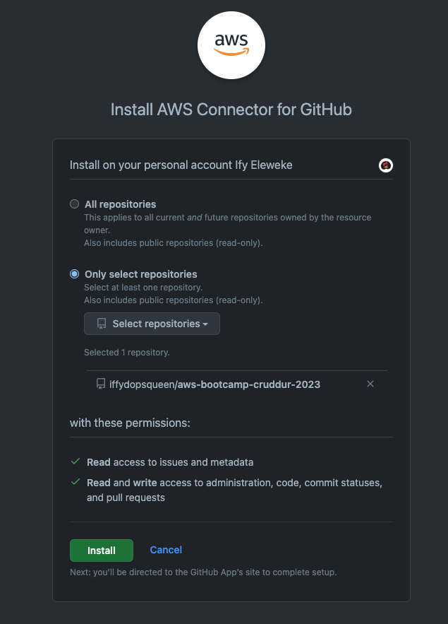
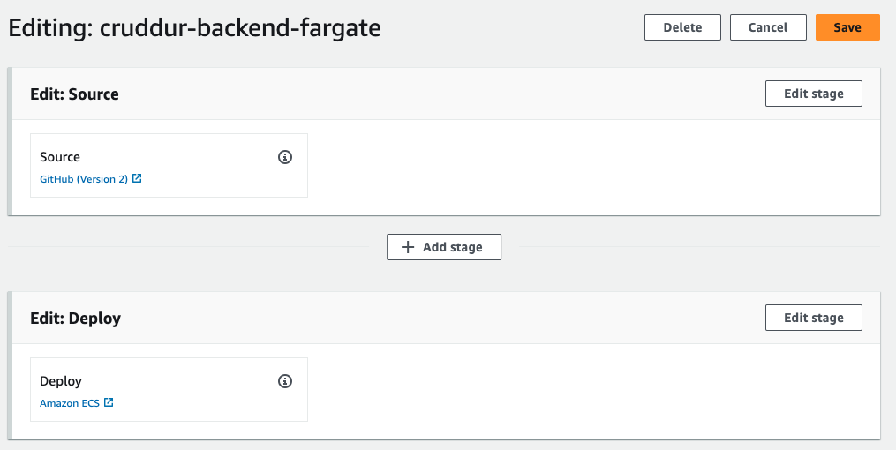
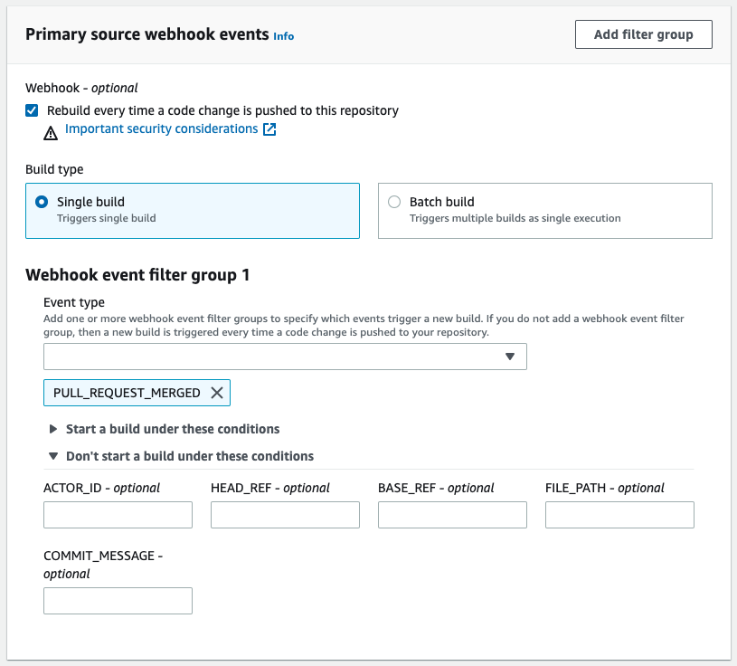
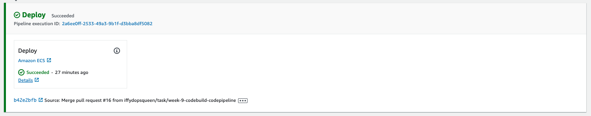
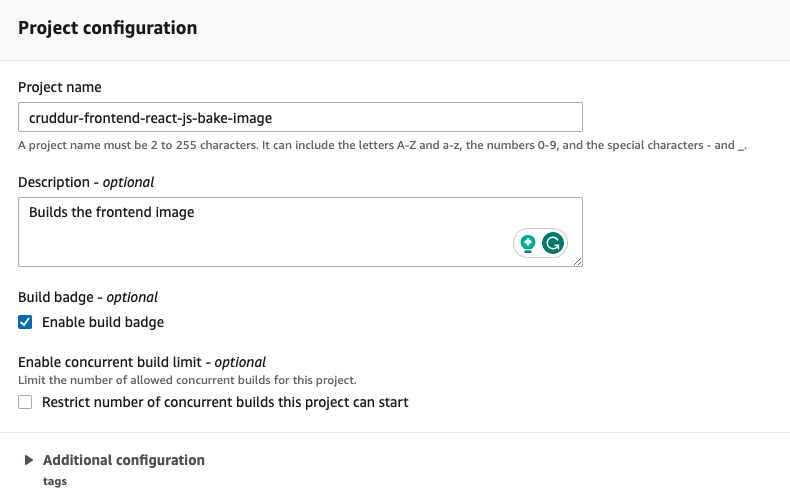

# Week 9 — CI/CD with CodePipeline and CodeBuild

## Required Homework/Tasks

All the tasks under this section are done using the `Gitpod` workspace.

### 1. Configuring CodeBuild & CodePipeline - `backend`

Let's create our pipeline. 

<details><summary>Configuration</summary>
<p> 

In your AWS console, navigate to **CodePipeline** service and start creating;

- In the **Pipeline settings** section,
  
    - Pipeline name: `cruddur-backend-fargate`
      
    - Service role: `New service role`
      
    - Leave the other settings as is
      
- In the **Advanced settings** section, leave as is
  
- Click **Next**
    
    
    
- In the **Source** section,
  
    - Source provider: `GitHub (Version 2)`
      
    - Connection: Click on `Connect to GitHub`
      
        - Connection name: `cruddur`
          
        - Click on **Connect to GitHub**, once verified create a link for your connection with GitHub
            
            
            
        - GitHub Apps: `Install a new app`; now go ahead and select your repo
            
            
            
        - You will have to confirm your password
          
        - Now select the `aws-bootcamp..` repo. If the connection is successful, you should get a number like so
            
            
            
        - Now go ahead and click **Connect**
          
    - We need to create a new branch called `prd` . Make sure to branch from your latest branch if you work in branches. After the creation, you should now be able to add it as your branch name
      
    - Branch name: `prd`
      
    - Make sure the **Start the pipeline on source code change** box is checked
      
    - Output artifact format: **CodePipeline default**
      
    - Click **Next**
      
- In the **Build** section,
  
    - Build provider: Skip build stage
      
- In the **Deploy** section,
  
    - Deploy provider: `ECS`
      
    - Region: `us-west-2`
      
    - Cluster name: select `cruddur`
      
    - Service name: select `backend-flask`
      
    - Click **Next**
        
        
        
- Go ahead and **Create Pipeline**

You should get an error in the deploy stage because it has no configurations given to it. 


Let’s edit the pipeline 

- Click on **Edit**
    
    
    
- Add a stage in between **Source** and **Deploy** by clicking on the `Add stage`
  
    - Stage name: `bake-image`
      
- In the `bake-image` stage, click on **Add action group**
  
    - Action name: `build`
      
    - Action provider: **AWS CodeBuild**
      
    - Region: `us-west-2`
      
    - Input artifacts: select the **SourceArtifact**
      
    - Project name: This wouldn’t work because we don’t have a `build` project in **CodeBuild** yet.

Let's go ahead and create one.

</p>
</details>

<details><summary>Configuring CodeBuild</summary>
<p> 

Let's create a `build` project. 

- Navigate to your **CodeBuild** service
  
- Click on **Create build project**
  
    - Project name: `cruddur-backend-flask-bake-image`
      
    - Description: O*ptional*
      
    - Build badge (*optional*): check the box
        
        
        
    - Enable concurrent build limit: DON’T check the box
      
- (We are creating a configuration for this section because we are creating it in isolation from our pipeline, not straight from the pipeline as it gave us the option to). In the **Source** section,
  
    - Source provider: **GitHub**
      
    - Repository: select **Connect using OAuth** then click **Connect to GitHub**
      
        - Click on **Authorize aws-codesuite** and then **Confirm**
        
        - Now select **Repository in my GitHub account**
          
    - GitHub repository: select the right repo
      
    - Source version - `prd`
      
    - Leave the rest of the configuration in that set
      
- In the **Primary source webhook events** section,
  
    - Check the box for **Rebuild every time a code change is pushed to this repository**
      
    - Event type: `PULL_REQUEST_MERGED`
        
        
        
- In the **Environment** section,

    - Environment image: **Managed image**
      
    - Operating system: **Amazon Linux 2**
      
    - Runtime(s): **Standard**
      
    - Image: choose the latest
      
    - Environment type: **Linux**
      
    - Privileged: check the box to build Docker images
      
    - Service role: **New service role**
      
    - **Additional configuration**
      
        - Timeout: **Hours → 0** & **Minutes → 20**
          
    - Certificate: **Do not install any certificate**
      
    - VPC: select your VPC
      
    - Subnets: select any 3 of them
      
    - Security group: choose **default**
      
    - Compute: Leave as
      
    - Environment variables: We will be using our `buildspec.yml`
      
    - File systems: Leave as is
      
- In the **Buildspec** section,
  
    - Select **Use a buildspec file**
      
    - Buildspec name: `backend-flask/buildspec.yml`
      
- Leave everything else
  
- In the **Logs** section,
  
    - Check the box for **CloudWatch logs**
      
    - Group name: `/cruddur/build/backend-flask`
      
    - Stream name: `backend-flask`
      
- Go ahead and click **Create build project**

After the creation, you can go ahead and copy the badge URL to your `README` file.

<details><summary>Creating a buildspec.yml File</summary>
<p> 
  
`Buildspec` file consists of a collection of build commands and related settings that **CodeBuild** uses to run a build. Without a build spec, CodeBuild cannot successfully convert your build input into build output or locate the build output artifact in the build environment to upload to your output bucket. [Read more here.](https://docs.aws.amazon.com/codebuild/latest/userguide/getting-started-cli-create-build-spec.html#:~:text=A%20buildspec%20is%20a%20collection,upload%20to%20your%20output%20bucket.)

Make sure to update the environment variables with YOURS. They should be located in your `backend-flask.env` file.

In `backend-flask` directory, create a file `buildspec.yml`

```bash
touch backend-flask/buildspec.yml
```

Content of the `buildspec.yml` file:

```yaml
# Buildspec runs in the build stage of your pipeline.
version: 0.2
phases:
  install:
    runtime-versions:
      docker: 19
    commands:
      - echo "cd into $CODEBUILD_SRC_DIR/backend"
      - cd $CODEBUILD_SRC_DIR/backend-flask
      - aws ecr get-login-password --region $AWS_DEFAULT_REGION | docker login --username AWS --password-stdin $IMAGE_URL
  build:
    commands:
      - echo Build started on `date`
      - echo Building the Docker image...          
      - docker build -t backend-flask .
      - "docker tag $REPO_NAME $IMAGE_URL/$REPO_NAME"
  post_build:
    commands:
      - echo Build completed on `date`
      - echo Pushing the Docker image..
      - docker push $IMAGE_URL/$REPO_NAME
      - echo "imagedefinitions.json > [{\"name\":\"$CONTAINER_NAME\",\"imageUri\":\"$IMAGE_URL/$REPO_NAME\"}]" > imagedefinitions.json
      - printf "[{\"name\":\"$CONTAINER_NAME\",\"imageUri\":\"$IMAGE_URL/$REPO_NAME\"}]" > imagedefinitions.json

env:
  variables:
    AWS_ACCOUNT_ID: 387543059434
    AWS_DEFAULT_REGION: ca-central-1
    CONTAINER_NAME: backend-flask
    IMAGE_URL: 387543059434.dkr.ecr.ca-central-1.amazonaws.com
    REPO_NAME: backend-flask:latest
    AWS_COGNITO_USER_POOL_CLIENT_ID: 5b6ro31g97urk767adrbrdj1g5
    AWS_COGNITO_USER_POOL_ID: ca-central-1_CQ4wDfnwc
    BACKEND_URL: "*"
    FRONTEND_URL: "*"
    OTEL_EXPORTER_OTLP_ENDPOINT: https://api.honeycomb.io
    OTEL_SERVICE_NAME: backend-flask 
  parameter-store:
    AWS_ACCESS_KEY_ID: /cruddur/backend-flask/AWS_ACCESS_KEY_ID
    AWS_SECRET_ACCESS_KEY: /cruddur/backend-flask/AWS_SECRET_ACCESS_KEY
    CONNECTION_URL: /cruddur/backend-flask/CONNECTION_URL
    OTEL_EXPORTER_OTLP_HEADERS: /cruddur/backend-flask/OTEL_EXPORTER_OTLP_HEADERS 
    ROLLBAR_ACCESS_TOKEN: /cruddur/backend-flask/ROLLBAR_ACCESS_TOKEN
artifacts:
  files:
    - imagedefinitions.json
```

</p>
</details>

Now you can merge your branch into `prd` to kick off your first `build`. 

- Do this by making a pull request

</p>
</details>


### 2. Fix CodeBuild Issues - `backend`

After configuring our `build` project, we encountered some errors. Below are the steps to resolve them.

<details><summary>Resolve Errors</summary>
<p> 

For the `bake-image` build we created, we attached a VPC and some subnets (they were private subnets). This restricted the `build` from connecting with our ECR because there was no internet connectivity.  

- So go to your `bake-image` build and remove that VPC.

In your build project in **CodeBuild**, click on the `cruddur-backend-flask-bake-image` project

- Click on **Edit** and select **Environment**
  
- Scroll down to **VPC** and select **No VPC**
  
- Go ahead and click **Update environment**

Also, make sure that the `docker` runtime versions you are using are accepted and not erroring out. Check this in your `buildspec.yml` file. 


Also, it looks like it doesn’t like these environment variable parameters we set. Besides, all those are loaded during runtime. Leave the ones needed for our `post_build` step, which are `CONTAINER_NAME`, `AWS_DEFAULT_REGION`, `IMAGE_URL`, and `REPO_NAME`.


Now you can merge your branch into `prd` to kick off a `build`. 

- Do this by making a pull request

</p>
</details>


### 3. Configuring CodePipeline - `backend`

From the pipeline we created previously, let’s go ahead and make some configurations. 

<details><summary>Modifying the Pipeline</summary>
<p> 

If you have a pipeline already built and failed, click on **Edit** to add `stages` to the pipeline. OR you can just create another pipeline. 

- Go ahead and click `Add stage`
  
- Stage name: `build`

In the **build** stage, click on **Add action group**

- Action name: `bake`
  
- Action provider: **AWS CodeBuild**
  
- Region: **us-west-2**
  
- Input artifacts: **SourceArtifact**
  
- Project name: `cruddur-backend-flask-bake-image`
  
- Build type: **Single build**
  
- Output artifacts: **ImageDefinition**
  
- Leave the rest as is

Go ahead and click **Done,** then **save** and deploy changes by clicking **Release change**.

In the **deploy** stage, go ahead and edit it 

- Input artifacts: **ImageDefinition**

- Go ahead and click **Done,** then **save** and deploy changes by clicking **Release change**.

If you are getting this error of `no matching artifacts found`, make this change to your `buildspec.yml` file. Check the logs of the build.


After the changes, go ahead and create a pull request to merge to `prd` so our `build` and `pipeline` are kicked off. 

Now, both the `build` and `deploy` stages passed. Yay!!! 🎉

Now head over to the **ECR** service to observe your tasks' creation for the `backend` happened. If you don’t see any tasks in your `backend-flask` service, that is because you have your **Desired count** set to **0.** 

- Click on **Update service** to change that number to **1**.

After the update, wait a little till it’s `healthy`. You can also do that by typing in your domain name, `api.MYDOMAIN.com`, and appending `/api/health-check` at the end of the URL. 

To ensure our health check is working, let’s go ahead and change our health check returned data. 


After the change, go ahead and create a pull request to merge to `prd` so we are sure our ECS tasks are `healthy`. 

Try your health check domain again.


<details><summary>Some of the Errors Encountered</summary>
<p> 

### Error 1


Change the **Image** in your build to the `..4.0` version. This version is more compatible with the docker `20` runtime version. 


You can do that by: 

- Clicking on **Edit** on your build project
  
- Select **Environment,** then scroll down and make the changes
  
- Go ahead and **Update environment**


### Error 2


Simply add this AWS-managed policy to your CodeBuild role in IAM


### Error 3


This error is due to no permission to put images in ECR that is attached to the `build` project. 

For this error, create a **custom inline** policy with the following permissions:


```json
{
	"Version": "2012-10-17",
	"Statement": [
		{
			"Sid": "Statement1",
			"Effect": "Allow",
			"Action": [
				"ecr:PutImage",
				"ecr:BatchGetImage",
				"ecr:UploadLayerPart",
				"ecr:CompleteLayerUpload",
				"ecr:InitiateLayerUpload",
				"ecr:GetDownloadUrlForLayer",
				"ecr:GetAuthorizationToken",
				"ecr:BatchCheckLayerAvailability"
			],
			"Resource": "*"
		}
	]
}
```

Check out [link](https://docs.aws.amazon.com/codebuild/latest/userguide/sample-docker.html) for more information. 

If you have the AWS-managed policy - `AmazonEC2ContainerRegistryReadOnly`, attached to your role, go ahead and delete it. If not, **ignore**.

### Error 4


You are getting the above error because your ECS service is meant to be launched already; else, it doesn’t detect the service name. 



</p>
</details>

</p>
</details>


### 4. Configuring CodeBuild - `frontend`

Let's create another `build` project for the frontend.

<details><summary>Configuring CodeBuild</summary>
<p> 

- Navigate to your **CodeBuild** service
  
- Click on **Create build project**

    - Project name: `cruddur-frontend-react-js-bake-image`
      
    - Description: O*ptional*
      
    - Build badge (*optional*): check the box
        
        
        
- In the **Source** section,

    - Source provider: **GitHub**
      
    - Repository: Select **Repository in my GitHub account**
      
    - GitHub repository: select the right repo
      
    - Source version - `prd`
      
    - Leave the rest of the configuration in that set
        
        
        
- In the **Primary source webhook events** section,
  
    - Check the box for **Rebuild every time a code change is pushed to this repository**
      
    - Event type: `PULL_REQUEST_MERGED`
        
        
        
- In the **Environment** section,
  
    - Environment image: **Managed image**
      
    - Operating system: **Amazon Linux 2**
      
    - Runtime(s): **Standard**
      
    - Image: choose the latest
      
    - Environment type: **Linux**
      
    - Privileged: check the box to build Docker images
      
    - Service role: **New service role**
      
    - **Additional configuration**
      
        - Timeout: **Hours → 0** & **Minutes → 20**
        
    - Certificate: **Do not install any certificate**
      
    - VPC: No VPC
      
    - Compute: Leave as
      
    - Environment variables: We will be using our `buildspec.yml`
      
    - File systems: Leave as is
        
        
        
        
        
- In the **Buildspec** section,
  
    - Select **Use a buildspec file**
      
    - Buildspec name: `frontend-react-js/buildspec.yml`
      
- Leave everything else
    
    
    
- In the **Logs** section,
  
    - Check the box for **CloudWatch logs**
      
    - Group name: `/cruddur/build/frontend-react-js`
      
    - Stream name: `frontend-react-js`
        
        
        
- Go ahead and click **Create build project**

After the creation, you can go ahead and copy the badge URL to your `README` file.


<details><summary>Creating a buildspec.yml File</summary>
<p> 

Make sure to update the environment variables with YOURS. They should be located in your `frontend-react-js.env` file.

In the `frontend-react-js` directory, create a file `buildspec.yml`

```bash
touch frontend-react-js/buildspec.yml
```

Content of the `buildspec.yml` file:

```yaml
# Buildspec runs in the build stage of your pipeline.
version: 0.2
phases:
  install:
    runtime-versions:
      docker: 20
    commands:
      - echo "cd into $CODEBUILD_SRC_DIR/frontend"
      - cd $CODEBUILD_SRC_DIR/frontend-react-js
      - aws ecr get-login-password --region $AWS_DEFAULT_REGION | docker login --username AWS --password-stdin $IMAGE_URL
  build:
    commands:
      - echo Build started on `date`
      - echo Building the Docker image...          
      - docker build -t frontend-react-js .
      - "docker tag $REPO_NAME $IMAGE_URL/$REPO_NAME"
  post_build:
    commands:
      - echo Build completed on `date`
      - echo Pushing the Docker image...
      - docker push $IMAGE_URL/$REPO_NAME
      - cd $CODEBUILD_SRC_DIR/
      - echo "imagedefinitions.json > [{\"name\":\"$CONTAINER_NAME\",\"imageUri\":\"$IMAGE_URL/$REPO_NAME\"}]" > imagedefinitions.json
      - printf "[{\"name\":\"$CONTAINER_NAME\",\"imageUri\":\"$IMAGE_URL/$REPO_NAME\"}]" > imagedefinitions.json

env:
  variables:
    AWS_ACCOUNT_ID: YOURS
    AWS_DEFAULT_REGION: YOURS
    CONTAINER_NAME: frontend-react-js
    IMAGE_URL: AWS_ACCOUNT_ID.dkr.ecr.REGION.amazonaws.com
    REPO_NAME: frontend-react-js:latest
artifacts:
  files:
    - imagedefinitions.json
```

</p>
</details>

Now you can merge your branch into `prd` to kick off our first `build`. 

- Do this by making a pull request

</p>
</details>

<details><summary>Some of the Errors Encountered</summary>
<p> 

### Error


For this error, create a custom inline policy in the `codebuild frontend service role` with the following permissions:


```json
{
	"Version": "2012-10-17",
	"Statement": [
		{
			"Sid": "Statement1",
			"Effect": "Allow",
			"Action": [
				"ecr:PutImage",
				"ecr:BatchGetImage",
				"ecr:UploadLayerPart",
				"ecr:CompleteLayerUpload",
				"ecr:InitiateLayerUpload",
				"ecr:GetDownloadUrlForLayer",
				"ecr:GetAuthorizationToken",
				"ecr:BatchCheckLayerAvailability"
			],
			"Resource": "*"
		}
	]
}
```

</p>
</details>


### 5. Configuring CodePipeline - `frontend`

Let's create another pipeline for the frontend.

<details><summary>Configuring the Pipeline</summary>
<p> 

- In your AWS console, navigate to **CodePipeline** service and start creating
  
- In the **Pipeline settings** section,
  
    - Pipeline name: `cruddur-frontend-fargate`
      
    - Service role: `New service role`
      
    - Leave the other settings as is
      
- In the **Advanced settings** section, leave as is

- Click **Next**
    
    
    
- In the **Source** section,
  
    - Source provider: `GitHub (Version 2)`
      
    - Connection: select the connection you’ve already established with the backend - `cruddur`
      
    - Repository name: select the `aws-bootcamp-cruddur-2023`
      
    - Branch name: `prd`
      
    - Make sure the **Start the pipeline on source code change** box is checked
      
    - Output artifact format: **CodePipeline default**
      
    - Click **Next**
        
        
        
- In the **Build** section,
  
    - Build provider: `AWS CodeBuild`
      
    - Region: `us-west-2`
      
    - Project name: `cruddur-frontend-react-js-bake-image`
        
        
        
- Before the next section, make sure you have your frontend FARGATE service running
  
- In the **Deploy** section,
  
    - Deploy provider: `ECS`
      
    - Region: `us-west-2`
      
    - Cluster name: select `cruddur`
      
    - Service name: select `frontend-react-js`
      
    - Click **Next**
        
        
        
- Click **Next**
  
- Go ahead and **Create Pipeline**

</p>
</details>

